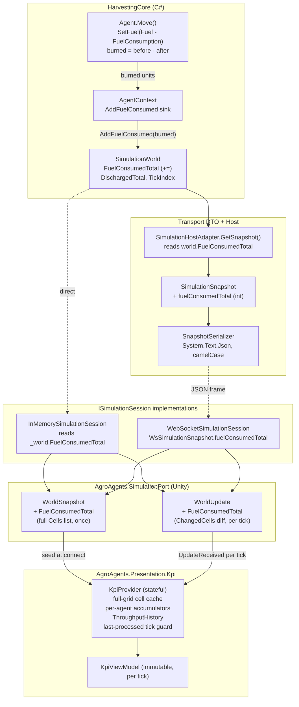

# Design Document

## Overview

This feature closes the data-contract gap between the AgenticModel simulation core and the
Unity-side `KpiViewModel`. Four of the five dashboard KPIs can already be reconstructed from
data present in each per-tick snapshot; the fifth (fuel efficiency, KPI #3) cannot, because the
snapshot only carries each agent's **remaining** fuel — a value that is reset to `MaxFuel` on
refuel and therefore loses all history of fuel actually burned.

The design does two things:

1. **Introduces a single new fleet-wide counter, `Fuel_Consumed_Total`**, that is threaded through
   every layer of the pipeline (core → wire DTO → port → KPI provider) exactly the way
   `Discharged_Total` already is. This is the only change to the wire contract (Requirements 1, 2, 8).
2. **Introduces the `KpiProvider`** — a new stateful component in the `AgroAgents.Presentation`
   assembly (namespace `AgroAgents.Presentation.Kpi`) that subscribes to the per-tick update
   stream, accumulates the per-agent and time-series state the KPIs require, and emits one
   immutable `KpiViewModel` per processed tick (Requirements 2–7).

The central architectural decision (justified in the Architecture section) is that **all
accumulated KPIs are computed on the client, inside the `KpiProvider`**, rather than on the
server. Only the raw `Fuel_Consumed_Total` scalar crosses the wire as a new field. Everything else
the KPIs need (per-agent state each tick, cell states, discharged total, tick index) is already in
the snapshot.

The scope is strictly the data contract: producing a fully-populated `KpiViewModel` per tick. No
chart, layout, or view rendering is in scope.

## Architecture

### The existing pipeline

The pipeline already carries per-tick simulation state from the C# core to the Unity presentation
layer through two adapters that both implement `ISimulationSession`:

- **In-memory adapter** (`InMemorySimulationSession`): wraps `SimulationWorld` directly, ticks it,
  and raises `WorldUpdate` synchronously from `RequestTick()`.
- **WebSocket adapter** (`WebSocketSimulationSession` + `WebSocketMessageParser`): deserialises
  `WsSimulationSnapshot` frames and raises `WorldUpdate` when pumped.

Both surface the same two read surfaces to the presentation layer:

- `WorldSnapshot` — captured **once** at connect time; carries the **full** cell list, the field
  dimensions, agents, refuel/dump sites, tick index, discharged total, halted flag.
- `WorldUpdate` — raised **once per completed tick**; carries only **changed** cells (a diff), the
  full agent list, tick index, discharged total, halted flag.

### Key insight: `WorldUpdate` carries a cell *diff*, not the full grid

This is the load-bearing structural fact for KPI #4 (field coverage). Because `WorldUpdate.ChangedCells`
is a diff, the `KpiProvider` **cannot** read the whole grid from a single update. It must maintain
its own full-grid cell-state cache: seed it from `WorldSnapshot.Cells` at construction, then apply
each `WorldUpdate.ChangedCells` batch as a patch. Field coverage each tick is computed from that
cache, restricted to the set of cells that were workable (Crop) at simulation start (Requirement 5).

### Central decision: client-side accumulation

The two accumulated KPIs — per-agent utilization tick counts (Requirement 3) and out-of-fuel event
counts (Requirement 4) — could in principle be accumulated on the server and shipped as fields, or
accumulated on the client from the per-tick agent states that are already transmitted. This design
chooses **client-side accumulation in the `KpiProvider`** for three reasons:

1. **The snapshot already carries what's needed.** Every `WorldUpdate` already includes each
   agent's `Id`, `Role`, and `CurrentState`. Utilization counts are just "how many ticks was this
   agent observed in each category", and out-of-fuel events are just "how many non-Inactive →
   Inactive transitions occurred". Both are pure functions of the state stream the client already
   sees. Shipping additional accumulator fields would be redundant.
2. **It avoids widening the wire contract.** The only field the wire genuinely cannot supply is
   `Fuel_Consumed_Total` (because remaining fuel destroys the information). Keeping accumulation
   client-side means the wire contract grows by exactly one integer, minimising the blast radius
   across the two DTOs, two adapters, the host producer, and the serializer (Requirement 8).
3. **It co-locates accumulation with the tick-continuity guards.** Requirement 7 requires
   discarding out-of-order/duplicate ticks and detecting gaps. The `KpiProvider` is the single
   place that observes the ordered tick stream, so the "increment counts by exactly one tick per
   agent per processed update" rule and the "discard if tick ≤ last processed" rule live together,
   preventing double-counting.

Consequently the **only** new wire field is `Fuel_Consumed_Total`. The `KpiProvider` owns all
accumulation.

### Fuel-consumed counter wiring (core)

`Fuel_Consumed_Total` mirrors `Discharged_Total` exactly:

- `SimulationWorld` gains a `FuelConsumedTotal` property (`int`, `private set`) initialised to zero
  in the constructor, and an `internal void AddFuelConsumed(int amount)` sink that increments it.
- `AgentContext` already carries an `Action<int>` discharge sink (`AddDischarged`) plus `TickIndex`.
  It gains a **parallel** `Action<int>` fuel-consumed sink, passed in from `SimulationWorld.Tick()`
  as `AddFuelConsumed`, and exposes it via an `AddFuelConsumed(int)` method the way it exposes
  `AddDischarged(int)`. This keeps layering acyclic: the context never references the façade.
- `Agent.Move` is the only place fuel is deducted (via `SetFuel(Fuel - FuelConsumption)`). Because
  `SetFuel` clamps to `[0, MaxFuel]`, the nominal `FuelConsumption` can exceed what is actually
  removed on the final step before empty. The design accumulates the **actual units removed**,
  computed as `fuelBefore - fuelAfter` around the `SetFuel` call, so the counter reflects true
  consumption and remains consistent with the tank readings. `Refuel()` calls `SetFuel(MaxFuel)`
  but must **not** call the sink, so refuelling never affects the counter (Requirement 1.5).

**Ordering:** fuel is burned during Phase 1 (agent `Execute` → `Move`) of `SimulationWorld.Tick()`.
`TickIndex` is incremented at the end of Phase 4. The snapshot is produced **after** `Tick()`
returns, so the `FuelConsumedTotal` read at snapshot time reflects the just-completed tick, exactly
matching how `DischargedTotal` and `TickIndex` are read.

### Data-flow diagram



## Components and Interfaces

### Simulation core (HarvestingCore)

**`SimulationWorld`** (`World.cs`)
- Add `public int FuelConsumedTotal { get; private set; }`, initialised to `0` in the constructor
  alongside `DischargedTotal`.
- Add `internal void AddFuelConsumed(int amount) { FuelConsumedTotal += amount; }` mirroring
  `AddDischarged`.
- In `Tick()`, pass `AddFuelConsumed` into the `AgentContext` constructor alongside the existing
  `AddDischarged`. (Requirements 1.1, 1.2, 1.4)

**`AgentContext`** (`Agents/AgentContext.cs`)
- Add a second `Action<int>` field, `_fuelConsumedSink`, set from the new constructor parameter.
- Add `public void AddFuelConsumed(int amount) => _fuelConsumedSink(amount);` mirroring
  `AddDischarged`. (Requirement 1.3)

**`Agent`** (`Agents/Agent.cs`)
- In `Move(AgentContext context)`, wrap the fuel deduction to accumulate the actual delta:
  ```csharp
  int fuelBefore = Fuel;
  SetFuel(Fuel - FuelConsumption);
  int burned = fuelBefore - Fuel;      // clamped-accurate actual consumption
  if (burned > 0) context.AddFuelConsumed(burned);
  ```
  `Refuel()` is left unchanged and never touches the sink. (Requirements 1.3, 1.5)

### Wire DTO + host (HarvestingCore.Transport / .Host)

**`SimulationSnapshot`** (`Transport/Dto/SimulationSnapshot.cs`)
- Add `[JsonPropertyName("fuelConsumedTotal")] public int FuelConsumedTotal { get; set; }`
  alongside `DischargedTotal`. (Requirements 2.3, 8.1)

**`AgentSnapshot`** (`Transport/Dto/AgentSnapshot.cs`)
- Unchanged. It already carries `id`, `role`, `state`, and remaining `fuel`, which is all the
  per-agent information the KPIs need (Requirements 3.1, 4.1). Remaining fuel is deliberately **not**
  the consumption source.

**`CellSnapshot`** — unchanged; already carries `x`, `y`, `state` (Requirement 5.2).

**`SimulationHostAdapter.GetSnapshot()`** (`Host/SimulationHostAdapter.cs`)
- Set `FuelConsumedTotal = world.FuelConsumedTotal` when building the `SimulationSnapshot`, next to
  `DischargedTotal = world.DischargedTotal`. (Requirements 1.6, 2.3)

**`SnapshotSerializer`** — no code change; System.Text.Json with camelCase serialises the new field
automatically, and the `[JsonPropertyName]` guarantees the wire name. (Requirement 8.3)

### Port layer (AgroAgents.SimulationPort)

**`WorldSnapshot`** (`Port/WorldSnapshot.cs`)
- Add `public int FuelConsumedTotal { get; }` and a constructor parameter for it, positioned next to
  `DischargedTotal`. (Requirements 1.7, 8.2)

**`WorldUpdate`** (`Port/WorldUpdate.cs`)
- Add `public int FuelConsumedTotal { get; }` and a constructor parameter, next to `DischargedTotal`.
  This is the per-tick read surface the `KpiProvider` consumes. (Requirements 1.7, 8.2)

**`PortAgentSnapshot`**, **`PortCellSnapshot`**, **`PortGridPosition`**, enums — unchanged. They
already carry `Id`, `Role`, `CurrentState`, and per-cell `Position`/`State`. (Requirements 3.2, 5.3)

### Adapters

**`InMemorySimulationSession`** (`Adapters/InMemory/`)
- Pass `_world.FuelConsumedTotal` into both the `WorldSnapshot` built in `BuildSnapshot()` and the
  `WorldUpdate` raised in `RequestTick()`. (Requirement 8.3)

**`Mappings`** (`Adapters/InMemory/Mappings.cs`) — no new mapping needed; `FuelConsumedTotal` is a
plain int passed through, not a translated type.

**`WebSocketSimulationSession`** + **`WsSimulationSnapshot`** (`Adapters/WebSocket/`)
- Add `[JsonPropertyName("fuelConsumedTotal")] public int FuelConsumedTotal { get; set; }` to
  `WsSimulationSnapshot` in `ServerMessage.cs`.
- Where `WebSocketSimulationSession` maps `WsSimulationSnapshot` into `WorldSnapshot`/`WorldUpdate`,
  carry `FuelConsumedTotal` through. (Requirements 8.2, 8.3)

### New component: `KpiProvider`

A stateful class in `AgroAgents.Presentation` (namespace `AgroAgents.Presentation.Kpi`).

**Construction**
- Takes an `ISimulationSession`. Subscribes to `session.UpdateReceived`.
- Seeds from `session.InitialSnapshot`:
  - Records `Width`, `Height`.
  - Builds the **full-grid cell-state cache** from `InitialSnapshot.Cells` (indexed by position).
  - Establishes the **workable-cell baseline**: the set of cell positions whose state at start is
    `Crop` (or `Harvested`, treated as already-workable-and-done — but at connect no cell is yet
    Harvested unless the sim was pre-advanced; the baseline is "was a Crop-class cell at start").
    `WorkableCellCount` is fixed at this size for the session (Requirement 5.5).
  - Initialises `_lastProcessedTick` to `InitialSnapshot.TickIndex`.

**Per-update handling (`OnUpdateReceived(WorldUpdate update)`)**
1. **Tick-continuity guard (Requirement 7):**
   - If `update.TickIndex <= _lastProcessedTick`: discard, do not mutate accumulators, do not emit.
   - If `update.TickIndex > _lastProcessedTick + 1`: record a gap (set a `GapDetected` flag / count),
     then process normally.
   - Otherwise process normally.
2. **Apply cell diff:** patch the full-grid cache with `update.ChangedCells`.
3. **Per-agent accumulation** for each agent in `update.Agents`:
   - Classify `CurrentState` into a `KpiStateCategory` via the `KpiStateCategory` mapping.
   - Increment that agent's category tick count by exactly one (Requirement 7.4).
   - Compare against the agent's previously-observed category: if it moved from a non-Inactive
     category to `Inactive`, increment its out-of-fuel event count by one (Requirement 4.2, 4.3).
   - Update the agent's remembered previous category.
   - Agents not present in this update retain their accumulators (Requirement 3.7).
4. **Append a `KpiTimeSample`** `(update.TickIndex, update.DischargedTotal, update.FuelConsumedTotal)`
   to the ordered `ThroughputHistory` list (Requirement 2.4, 2.5).
5. **Set `_lastProcessedTick = update.TickIndex`.**
6. **Build and emit** one immutable `KpiViewModel` (Requirement 6).

**Emitted `KpiViewModel`**
- `Tick` = `update.TickIndex`.
- `AgentUtilization` = one `AgentUtilizationKpi` per known agent, with category counts and
  `TotalTicks = productive + idle + inactive` (Requirement 3).
- `ThroughputHistory` = the accumulated ordered sample list (Requirement 2).
- `FuelPerTon` = latest `FuelConsumedTotal / DischargedTotal` if discharged > 0, else `0`
  (Requirement 2.6, 2.7).
- `FieldCoverage` = `FieldCoverageKpi` computed from the cell cache over the workable baseline
  (Requirement 5).
- `OutOfFuelEvents` = one `OutOfFuelEventsKpi` per known agent (Requirement 4).

The provider exposes the latest `KpiViewModel` (e.g. via an event `KpiUpdated` and/or a `Latest`
property) for view components to consume; the exact surfacing is a view concern and not constrained
by this data contract.

## Data Models

### New / changed fields (the whole feature, wire-side)

| Layer | Type | Field | Notes |
|-------|------|-------|-------|
| Core | `SimulationWorld` | `int FuelConsumedTotal { get; private set; }` | mirrors `DischargedTotal` |
| Core | `AgentContext` | `Action<int>` fuel sink + `AddFuelConsumed(int)` | mirrors discharge sink |
| Wire | `SimulationSnapshot` | `int FuelConsumedTotal` `[JsonPropertyName("fuelConsumedTotal")]` | camelCase on wire |
| Port | `WorldSnapshot` | `int FuelConsumedTotal` | seed value |
| Port | `WorldUpdate` | `int FuelConsumedTotal` | per-tick value |
| WS adapter | `WsSimulationSnapshot` | `int FuelConsumedTotal` `[JsonPropertyName("fuelConsumedTotal")]` | case-insensitive parse |

### `KpiProvider` internal state

| Field | Type | Purpose |
|-------|------|---------|
| `_width`, `_height` | `int` | field dimensions from `InitialSnapshot` |
| `_cellCache` | `Dictionary<PortGridPosition, PortCellState>` (or position-indexed array) | full-grid state, seeded then patched by diffs |
| `_workablePositions` | `IReadOnlyCollection<PortGridPosition>` | positions Crop-class at start; fixes `WorkableCellCount` |
| `_agentAccumulators` | `Dictionary<string, AgentAccumulator>` | per-agent counts + previous category |
| `_throughput` | `List<KpiTimeSample>` | ordered by ascending tick |
| `_lastProcessedTick` | `long` | continuity guard |
| `_gapDetected` | `bool` / gap count | Requirement 7.3 |

`AgentAccumulator` (internal): `Role`, `ProductiveTicks`, `IdleTicks`, `InactiveTicks`,
`OutOfFuelEventCount`, `PreviousCategory`.

### Target contract types (existing, unchanged shape)

`KpiViewModel`, `AgentUtilizationKpi`, `KpiTimeSample`, `FieldCoverageKpi` / `FieldCoverageCell`,
`OutOfFuelEventsKpi`, `KpiStateCategory` are already defined and are the output the `KpiProvider`
populates. No structural change is required to them.

### State-category mapping (from `KpiStateCategory`)

- **Productive:** `Harvest`, `GoToDump`
- **Idle:** `Idle`, `GoToRefuel`, `GoToMeetingPoint`, `WaitTractor`, `WaitHarvester`
- **Inactive:** `Inactive`

## Correctness Properties

*A property is a characteristic or behavior that should hold true across all valid executions of a
system — essentially, a formal statement about what the system should do. Properties serve as the
bridge between human-readable specifications and machine-verifiable correctness guarantees.*

The properties below were derived from the acceptance-criteria prework. Structural/presence-only
criteria (e.g. "the snapshot carries field X") and compile-time guarantees (e.g. read-only structs)
are validated by the round-trip and well-formedness properties rather than restated, and redundant
criteria were consolidated during property reflection.

### Property 1: Fuel-consumed counter equals actual fleet burn

*For any* generated world advanced by any number of ticks, `SimulationWorld.FuelConsumedTotal`
equals the sum over all agents of the actual fuel units removed from their tanks (each step's
`fuelBefore - fuelAfter`, i.e. `min(FuelConsumption, fuelBefore)` under clamping), excluding any
refuel. Equivalently, the counter's increase over a tick equals the total clamped fuel delta burned
that tick.

**Validates: Requirements 1.1, 1.3**

### Property 2: Fuel-consumed counter is monotonically non-decreasing

*For any* world and any sequence of ticks, `FuelConsumedTotal` after each tick is greater than or
equal to its value before that tick.

**Validates: Requirements 1.4**

### Property 3: Refuel does not change the fuel-consumed counter

*For any* agent positioned on a refuel station, invoking `Refuel` leaves `FuelConsumedTotal`
unchanged.

**Validates: Requirements 1.5**

### Property 4: Fuel-consumed total survives the wire round-trip

*For any* integer `Fuel_Consumed_Total` value placed in a `SimulationSnapshot` by the producer,
serialising and then deserialising the snapshot (and mapping it into the port `WorldSnapshot` /
`WorldUpdate`) yields a `FuelConsumedTotal` equal to the original value; and for any world state,
`GetSnapshot().FuelConsumedTotal == world.FuelConsumedTotal`.

**Validates: Requirements 1.6, 1.7, 2.3, 8.1, 8.2, 8.3**

### Property 5: A time sample mirrors its source update

*For any* processed per-tick update, the `KpiTimeSample` produced for that tick has `Tick`,
`DischargedTotal`, and `FuelConsumedTotal` respectively equal to the update's `TickIndex`,
`DischargedTotal`, and `FuelConsumedTotal` — all three taken from that single update.

**Validates: Requirements 1.8, 2.4, 8.4**

### Property 6: Throughput history is ordered by ascending tick

*For any* sequence of processed updates, the samples in `KpiViewModel.ThroughputHistory` are in
strictly ascending `Tick` order.

**Validates: Requirements 2.5**

### Property 7: FuelPerTon is the fuel/discharged ratio with a zero guard

*For any* provider state, `KpiViewModel.FuelPerTon` equals the latest `FuelConsumedTotal` divided by
the latest `DischargedTotal` when the latest `DischargedTotal` is greater than zero, and equals zero
when the latest `DischargedTotal` is zero.

**Validates: Requirements 2.6, 2.7**

### Property 8: State classification is a total, single-valued function

*For any* `PortStateId`, the `KpiStateCategory` mapping assigns exactly one category, and the
Productive / Idle / Inactive buckets are mutually exclusive and jointly exhaustive over all
`PortStateId` values.

**Validates: Requirements 3.3**

### Property 9: Exactly one KPI entry per observed agent, carrying id and role

*For any* set of agents observed across processed updates, `KpiViewModel.AgentUtilization` and
`KpiViewModel.OutOfFuelEvents` each contain exactly one entry per observed agent, and each entry's
`AgentId` and `Role` match that agent's observed identifier and role.

**Validates: Requirements 3.4, 4.4**

### Property 10: Utilization counts equal observed ticks per category

*For any* ascending stream of processed updates, each agent's `ProductiveTicks`, `IdleTicks`, and
`InactiveTicks` equal the number of processed updates in which that agent was observed in the
Productive, Idle, and Inactive category respectively; and each processed update increments exactly
one category by exactly one for each agent present in it.

**Validates: Requirements 3.5, 7.4**

### Property 11: Utilization category counts sum to total ticks

*For any* produced `AgentUtilizationKpi`, `ProductiveTicks + IdleTicks + InactiveTicks == TotalTicks`.

**Validates: Requirements 3.6**

### Property 12: Absent agents retain their accumulated counts

*For any* processed update that omits an agent seen in a prior update, that agent's category counts
and out-of-fuel event count are identical before and after the update.

**Validates: Requirements 3.7**

### Property 13: Out-of-fuel count equals non-Inactive→Inactive transitions

*For any* ascending stream of processed updates, each agent's `OutOfFuelEventCount` equals the number
of consecutive-observation transitions in which that agent's category changed from a non-Inactive
category to Inactive; remaining continuously Inactive across successive updates adds no events.

**Validates: Requirements 4.2, 4.3, 4.5**

### Property 14: Field coverage reflects the workable set over the cell cache

*For any* provider state, `FieldCoverageKpi.Width`/`Height` equal the reported field dimensions;
`HarvestedCellCount` equals the number of workable positions whose current cached state is Harvested;
`CoveragePercent` equals `HarvestedCellCount / WorkableCellCount` when `WorkableCellCount > 0` and
equals zero when `WorkableCellCount == 0`; and `Cells` contains one `FieldCoverageCell` per workable
position carrying that position and its current cached state.

**Validates: Requirements 5.4, 5.6, 5.7, 5.8, 5.9**

### Property 15: Workable-cell count is fixed at simulation start

*For any* session, `FieldCoverageKpi.WorkableCellCount` equals the number of cells that were
Crop-class at the initial snapshot and does not change across subsequent ticks.

**Validates: Requirements 5.5**

### Property 16: Exactly one well-formed view model per processed tick

*For any* processed per-tick update, the provider emits exactly one `KpiViewModel` whose `Tick`
equals the update's `TickIndex` and whose six members (`Tick`, `AgentUtilization`,
`ThroughputHistory`, `FuelPerTon`, `FieldCoverage`, `OutOfFuelEvents`) are all populated
(non-null collections and initialised values).

**Validates: Requirements 6.1, 6.2, 6.3**

### Property 17: Duplicate or out-of-order ticks are discarded without effect

*For any* update whose `TickIndex` is less than or equal to the most recently processed tick, the
provider does not alter any accumulated count, does not append a sample, and does not emit a view
model.

**Validates: Requirements 7.2**

### Property 18: Tick gaps are recorded

*For any* update whose `TickIndex` is more than one greater than the most recently processed tick,
the provider records that a tick gap occurred.

**Validates: Requirements 7.3**

## Error Handling

- **Malformed wire frames (WebSocket):** deserialisation already returns a parse-error message
  rather than throwing (`SnapshotSerializer.Deserialize` / `WebSocketMessageParser`). A missing
  `fuelConsumedTotal` field deserialises to the JSON default `0` under System.Text.Json, which is a
  safe, non-crashing value; the design treats an absent field as zero rather than an error, since
  the counter is only ever additive from zero.
- **Out-of-order / duplicate ticks:** handled as a first-class case by the continuity guard
  (Property 17), not as an exception. This is the primary defence against double-counting
  accumulators.
- **Tick gaps:** recorded (Property 18) so consumers can surface that accumulated counts may
  undercount; the provider still processes the newer tick rather than stalling.
- **Divide-by-zero:** both ratio computations (`FuelPerTon` at zero discharged, `CoveragePercent` at
  zero workable cells) are explicitly guarded to return zero (Properties 7, 14).
- **Fuel clamp underflow:** accumulating the actual `fuelBefore - fuelAfter` delta (never the
  nominal `FuelConsumption`) prevents the counter from over-counting on the final step before a tank
  empties; the delta is always ≥ 0, so Property 2 (monotonicity) cannot be violated.
- **Unknown agent state string:** if a future core adds an FSM state, the port enum mapping would
  fail to translate it; the mapping is exhaustive over today's `StateId`, and adding a state is a
  cross-cutting change that would update `Mappings.MapStateId`, the port enum, and the
  `KpiStateCategory` mapping together. This is called out so the classification totality
  (Property 8) is maintained.

## Testing Strategy

This feature uses a **dual testing approach**: unit tests for concrete examples, edge cases, and
integration points, and property-based tests for the universal properties above. Both are required
and complementary — unit tests pin down specific behaviours and boundaries, property tests exercise
broad randomised input coverage.

### Property-based testing

- **Library:** use an existing property-based testing library for each target runtime, and do not
  hand-roll one. On the C# core/wire side (xUnit test projects already present), use **FsCheck**
  (or CsCheck) integrated with xUnit. On the Unity/presentation side, use the same library from the
  plain .NET test project that references the presentation assembly (the pattern already used by the
  WebSocket adapter tests).
- **Iterations:** configure each property test to run a **minimum of 100 iterations**.
- **Tagging:** tag each property test with a comment referencing its design property, in the format
  **Feature: kpi-data-integration, Property {number}: {property_text}**.
- **One test per property:** each of the 18 correctness properties above is implemented by a
  **single** property-based test.
- **Generators:** provide generators for random worlds/configs (for core Properties 1–3), random
  `SimulationSnapshot`/`FuelConsumedTotal` values (Property 4), and random **ordered tick streams**
  of `WorldUpdate` values with random agent state sequences and cell diffs (Properties 5–18). The
  tick-stream generator must be able to emit duplicate, out-of-order, and gapped ticks so
  Properties 17 and 18 have coverage, and must include non-Inactive→Inactive transitions and
  continuous-Inactive runs for Property 13.

### Unit testing

Keep unit tests focused; property tests carry the bulk of input coverage. Unit tests should cover:

- **Examples:** `FuelConsumedTotal == 0` on a freshly constructed world before any tick
  (Requirement 1.2); a hand-built two-tick scenario producing a known `FuelPerTon` and coverage
  percentage.
- **Edge cases:** `FuelPerTon` with zero discharged returns zero (Requirement 2.7);
  `CoveragePercent` with zero workable cells returns zero (Requirement 5.8); an agent that goes
  Inactive and stays Inactive counts exactly one event; an agent refuelled after going Inactive and
  then Inactive again counts two events.
- **Integration points:** end-to-end value flow of `FuelConsumedTotal` through the in-memory adapter
  (`SimulationWorld` → `WorldUpdate`) and through the WebSocket adapter
  (`WsSimulationSnapshot` JSON → `WorldUpdate`), asserting the value read by the `KpiProvider`
  equals the value the core produced (Requirement 8.3, 8.4).
- **Well-formedness:** a processed update yields a `KpiViewModel` with all six members populated
  (Requirement 6.3).
