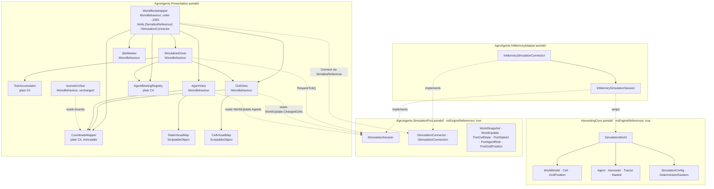

# Design Document

## Overview

This design turns `AgroAgents-RetoJohnDeere` into a pure view over `HarvestingCore`. The Unity project keeps prefab instantiation, materials, camera, interpolation, rotation smoothing, and debug controls. Everything that decides an outcome moves to the core, and the Unity implementations of those decisions are deleted.

Four constraints drive every decision below.

**The compiler enforces engine-agnosticism.** The core source is compiled inside the Unity project by an assembly definition with `noEngineReferences: true`. A stray `using UnityEngine;` in core source is a build error, not a review comment (Req 1.3).

**The compiler enforces the simulation boundary too.** Unity is a view over a *port*, not over `HarvestingCore` directly. The presentation assembly has no reference — transitive or otherwise — to the `HarvestingCore` assembly; it references only `AgroAgents.SimulationPort`, a small assembly of interfaces and mirrored value types with no dependency on the core and no dependency on Unity. A stray `using HarvestingCore;` anywhere under `Assets/Scripts/` is a `CS0246` for the same structural reason Req 1.3 already gives the engine boundary. This is what makes the in-memory implementation swappable for a future networked one without touching presentation code — the seam is compiled in, not maintained by convention. This is a late addition to the design, driven by the near-term plan to add a WebSocket-backed simulation; see Decision B1 and the new "Port and Adapter" component section below.

**Presentation is a projection, never a fork.** The presentation assembly performs exactly one mutating operation in steady state, `ISimulationSession.RequestTick()`. Everything else is a read of the immutable snapshot the port delivers — the `WorldSnapshot` captured once at connect time, and a `WorldUpdate` event raised after every tick (Req 2.1 - 2.5).

**Simulated time is integer ticks; rendered time is continuous.** The driver converts real seconds into a whole number of `RequestTick()` calls plus a fractional remainder, and the fractional remainder only ever reaches the renderer (Req 3, Req 5).

### Deliberate deferrals

Two requirement fragments are **not** satisfied by this design and are recorded here rather than hidden:

| Deferred | Why |
| --- | --- |
| Req 13.5 (preserve existing scene prefab, material, and camera assignments) | This is editor authoring work on `SimulationScene.unity` and prefab assets. The design defines the serialized field surface that authoring targets; re-wiring the scene is a manual step outside the code contract. |
| Req 7.3 / 7.8 prefab-instantiation *authoring* (which crop and obstacle prefabs, variant lists, material assets) | The design fixes the `CellState` → visual contract and the serialized fields that hold it. Selecting and assigning the actual assets is authoring work. |

Everything else in the requirements document is addressed; see the traceability table at the end.

### Rejected alternative for the whole approach

Shipping `HarvestingCore.dll` as a precompiled binary into `Assets/Plugins/` was rejected: it satisfies Req 1.2 trivially but breaks the debugger stepping into core code, makes the core version implicit in a binary blob, and requires a build step before every Unity run. Source-in-project keeps one editable truth.

### Rejected alternative for the port boundary

Letting Presentation keep its direct reference to `HarvestingCore` and treating "the port" as a documented subset of `SimulationWorld`'s public surface (i.e. a convention: "only touch `Cells`, `Agents`, `Tick()`") was rejected. It is exactly what Requirement 2 already asked for and it is not enough for the stated goal: a future WebSocket adapter needs to *construct* a session differently (a handshake, not `GenerateGrid()`/`Register()`), and a convention has no way to intercept construction — only a reference boundary does. It also gives up the same guarantee the engine boundary relies on: nothing stops a later edit from reading `SimulationWorld.Agents[i].Path` directly because the compiler has no opinion. Since the project already treats "the compiler enforces it" as the standard for the engine boundary, the same standard is applied here.

---

## Architecture

### Decision A: how core source enters the Unity project

**Chosen:** git submodule **outside** `Assets/`, exposed to Unity as a **local UPM package** via a `file:` path in `Packages/manifest.json`.

```
AgroAgents-RetoJohnDeere/                     (Unity project root, git repo)
├── Packages/
│   └── manifest.json                         ← adds the file: dependency
├── External/
│   └── AgenticModel/                         ← git submodule of the core repo
│       ├── HarvestingCore.sln
│       ├── artifacts/                        ← NEW: dotnet bin/obj redirected here
│       └── src/
│           └── HarvestingCore/               ← THIS folder is the UPM package root
│               ├── package.json              ← NEW
│               ├── HarvestingCore.asmdef     ← NEW
│               ├── HarvestingCore.csproj     (ignored by Unity, used by dotnet build)
│               ├── World.cs
│               ├── Agents/ Configuration/ Coordination/ Pathfinding/ World/
│               └── (no bin/ no obj/ no __tests__/)
└── Assets/
    ├── Scripts/
    │   ├── Port/
    │   │   └── AgroAgents.SimulationPort.asmdef     ← NEW: interfaces + mirrored DTOs, no HarvestingCore ref
    │   ├── Adapters/
    │   │   └── InMemory/
    │   │       └── AgroAgents.InMemoryAdapter.asmdef ← NEW: references SimulationPort + HarvestingCore
    │   ├── AgroAgents.Presentation.asmdef    ← references SimulationPort ONLY (no HarvestingCore ref)
    │   ├── Simulation/  Views/  Mapping/  Authoring/
    │   └── CameraScripts/IsometricView.cs
    ├── Plugins/CsCheck/                      ← test-only PBT dependency
    └── Tests/EditMode/ , Tests/PlayMode/
```

**Why the port and the in-memory adapter both live under `Assets/Scripts/` rather than beside `HarvestingCore` in the submodule.** `AgroAgents.SimulationPort` has zero core knowledge and zero Unity knowledge — it could in principle live anywhere — but its only two consumers today are Unity assemblies, and putting it in the core submodule would wire the core repository's release cadence to a Unity-side concern it has no reason to know about. `AgroAgents.InMemoryAdapter` does reference `HarvestingCore`, but it is *presentation-side wiring*, not core logic: it is the thing that used to be half of `WorldBootstrapper.Awake` and all of `WorldBootstrapper.TryBuild`, relocated so that logic sits behind the port instead of in front of it. Both are plain C# with no Unity types beyond what the DTOs need (none, in the port's case), so a future project could lift `SimulationPort` out with no Unity dependency to break.

`Packages/manifest.json` gains:

```json
"com.agroagents.harvestingcore": "file:../External/AgenticModel/src/HarvestingCore"
```

The path is resolved relative to the `Packages` folder, so it may point outside the project. This is the documented behaviour of local `file:` packages; I have not run it in this project, so it is worth confirming on the first import.

`External/AgenticModel/src/HarvestingCore/package.json`:

```json
{
  "name": "com.agroagents.harvestingcore",
  "version": "0.1.0",
  "displayName": "Harvesting Core",
  "description": "Engine-agnostic multi-agent harvesting simulation core.",
  "unity": "6000.0"
}
```

Three small changes inside the core repo make this safe, and none of them touch core logic:

1. **Redirect MSBuild output** so `bin/` and `obj/` never sit in the package root. Unity compiles every `.cs` under a package, and `obj/` contains generated `HarvestingCore.AssemblyInfo.cs` and `.NETStandard,Version=v2.1.AssemblyAttributes.cs`, which would produce duplicate-attribute compile errors. Add to `HarvestingCore.csproj`:

   ```xml
   <PropertyGroup>
     <BaseOutputPath>$(MSBuildThisFileDirectory)../../artifacts/bin/</BaseOutputPath>
     <BaseIntermediateOutputPath>$(MSBuildThisFileDirectory)../../artifacts/obj/</BaseIntermediateOutputPath>
   </PropertyGroup>
   ```

   and `artifacts/` to the core `.gitignore`. `dotnet build HarvestingCore.sln` keeps working unchanged.
2. **Remove the empty `src/HarvestingCore/__tests__/` folder.** Core tests live in a sibling project (Decision I), so nothing under the package root is ever test source. If that folder is wanted back, it must be named `__tests__~`; Unity ignores folders with a trailing `~`.
3. Nothing else. `HarvestingCore.csproj` is imported by Unity as an inert `DefaultAsset` and is not compiled.

**Why not the alternatives:**

| Alternative | Rejected because |
| --- | --- |
| Submodule under `Assets/` | Unity writes a `.meta` file next to every file it imports, so the core repo's working tree is permanently dirty and every collaborator produces conflicting GUIDs inside a repo that is not theirs. Packages outside the project get no `.meta` files. Also compiles `obj/`-generated `.cs`. |
| Symlink into `Assets/` | Not portable: needs Developer Mode or admin on Windows, and git does not round-trip symlinks there. Unity's asset database has historically mis-tracked symlinked trees. |
| Copy step (script or CI) | Two copies of the same source, so it goes stale exactly when someone is in a hurry. Requires a guard job to detect drift, which is more machinery than the submodule it replaces. |

`AgenticModel` remains independently buildable: `dotnet build` from its own root sees only the `.sln` and `.csproj`; `package.json` and `.asmdef` are not `.cs` and not globbed.

### Decision B: assembly graph

`External/AgenticModel/src/HarvestingCore/HarvestingCore.asmdef`:

```json
{
  "name": "HarvestingCore",
  "rootNamespace": "HarvestingCore",
  "references": [],
  "includePlatforms": [],
  "excludePlatforms": [],
  "allowUnsafeCode": false,
  "overrideReferences": true,
  "precompiledReferences": [],
  "autoReferenced": false,
  "defineConstraints": [],
  "versionDefines": [],
  "noEngineReferences": true
}
```

`Assets/Scripts/AgroAgents.Presentation.asmdef`:

```json
{
  "name": "AgroAgents.Presentation",
  "rootNamespace": "AgroAgents.Presentation",
  "references": [
    "AgroAgents.SimulationPort"
  ],
  "includePlatforms": [],
  "excludePlatforms": [],
  "allowUnsafeCode": false,
  "overrideReferences": false,
  "precompiledReferences": [],
  "autoReferenced": true,
  "defineConstraints": [],
  "versionDefines": [],
  "noEngineReferences": false
}
```

`noEngineReferences: true` removes `UnityEngine.dll` and `UnityEngine.CoreModule.dll` from the compiler invocation for that assembly. A core file writing `Vector3` or `MonoBehaviour` therefore fails with `CS0246: The type or namespace name 'Vector3' could not be found`, which is exactly the unresolved-type error Req 1.3 asks for. `autoReferenced: false` means only assemblies that name `HarvestingCore` explicitly can see it, so Req 1.5's "no reference back" is structural: `references` is empty and asmdef references are not transitive upward.

**`AgroAgents.Presentation` no longer references `HarvestingCore` at all** — this is the change this revision makes. It references only `AgroAgents.SimulationPort` (Decision B1 below). Since Unity asmdef references are not transitive, referencing the port does not pull `HarvestingCore` in behind the scenes; a `using HarvestingCore;` anywhere under `Assets/Scripts/` (excluding the adapter folder, Decision B1) fails with `CS0246` for the same structural reason the engine boundary does.

**Test assemblies.** `Assets/Tests/EditMode/AgroAgents.Tests.EditMode.asmdef` and `Assets/Tests/PlayMode/AgroAgents.Tests.PlayMode.asmdef` reference `AgroAgents.Presentation`, `AgroAgents.SimulationPort`, and `AgroAgents.InMemoryAdapter` (the last one because tests need a concrete session to exercise the presentation layer against — see Testing Strategy), set `"defineConstraints": ["UNITY_INCLUDE_TESTS"]`, and take `precompiledReferences` on `nunit.framework.dll` and `CsCheck.dll` with `overrideReferences: true`. They are excluded from player builds by the define constraint, so the PBT dependency never ships. Note neither test asmdef references `HarvestingCore` directly; where a test needs to seed or inspect core state precisely (e.g. the determinism properties), it does so through `AgroAgents.InMemoryAdapter`'s test-only accessors rather than reaching past the adapter.

### Decision B1: the port and the in-memory adapter

**Chosen:** a third assembly, `AgroAgents.SimulationPort`, sits between `HarvestingCore` and `AgroAgents.Presentation`. It declares interfaces and DTOs only, has an empty `references` array, and `noEngineReferences: true` — the same engine barrier the core has, because the port must be constructible and testable in the fast `dotnet` host exactly like `TickAccumulator` is today.

`Assets/Scripts/Port/AgroAgents.SimulationPort.asmdef`:

```json
{
  "name": "AgroAgents.SimulationPort",
  "rootNamespace": "AgroAgents.SimulationPort",
  "references": [],
  "allowUnsafeCode": false,
  "overrideReferences": true,
  "precompiledReferences": [],
  "autoReferenced": false,
  "defineConstraints": [],
  "versionDefines": [],
  "noEngineReferences": true
}
```

A fourth assembly, `AgroAgents.InMemoryAdapter`, implements the port by wrapping `SimulationWorld`. It is the only assembly besides the test assemblies that references both `HarvestingCore` and `AgroAgents.SimulationPort`, and `AgroAgents.Presentation` does not reference it.

`Assets/Scripts/Adapters/InMemory/AgroAgents.InMemoryAdapter.asmdef`:

```json
{
  "name": "AgroAgents.InMemoryAdapter",
  "rootNamespace": "AgroAgents.InMemoryAdapter",
  "references": [
    "AgroAgents.SimulationPort",
    "HarvestingCore"
  ],
  "allowUnsafeCode": false,
  "overrideReferences": false,
  "precompiledReferences": [],
  "autoReferenced": true,
  "defineConstraints": [],
  "versionDefines": [],
  "noEngineReferences": false
}
```

**Wiring without a compile-time reference.** `WorldBootstrapper` needs an `ISimulationConnector` to open a session, but it cannot hold a field typed `InMemorySimulationConnector` — that would be exactly the reference the whole design exists to forbid. `ISimulationConnector` implementations are plain `[Serializable]` C# classes (not `MonoBehaviour`s, since a connector has no scene lifecycle of its own), and `WorldBootstrapper` holds one behind a `[SerializeReference]` field:

```csharp
[SerializeReference] private ISimulationConnector connector;
```

Unity's Inspector offers every `[Serializable]` type implementing `ISimulationConnector` found in *any* loaded assembly, regardless of whether `AgroAgents.Presentation` references that assembly at compile time — `[SerializeReference]` resolution happens through Unity's type cache, not through asmdef references. A designer picks `InMemorySimulationConnector` today; the day a `WebSocketSimulationConnector` assembly exists, it appears in the same dropdown with zero changes to `WorldBootstrapper` or any other presentation file. This is the concrete mechanism behind "Unity must not depend on its concrete implementation" — the dependency is resolved at the object-instance level, in an authored asset, never in source.

**Why not a factory `MonoBehaviour` per adapter, or a `ScriptableObject` picker?** A per-adapter factory component would work but adds a `MonoBehaviour` (with a scene presence) for something that has no per-frame behaviour and no lifecycle beyond "hold a reference"; `[SerializeReference]` gives the same designer-facing swap without the extra GameObject. A `ScriptableObject`-based picker was considered and rejected only because it would need one asset per environment (dev/in-memory vs. staging/networked) plus a resolution step to pick the right asset at startup — deferred complexity for a feature (environment-specific connection config) this design does not yet need; `[SerializeReference]` can be revisited in favour of it if the WebSocket adapter later needs authored connection settings (host, port, auth) that don't fit a single field.

### Component graph



The dashed edges from `PresAsm` reach only `PortAsm` types. `AdapterAsm` is a leaf that both `PortAsm` and `CoreAsm` feed into; nothing in `PresAsm` points at it, and nothing in `PortAsm` or `CoreAsm` points back up. This is the picture Requirement 2 and the ports-and-adapters goal both describe: Presentation depends on an abstraction, the abstraction depends on nothing, and exactly one concrete implementation today satisfies it by depending on the concrete core.

### One frame

```mermaid
sequenceDiagram
    participant U as Unity
    participant SD as SimulationDriver.Update
    participant TA as TickAccumulator
    participant ABR as AgentBindingRegistry
    participant SS as ISimulationSession
    participant GV as GridView
    participant AV as AgentView

    U->>SD: Update() with Time.unscaledDeltaTime
    SD->>TA: Advance(dt, speed, halted, paused)
    TA-->>SD: TickPlan { Count, Alpha }
    loop Count times (0..TickBudget)
        SD->>SS: RequestTick()
        SS-->>SD: UpdateReceived(WorldUpdate)  %% in-memory: fires before RequestTick returns
        SD->>ABR: ApplyUpdate(update)   %% previous <- last-known, current <- update.Agents
        SD->>GV: OnUpdateReceived(update)      %% apply update.ChangedCells against render cache
    end
    SD->>AV: Render(Alpha) for each bound view
    AV->>ABR: read PreviousSnapshot / CurrentSnapshot
    AV->>AV: lerp(prevWorld, currWorld, Alpha); RotateTowards
    Note over U: Unity renders
```

The ordering matters, and the port changes *how* the ordering is achieved without changing what it achieves. Where the direct-reference design snapshotted `Agent.Position` immediately before a mutating `Tick()` call, the port-based design instead relies on the adapter delivering one `WorldUpdate` per `RequestTick()`: `AgentBindingRegistry.ApplyUpdate` shifts its currently-held snapshot into "previous" and installs the new one as "current," in the `UpdateReceived` handler, so the previous/current pair always brackets exactly one tick regardless of whether the session completed it synchronously (in-memory, today) or asynchronously (a future remote adapter). `GridView` diffs `WorldUpdate.ChangedCells` — a list the adapter already computed — rather than re-deriving a diff against the full grid itself, which also removes the presentation-side shadow array described in the old Decision E; see the updated Decision E below. Compute alpha **before** the tick loop is wrong and **after** it is right, unchanged from before: alpha must reflect the accumulator remainder that survives the loop. And render views last, in the same `Update`, so no frame is ever rendered with a stale alpha.

**What happens when `RequestTick()` does not complete synchronously.** The in-memory adapter always raises `UpdateReceived` before `RequestTick()` returns, so the loop above executes exactly as written for this release. A future remote adapter could instead return immediately and raise `UpdateReceived` on a later frame; `SimulationDriver`'s loop is written as "call `RequestTick` up to `TickCount` times, and separately react to `UpdateReceived` whenever it arrives" rather than "call `RequestTick` and assume the update," precisely so that swap does not require rewriting the loop — only the adapter's timing changes. This is elaborated in Decision D.

---

## Components and Interfaces

Namespace roots: `AgroAgents.Presentation` for the presentation types below; `AgroAgents.SimulationPort` for the port interfaces and DTOs; `AgroAgents.InMemoryAdapter` for the one adapter this release ships.

### Port interfaces and DTOs (`AgroAgents.SimulationPort`, no Unity, no `HarvestingCore`)

This is the abstraction every presentation component below is written against. Every value type here is a mirror of a `HarvestingCore` type, not a reuse of it — see Data Models for why.

```csharp
public readonly struct PortGridPosition { public int X { get; } public int Y { get; } }

public enum PortCellState { Empty, Crop, Blocked, Harvested }
public enum PortStateId   { Idle, Harvest, GoToRefuel, GoToDump, GoToMeetingPoint, WaitTractor, WaitHarvester, Inactive }
public enum PortAgentRole { Harvester, Tractor }
public enum PortHeuristicKind { Zero, Octile, SquaredEuclidean }   // mirrors HarvestingCore.Configuration.HeuristicKind, same ordinals

public readonly struct PortCellSnapshot { public PortGridPosition Position { get; } public PortCellState State { get; } }

public readonly struct PortAgentSnapshot
{
    public string Id { get; } public PortAgentRole Role { get; } public PortGridPosition Position { get; }
    public PortStateId CurrentState { get; } public int Fuel { get; } public int Load { get; } public int MaxLoad { get; }
    public bool PathInvalidatedThisTick { get; } public PortGridPosition? MeetingPoint { get; }
}

/// Captured once, immediately after Connect completes. Req 2.1, 2.2 read this and
/// WorldUpdate exclusively; nothing else is an authoritative read surface.
public readonly struct WorldSnapshot
{
    public int Width { get; } public int Height { get; }
    public IReadOnlyList<PortCellSnapshot> Cells { get; }             // full grid, row-major
    public IReadOnlyList<PortAgentSnapshot> Agents { get; }           // ordinal-id order
    public IReadOnlyList<PortGridPosition> RefuelStations { get; }
    public IReadOnlyList<PortGridPosition> DumpSites { get; }
    public long TickIndex { get; } public int DischargedTotal { get; } public bool IsHalted { get; }
}

/// Raised once per completed tick. Req 2.4's "exactly one mutating operation" is
/// RequestTick; this is the read that follows it.
public readonly struct WorldUpdate
{
    public long TickIndex { get; }
    public IReadOnlyList<PortCellSnapshot> ChangedCells { get; }     // only cells whose State changed this tick
    public IReadOnlyList<PortAgentSnapshot> Agents { get; }          // full list; agent counts are small
    public int DischargedTotal { get; } public bool IsHalted { get; }
}

public sealed class PortAgentSpec
{
    public string Id { get; } public PortAgentRole Role { get; } public PortGridPosition Start { get; }
    public int? MaxLoad { get; } public int? MaxFuel { get; } public int? FuelConsumption { get; }
}

/// Everything a connector needs to open a session. One shape for every adapter;
/// an adapter uses the subset it understands (Decision B1, Decision G').
public sealed class SessionRequest
{
    public int Width { get; } public int Height { get; } public int Seed { get; }
    public double CropDensity { get; } public double BlockedDensity { get; }
    public string AuthoredGridText { get; }                          // null when generating
    public IReadOnlyList<PortGridPosition> RefuelStations { get; }
    public IReadOnlyList<PortGridPosition> DumpSites { get; }
    public IReadOnlyList<PortAgentSpec> Agents { get; }               // sorted by ordinal id
    public int CropCost { get; } public int EmptyCost { get; } public int HarvestedCost { get; }
    public int HeuristicKind { get; }                                 // mirrors HarvestingCore.HeuristicKind, int-backed
    public int DefaultMaxLoad { get; } public int DefaultMaxFuel { get; } public int DefaultFuelConsumption { get; }
    public double DumpPreferenceFactor { get; } public double CapacityFactor { get; }
    public double HarvesterFuelReserveMultiplier { get; } public double TractorFuelReserveMultiplier { get; }
}

/// The live handle to a running simulation. RequestTick is the presentation
/// assembly's only mutating call (Req 2.4); everything else is a read of the
/// InitialSnapshot or of the most recent WorldUpdate.
public interface ISimulationSession : IDisposable
{
    WorldSnapshot InitialSnapshot { get; }

    /// In-memory: synchronous — calls SimulationWorld.Tick() and raises
    /// UpdateReceived before this call returns. A remote session is free to
    /// return immediately and raise UpdateReceived on a later frame; callers
    /// must not assume synchronous delivery (see SimulationDriver, Decision D').
    void RequestTick();

    event Action<WorldUpdate> UpdateReceived;
}

/// Opens a session from a SessionRequest. The in-memory adapter is the sole
/// implementation today; the seam a future WebSocket adapter fills.
public interface ISimulationConnector
{
    ISimulationConnection Connect(SessionRequest request);
}

/// A handle to an in-flight or completed connection attempt. Poll() is called
/// once per frame by WorldBootstrapper until IsComplete; the in-memory adapter
/// completes on its first Poll(), so this release resolves within one Awake.
public interface ISimulationConnection
{
    bool IsComplete { get; }
    bool Failed { get; }
    string Error { get; }                          // valid once Failed
    IReadOnlyList<string> Warnings { get; }         // valid once IsComplete; non-fatal issues (Req 11.7, 10.1/10.2 soft path)
    ISimulationSession Session { get; }             // valid once IsComplete && !Failed
    void Poll();
}
```

`RequestTick` and `UpdateReceived` replace `SimulationWorld.Tick()` and the direct reads of `SimulationWorld.Cells`/`SimulationWorld.Agents` everywhere in this document. Where earlier revisions of this design said "reads `SimulationWorld.Cells`", read that as "reads `WorldSnapshot.Cells` or the latest `WorldUpdate.Agents`" from here on; the Data Models section keeps a table of the exact mapping.

### InMemorySimulationConnector / InMemorySimulationSession (`AgroAgents.InMemoryAdapter`)

The one implementation of the port this release ships. It is where every line of the old `WorldBootstrapper.TryBuild` and the world-construction half of Decision G now lives — `WorldModel` generation or parsing, `SimulationConfig` construction, `DeterministicRandom`, agent validation and registration, and the single `RedistributeAreas()` call. None of that logic changed; only its address did, so that a future remote adapter can replace it wholesale without touching anything upstream.

```csharp
[Serializable]
public sealed class InMemorySimulationConnector : ISimulationConnector
{
    public ISimulationConnection Connect(SessionRequest request);
}

/// Completes synchronously on its first Poll(): builds SimulationConfig,
/// DeterministicRandom, the WorldModel (generated or parsed), validates and
/// registers agents in sorted order, calls RedistributeAreas() once, and wraps
/// the result in an InMemorySimulationSession — or fails with the same message
/// shapes Decision G' and Error Handling specify.
internal sealed class InMemorySimulationConnection : ISimulationConnection
{
    public bool IsComplete { get; private set; }   // true immediately after the first Poll()
    public bool Failed { get; private set; }
    public string Error { get; private set; }
    public IReadOnlyList<string> Warnings { get; private set; }
    public ISimulationSession Session { get; private set; }
    public void Poll();

    /// Unity-free, testable in the dotnet host. Returns null and fills `error`
    /// instead of throwing — the same contract WorldBootstrapper.TryBuild had.
    internal static SimulationWorld TryBuildWorld(SessionRequest request, out string error, out List<string> warnings);
}

/// Wraps one SimulationWorld. Translates HarvestingCore types to the mirrored
/// port DTOs on every read; owns no Unity type and no mutable state beyond the
/// wrapped world and the last-published DischargedTotal/IsHalted.
internal sealed class InMemorySimulationSession : ISimulationSession
{
    private readonly SimulationWorld _world;

    public WorldSnapshot InitialSnapshot { get; }
    public event Action<WorldUpdate> UpdateReceived;

    public void RequestTick()
    {
        var before = SnapshotCellStates();      // for the ChangedCells diff below
        _world.Tick();
        var changed = DiffCellStates(before);
        UpdateReceived?.Invoke(new WorldUpdate(_world.TickIndex, changed, MapAgents(_world.Agents),
                                                _world.DischargedTotal, _world.IsHalted));
    }

    public void Dispose() { }   // no unmanaged resources; present for a future adapter that owns a socket
}
```

`ChangedCells` is computed here, inside the adapter, rather than by `GridView` polling a full grid every tick — the adapter is the party that actually knows what changed (it has both the before and after state right around the mutating call), and computing the diff once centrally means `GridView`'s render-cache logic from the old Decision E is no longer needed at all; see the updated Decision E below.

**Where the mirroring happens, concretely.** `MapAgents`, `SnapshotCellStates`, and the reverse direction (`PortGridPosition` → `HarvestingCore.GridPosition`, `PortAgentSpec` → `AgentRole`-specific `Harvester`/`Tractor` construction) live entirely inside `AgroAgents.InMemoryAdapter`. Nothing upstream of the port ever sees a `HarvestingCore` type.

### TickAccumulator (plain C#, `AgroAgents.Presentation.Simulation`)

Extracted from the MonoBehaviour so the whole of Requirement 3 and 4 is testable without a frame loop.

```csharp
public readonly struct TickPlan
{
    public int TickCount { get; }        // ticks to execute this frame, 0..TickBudget
    public float InterpolationAlpha { get; }  // [0,1], accumulator / interval after the loop
    public bool Clamped { get; }         // true when Req 3.6 clamping fired
}

public sealed class TickAccumulator
{
    public TickAccumulator(float tickRate, int tickBudget, float speedMultiplier, bool startPaused);

    public float TickRate { get; set; }            // setter: rejects <= 0, retains previous (Req 3.2)
    public int TickBudget { get; set; }            // setter: rejects < 1, retains previous
    public float SpeedMultiplier { get; set; }     // setter: rejects <= 0, retains previous (Req 4.5)
    public bool IsPaused { get; set; }
    public float TickInterval { get; }             // 1f / TickRate
    public float Accumulated { get; }              // exposed read-only for tests and HUD

    /// Pure function of (state, deltaSeconds, halted). Mutates only the accumulator.
    public TickPlan Advance(float deltaSeconds, bool halted);

    /// Req 4.2: returns 1 when paused, 0 otherwise. Does not touch the accumulator.
    public int RequestSingleStep();

    public void Reset();
}
```

`Advance` never calls `Tick()` itself; it returns a count. That is what makes it host-free.

### SimulationDriver (MonoBehaviour, `AgroAgents.Presentation.Simulation`)

Owns the single `ISimulationSession` (Req glossary, Assumption 3, updated). Nothing else in the project holds a reference to the session, and nothing in this class or below it ever names `SimulationWorld`.

```csharp
[DisallowMultipleComponent]
public sealed class SimulationDriver : MonoBehaviour
{
    public ISimulationSession Session { get; private set; }
    public CoordinateMapper Mapper { get; private set; }
    public AgentBindingRegistry Bindings { get; private set; }
    public TickAccumulator Accumulator { get; }
    public float InterpolationAlpha { get; private set; }
    public bool IsPaused { get; set; }
    public int DischargedTotal { get; private set; }   // Req 2.6, updated from the latest WorldUpdate

    /// Called once by WorldBootstrapper after ISimulationConnection.IsComplete.
    /// Enables the component and subscribes to session.UpdateReceived; before
    /// this the component is disabled so Update never sees a null session.
    public void Initialize(ISimulationSession session, CoordinateMapper mapper,
                          AgentBindingRegistry bindings, GridView gridView);

    public void StepOneTick();          // Req 4.2
    public void SetTickRate(float value);       // Req 3.1, 3.2
    public void SetSpeedMultiplier(float value);// Req 4.4, 4.5, 4.6

    private void Update();              // the loop below
    private void OnUpdateReceived(WorldUpdate update);   // Bindings.ApplyUpdate + GridView.OnUpdateReceived + DischargedTotal/IsHalted refresh
}
```

### CoordinateMapper (plain C#, immutable, `AgroAgents.Presentation.Mapping`)

Not a MonoBehaviour: it has no per-frame work and no lifecycle, and making it a plain immutable value removes any chance of two mappers disagreeing. Its authored inputs live on `WorldBootstrapper`.

```csharp
public sealed class CoordinateMapper
{
    public Vector3 GridOrigin { get; }
    public float TileSize { get; }
    public int Width { get; }
    public int Height { get; }

    public CoordinateMapper(Vector3 gridOrigin, float tileSize, int width, int height);

    public Vector3 ToWorld(PortGridPosition p);                  // Req 6.1
    public Vector3 ToWorld(PortGridPosition p, float height);    // convenience for agent/content Y
    public bool TryToGrid(Vector3 world, out PortGridPosition p); // Req 6.2, 6.5
    public bool InBounds(PortGridPosition p);
    public Vector3 GridCentreWorld { get; }                  // used by IsometricView
}
```

`ToWorld` is `GridOrigin + new Vector3(p.X * TileSize, 0f, p.Y * TileSize)`, verbatim from Req 6.1. `TryToGrid` uses `Mathf.RoundToInt` on the local x/z divided by `TileSize`, returning `false` without producing a `PortGridPosition` when the rounded cell is outside `[0,Width) x [0,Height)`. `CoordinateMapper` operates purely on the port's `PortGridPosition` — it already had no `HarvestingCore` dependency beyond that one type, so this change is a rename at the signature level, not a behaviour change, and it is what lets `CoordinateMapper` sit in `AgroAgents.Presentation` without that assembly referencing `HarvestingCore`.

### WorldBootstrapper (MonoBehaviour, `AgroAgents.Presentation.Authoring`)

`BootstrapRequest`/`AgentSpec` and `TryBuild` are gone from this class — that logic moved to `AgroAgents.InMemoryAdapter.InMemorySimulationConnection.TryBuildWorld` (previous section), because construction is now adapter-specific by design. `WorldBootstrapper` builds a `SessionRequest` (the port DTO, adapter-agnostic) and drives the connect handshake to completion; it no longer builds a `SimulationConfig`, a `WorldModel`, or a `SimulationWorld` itself.

```csharp
[DefaultExecutionOrder(-1000)]
[DisallowMultipleComponent]
public sealed class WorldBootstrapper : MonoBehaviour
{
    [SerializeReference] private ISimulationConnector connector;   // Decision B1: no compile-time adapter reference

    public bool InitializationFailed { get; private set; }
    public ISimulationSession Session { get; private set; }
    public CoordinateMapper Mapper { get; private set; }

    private void Awake();       // builds the SessionRequest, calls connector.Connect, starts polling
    private void Update();      // polls the pending ISimulationConnection until IsComplete, then finishes bootstrap (see Decision G')
}
```

### AgentBindingRegistry (plain C#, `AgroAgents.Presentation.Simulation`)

Holds the Agent_Binding of Req 9.3 and the previous/current snapshot pair of Req 5.1. No longer holds a live `Agent` reference — there is no `Agent` type available to it, since this assembly does not reference `HarvestingCore`. It holds two `PortAgentSnapshot` values per binding instead, replaced wholesale on every `WorldUpdate`.

```csharp
public sealed class AgentBindingRegistry
{
    public IReadOnlyList<AgentBinding> Bindings { get; }   // ordinal-id order
    public bool TryGet(string agentId, out AgentBinding binding);

    public void Add(AgentBinding binding);
    /// Req 5.1, 5.6: for each binding, shifts CurrentSnapshot into
    /// PreviousSnapshot, then installs the matching entry of update.Agents as
    /// the new CurrentSnapshot. Called once from SimulationDriver.OnUpdateReceived,
    /// replacing the old "snapshot before Tick()" step — the port delivers
    /// before/after atomically per update instead of the registry having to
    /// catch the core mid-mutation.
    public void ApplyUpdate(WorldUpdate update);
}

public sealed class AgentBinding
{
    public string AgentId { get; }
    public AgentView View { get; }
    public PortAgentSnapshot PreviousSnapshot { get; internal set; }
    public PortAgentSnapshot CurrentSnapshot { get; internal set; }
    public PortGridPosition PreviousPosition => PreviousSnapshot.Position;
    public PortGridPosition CurrentPosition => CurrentSnapshot.Position;
}
```

### GridView (MonoBehaviour, `AgroAgents.Presentation.Views`)

The render-cache diffing from the old Decision E moves into the adapter (previous section: `InMemorySimulationSession.RequestTick` computes `ChangedCells` itself). `GridView` becomes a consumer of an already-computed diff rather than a computer of one.

```csharp
[DisallowMultipleComponent]
public sealed class GridView : MonoBehaviour
{
    public void Initialize(WorldSnapshot snapshot, CoordinateMapper mapper);  // Req 7.1 - 7.3
    /// Applies update.ChangedCells directly; no polling, no local diff. Req 7.4, 7.5.
    public void OnUpdateReceived(WorldUpdate update);
    public PortCellState RenderedStateAt(int flatIndex);   // test seam only
}
```

### AgentView (MonoBehaviour, `AgroAgents.Presentation.Views`)

```csharp
[DisallowMultipleComponent]
public sealed class AgentView : MonoBehaviour
{
    public string AgentId { get; }
    public PortAgentRole Role { get; }
    public PortGridPosition AuthoredStart { get; }   // from the serialized Vector2Int
    public bool IsBound { get; }

    public void Bind(AgentBinding binding, CoordinateMapper mapper);
    /// Req 9.6: logs one warning naming the id, renders nothing thereafter.
    public void MarkUnbound();
    /// Req 5.2 - 5.9, 8.2 - 8.4. Reads the binding's snapshots, writes only
    /// transform, renderer material, and label text. Calls no port method.
    public void Render(float interpolationAlpha, float deltaTime);
}
```

### StateVisualMap / CellVisualMap (ScriptableObject, `AgroAgents.Presentation.Views`)

ScriptableObjects because both maps are shared across many views and belong in version control as assets rather than duplicated per prefab.

```csharp
[CreateAssetMenu(menuName = "AgroAgents/State Visual Map")]
public sealed class StateVisualMap : ScriptableObject
{
    public bool TryGet(PortStateId state, out StateVisual visual);   // Req 8.1
    public StateVisual Fallback { get; }                             // Req 8.5
    public IReadOnlyList<PortStateId> MissingStates();                // editor validation
}

[Serializable] public struct StateVisual { public PortStateId State; public Material Material; public Color Tint; public GameObject Badge; }

[CreateAssetMenu(menuName = "AgroAgents/Cell Visual Map")]
public sealed class CellVisualMap : ScriptableObject
{
    public bool TryGet(PortCellState state, out CellVisual visual);  // Req 7.6
    public CellVisual Fallback { get; }
}

[Serializable] public struct CellVisual { public PortCellState State; public Material FloorMaterial; public GameObject ContentPrefab; public GameObject[] ContentVariants; }
```

### SiteMarker (MonoBehaviour, `AgroAgents.Presentation.Authoring`)

```csharp
public enum SiteKind { Refuel, Dump }   // presentation-only, no core counterpart to duplicate

public sealed class SiteMarker : MonoBehaviour
{
    public SiteKind Kind { get; }
    /// Req 10.1 - 10.3: resolves through the mapper, or returns the explicit cell.
    public bool TryResolveCell(CoordinateMapper mapper, out PortGridPosition cell);
}
```

### IsometricView

Survives intact, with `gridManager` swapped for `WorldBootstrapper` (or the `CoordinateMapper` it exposes) so it reads `Width`, `Height`, `TileSize` from the mapper instead of the deleted `GridManager`.

---

## Serialized Field Surface

This is the authoring contract. Every field is `private` with `[SerializeField]`; public access is through the properties listed above.

### `WorldBootstrapper`

| Field | Type | Attributes | Default |
| --- | --- | --- | --- |
| `connector` | `ISimulationConnector` | `[Header("Connection")]` `[SerializeReference]` `[Tooltip("Which simulation implementation to open a session against. Only InMemorySimulationConnector ships in this release; the field exists so a future connector needs no code change here.")]` | none (required) |
| `simulationDriver` | `SimulationDriver` | `[Header("Wiring")]` `[Tooltip("Explicit reference. No FindObjectOfType anywhere in this project.")]` | none (required) |
| `gridView` | `GridView` | | none (required) |
| `agentViews` | `AgentView[]` | `[Tooltip("Authored list. Registration order is derived by sorting these by ordinal id, so drag order does not affect the simulation.")]` | empty |
| `siteMarkers` | `SiteMarker[]` | | empty |
| `gridOrigin` | `Transform` | `[Header("Grid")]` `[Tooltip("World position of GridPosition(0,0). Null falls back to this transform.")]` | `null` |
| `gridWidth` | `int` | `[Range(1, 512)]` | `32` |
| `gridHeight` | `int` | `[Range(1, 512)]` | `32` |
| `tileSize` | `float` | `[Min(0.0001f)]` | `1f` |
| `worldSource` | `WorldSource` | `[Header("World source")]` `[Tooltip("Generated fills SessionRequest.AuthoredGridText = null; AuthoredText fills it with the parsed text. The chosen connector decides what that means — the in-memory adapter maps Generated to GenerateGrid() and AuthoredText to WorldModel.Parse, per Decision G'.")]` | `WorldSource.Generated` |
| `authoredGrid` | `TextAsset` | `[Tooltip("Char grid: '.' empty, 'W' crop, '#' blocked, '_' harvested. Used only when worldSource is AuthoredText.")]` | `null` |
| `seed` | `int` | `[Header("Determinism")]` `[Tooltip("Copied into SessionRequest.Seed.")]` | `20240101` |
| `cropDensity` | `float` | `[Header("Grid generation")]` `[Range(0f, 1f)]` | `0.55f` |
| `blockedDensity` | `float` | `[Range(0f, 1f)]` | `0.10f` |
| `cropCost` | `int` | `[Header("Terrain costs")]` `[Min(1)]` | `1` |
| `emptyCost` | `int` | `[Min(1)]` | `2` |
| `harvestedCost` | `int` | `[Min(1)]` | `10` |
| `heuristic` | `PortHeuristicKind` | `[Tooltip("Port enum, mirrors HarvestingCore.Configuration.HeuristicKind by ordinal. Int-backed, so Unity serializes it directly, same as the core enum did before the port existed.")]` | `PortHeuristicKind.Octile` |
| `defaultMaxLoad` | `int` | `[Header("Agent defaults")]` `[Min(1)]` | `100` |
| `defaultMaxFuel` | `int` | `[Min(1)]` | `1000` |
| `defaultFuelConsumption` | `int` | `[Min(1)]` | `1` |
| `dumpPreferenceFactor` | `float` | `[Header("Coordination tunables")]` `[Min(0f)]` | `1f` |
| `capacityFactor` | `float` | `[Range(0f, 1f)]` | `0.5f` |
| `harvesterFuelReserveMultiplier` | `float` | `[Min(0f)]` | `1.2f` |
| `tractorFuelReserveMultiplier` | `float` | `[Min(0f)]` | `2.5f` |

`enum WorldSource { Generated, AuthoredText }` is presentation-only.

The `[Range]` and `[Min]` attributes mirror `SimulationConfig`'s own validation ranges exactly, which is the point: the inspector cannot author an individually invalid value. This table's shape is otherwise unchanged from before the port was introduced — `WorldBootstrapper` still owns every authored tunable — but the fields now flow into a `SessionRequest` instead of directly into a `SimulationConfig`, and the class that owns the cross-field validation (`cropDensity + blockedDensity > 1.0`, the constraint no attribute can express) is `InMemorySimulationConnection.TryBuildWorld`, not `WorldBootstrapper`. `WorldBootstrapper.Awake` surfaces whatever error or warning list `ISimulationConnection` reports once `IsComplete`; it does not itself call anything named `SimulationConfig` or catch `ArgumentOutOfRangeException` any more — see Decision G'.

Unity serializes `float`, `SessionRequest` takes `double` for density and factor tunables, matching the `SimulationConfig` constructor's own parameter types one layer down. Conversion is a single explicit widening at `SessionRequest` construction inside `WorldBootstrapper.Awake`, and the widened value is what determinism is defined against: `(double)0.55f` is stable, so two runs with the same authored float produce the same config.

### `SimulationDriver`

| Field | Type | Attributes | Default |
| --- | --- | --- | --- |
| `tickRate` | `float` | `[Header("Tick")]` `[Min(0.0001f)]` `[Tooltip("Ticks per second of unscaled real time.")]` | `4f` |
| `tickBudget` | `int` | `[Range(1, 64)]` `[Tooltip("Maximum Tick() calls in one Unity frame.")]` | `4` |
| `speedMultiplier` | `float` | `[Min(0.0001f)]` `[Tooltip("Scales simulation time only. Never affects per-tick outcomes.")]` | `1f` |
| `startPaused` | `bool` | | `false` |
| `pauseKey` | `KeyCode` | `[Header("Debug controls")]` | `KeyCode.P` |
| `stepKey` | `KeyCode` | `[Tooltip("Advances exactly one tick while paused.")]` | `KeyCode.Period` |

`OnValidate` pushes `tickRate`, `tickBudget`, and `speedMultiplier` through the `TickAccumulator` setters, which reject non-positive values and retain the previous one (Req 3.2, 4.5) rather than silently clamping.

### `AgentView`

| Field | Type | Attributes | Default |
| --- | --- | --- | --- |
| `agentId` | `string` | `[Header("Binding")]` `[Tooltip("Unique within the scene. Becomes the PortAgentSpec.Id, and from there whatever id the connected adapter registers.")]` | `""` |
| `role` | `PortAgentRole` | `[Tooltip("Port enum, mirrors HarvestingCore.AgentRole. Harvester and Tractor map 1:1 in the in-memory adapter.")]` | `PortAgentRole.Harvester` |
| `startCell` | `Vector2Int` | `[Tooltip("X = column, Y = row, core top-left origin. PortGridPosition is a readonly struct with get-only properties and no [SerializeField], so Unity cannot serialize it; this Vector2Int is the surrogate and is converted to a PortGridPosition at bootstrap.")]` | `(0, 0)` |
| `overrideCapacities` | `bool` | `[Header("Capacity overrides")]` `[Tooltip("Off means the SimulationConfig defaults apply.")]` | `false` |
| `maxLoad` | `int` | `[Min(1)]` | `100` |
| `maxFuel` | `int` | `[Min(1)]` | `1000` |
| `fuelConsumption` | `int` | `[Min(1)]` | `1` |
| `stateVisualMap` | `StateVisualMap` | `[Header("Visuals")]` | none (required) |
| `bodyRenderer` | `Renderer` | `[Tooltip("Renderer whose material the State_Visual_Map drives.")]` | none |
| `badgeAnchor` | `Transform` | | `null` |
| `heightOffset` | `float` | `[Tooltip("Added to world Y so the model rests on the tile surface.")]` | `0f` |
| `rotationSpeed` | `float` | `[Header("Rotation smoothing")]` `[Min(0f)]` `[Tooltip("Degrees per second, yaw only.")]` | `720f` |
| `forwardOffsetY` | `float` | `[Range(-180f, 180f)]` `[Tooltip("Yaw correction for models whose forward axis is not +Z. Preserved from the deleted AgentController.")]` | `0f` |
| `statusLabel` | `UnityEngine.UI.Text` | `[Header("Readouts")]` `[Tooltip("Optional. Shows Fuel and Load / MaxLoad read from the bound AgentBinding's PortAgentSnapshot.")]` | `null` |

`PortGridPosition` is `readonly struct` with get-only auto-properties and no serialization attributes, so Unity's serializer sees no fields it can write. `Vector2Int` is the surrogate; conversion is `new PortGridPosition(startCell.x, startCell.y)` inside `WorldBootstrapper.Awake` when building each `PortAgentSpec`. Nothing else in the project stores a `PortGridPosition` in a serialized field. The in-memory adapter performs the second conversion, `PortGridPosition` → `HarvestingCore.GridPosition`, entirely inside `AgroAgents.InMemoryAdapter`; `WorldBootstrapper` never constructs a core `GridPosition`.

`moveSpeed` and `arrivalTolerance` from the old `AgentController` are **gone**: motion is now fully determined by the tick boundary and the alpha, so a separate speed would let the view arrive early or late.

### `SiteMarker`

| Field | Type | Attributes | Default |
| --- | --- | --- | --- |
| `kind` | `SiteKind` | `[Tooltip("Refuel station or dump site. Passed to SessionRequest.RefuelStations or DumpSites.")]` | `SiteKind.Refuel` |
| `useExplicitCell` | `bool` | `[Tooltip("Off resolves the cell from this transform's world position via the Coordinate_Mapper.")]` | `false` |
| `explicitCell` | `Vector2Int` | | `(0, 0)` |

### `GridView`

| Field | Type | Attributes | Default |
| --- | --- | --- | --- |
| `floorPrefab` | `GameObject` | `[Header("Prefabs")]` `[Tooltip("One instance per Cell in WorldSnapshot.Cells.")]` | none (required) |
| `cellVisualMap` | `CellVisualMap` | | none (required) |
| `refuelMarkerPrefab` | `GameObject` | `[Tooltip("Rendered at each WorldSnapshot.RefuelStations position.")]` | `null` |
| `dumpMarkerPrefab` | `GameObject` | | `null` |
| `floorParent` | `Transform` | `[Header("Hierarchy")]` `[Tooltip("Null parents floors to this transform.")]` | `null` |
| `contentParent` | `Transform` | | `null` |
| `contentYOffset` | `float` | `[Header("Rendering")]` | `0f` |
| `useSharedMaterial` | `bool` | `[Tooltip("On assigns sharedMaterial to avoid one material instance per tile.")]` | `true` |

Absent by requirement: `width`, `height`, `useRandomSeed`, `customSeed`, `obstacleChance`, `cropChance` (Req 12.3). Dimensions come from `WorldSnapshot.Width`/`Height`, passed in at `Initialize`.

### `StateVisualMap`

| Field | Type | Attributes | Default |
| --- | --- | --- | --- |
| `entries` | `StateVisual[]` | `[Header("Per-state visuals")]` `[Tooltip("One entry per PortStateId. Missing entries fall back and log once.")]` | 8 entries, one per `PortStateId` |
| `fallbackMaterial` | `Material` | `[Header("Fallback (Req 8.5)")]` | none (required) |
| `fallbackTint` | `Color` | | `Color.magenta` |

`StateVisual` fields: `state` (`PortStateId`), `material` (`Material`), `tint` (`Color`, default `Color.white`), `badge` (`GameObject`, default `null`).

### `CellVisualMap`

| Field | Type | Attributes | Default |
| --- | --- | --- | --- |
| `entries` | `CellVisual[]` | `[Tooltip("One entry per PortCellState. Exactly four.")]` | 4 entries |
| `fallbackFloorMaterial` | `Material` | `[Header("Fallback")]` | none (required) |

`CellVisual` fields: `state` (`PortCellState`), `floorMaterial` (`Material`), `contentPrefab` (`GameObject`, `null` allowed per Req 7.8), `contentVariants` (`GameObject[]`, empty).

---

## Decision D: the tick loop

**Chosen:** `Update()` with `Time.unscaledDeltaTime`.

Req 3.3 says "unscaled elapsed real time multiplied by the Speed_Multiplier", which rules out `Time.timeScale`: `timeScale` scales `Time.deltaTime` and the `FixedUpdate` cadence together, so the driver would be reading a value the engine had already scaled and then scaling it again. `FixedUpdate` also fires zero or several times per frame independently of rendering, so computing an alpha inside it means the alpha the renderer sees is up to one physics step stale. `Update` gives exactly one accumulator advance, one tick loop, and one alpha per rendered frame, which is what Req 5.3 describes. `Time.timeScale` stays at `1` and the project does not touch it, so any physics or animation in the scene is unaffected by the simulation speed control.

This section described `World.Tick()` called directly against a held `SimulationWorld`. With the port in place, `SimulationDriver` calls `Session.RequestTick()` instead, and reacts to `UpdateReceived` rather than reading `World.IsHalted`/`World.Agents` off a live object afterward. For the in-memory adapter, `RequestTick()` raises `UpdateReceived` before it returns, so the loop below observes each update synchronously, in order — which is why the pseudocode reads almost identically to the pre-port version. The one structural difference: `IsHalted` is now read from the most recent `WorldUpdate` (`_lastHalted`, updated by `OnUpdateReceived`) rather than from a live `World.IsHalted` property, because there is no live core object to ask.

```
SimulationDriver.Update():

    if Session == null:                   # bootstrapper failed or has not run
        return

    dt = Time.unscaledDeltaTime
    plan = Accumulator.Advance(dt, _lastHalted)

    ticks = plan.TickCount
    if pendingSingleStep > 0:             # StepOneTick while paused
        ticks = pendingSingleStep
        pendingSingleStep = 0

    for i in 0 .. ticks-1:
        Session.RequestTick()             # in-memory: OnUpdateReceived fires synchronously inside this call
        if _lastHalted:                   # Req 3.7: stop mid-loop; set by the OnUpdateReceived handler
            break

    InterpolationAlpha = plan.InterpolationAlpha
    for binding in Bindings.Bindings:
        binding.View.Render(InterpolationAlpha, dt)


SimulationDriver.OnUpdateReceived(update):        # subscribed once, in Initialize

    Bindings.ApplyUpdate(update)          # prev <- last current, current <- update.Agents (Req 5.1, 5.6)
    GridView.OnUpdateReceived(update)     # apply update.ChangedCells (Req 7.4)
    DischargedTotal = update.DischargedTotal
    _lastHalted = update.IsHalted


TickAccumulator.Advance(dt, halted):

    if halted:
        accumulated = 0                   # Req 3.7: no ticks, alpha settles to 0
        return TickPlan(0, 0f, false)

    if IsPaused:
        return TickPlan(0, accumulated / TickInterval, false)   # Req 4.1: accumulator untouched

    accumulated += dt * SpeedMultiplier                         # Req 3.3

    count = 0
    while accumulated >= TickInterval and count < TickBudget:    # Req 3.4
        accumulated -= TickInterval
        count += 1

    clamped = false
    if accumulated > TickInterval * TickBudget:                  # Req 3.6
        accumulated = TickInterval * TickBudget
        clamped = true

    alpha = Clamp01(accumulated / TickInterval)                  # Req 5.3
    return TickPlan(count, alpha, clamped)
```

Notes on the edge cases the requirements single out.

**Alpha is computed after the loop.** `plan.InterpolationAlpha` is derived from the accumulator remainder that survives the loop. Computing it before would render the frame one interval ahead of the state it just ticked into, giving a visible snap backwards on the next frame.

**Previous-position snapshot, now port-mediated.** In the core, `Agent.Position` has a private setter mutated in place by `Agent.Move`, so there was never a core-side history to read even before the port existed — that fact does not change. What changes is *who* captures the before/after pair. Previously `AgentBindingRegistry.SnapshotPositions()` had to run inside the loop, immediately before `World.Tick()`, precisely because `Agent.Position` was about to be mutated in place and there was no other moment to catch it. With the port, `InMemorySimulationSession.RequestTick()` already computes both the before-tick cell diff and the after-tick agent list on the adapter side of the boundary (previous section), and delivers them together in one `WorldUpdate`. So `AgentBindingRegistry.ApplyUpdate(update)` can run entirely *after* `RequestTick()` returns: it shifts each binding's current snapshot into `PreviousSnapshot` and installs `update.Agents[i]` as the new `CurrentSnapshot`, in one place, no longer required to race a live mutation. A frame that executes three ticks still leaves `PreviousSnapshot` at the position before the *third* tick, because `ApplyUpdate` runs once per `RequestTick()` call inside the loop — the rendered interpolation still covers only the final tick's transition, unchanged from before. Interpolating across three ticks would still need a queue of intermediate snapshots and would still render motion the model already finished, so that trade is preserved, not reconsidered.

**Paused.** `Advance` returns early with `TickCount == 0` and leaves `accumulated` alone (Req 4.1), so the alpha it reports is constant across frames and `AgentView.Render` produces a constant position (Req 5.9). Rendering continues because `Render` is outside the tick loop (Req 4.3). Step-one-tick sets `pendingSingleStep = 1` without touching the accumulator, executes one tick, and stays paused (Req 4.2).

**IsHalted flips.** `IsHalted` is `Manager.AllInactive()` on the core side, surfaced to the driver as `WorldUpdate.IsHalted` and cached in `_lastHalted`. On the tick where it becomes true, the loop breaks after processing that update, and the next `Advance` zeroes the accumulator and reports `alpha == 0`. Agents therefore render at their previous-tick position for exactly one frame and then settle. That is acceptable because Req 8.3 requires an `Inactive` agent to hold at its *current* `GridPosition`, and `AgentView.Render` special-cases `Inactive` by ignoring the alpha and rendering the current position directly. When `IsHalted` returns to false (it can, since `AllInactive` also requires a non-empty agent list, and agents never leave `Inactive`, so in practice it does not), the accumulator restarts from zero rather than from a stale value.

**Speed multiplier changes.** The setter writes only `SpeedMultiplier`; `accumulated` is untouched (Req 4.6). Since the multiplier scales the *input* to the accumulator and never the interval, the per-tick core state sequence is identical to an unscaled run with the same seed (Req 4.7) — the multiplier changes only when ticks happen in wall-clock time, never what a tick does.

---

## Decision E: cell state projection and change detection

`WorldModel.Cells` is an `IReadOnlyList<Cell>` of mutable `Cell` objects with no change event. Polling was the only mechanism available to `GridView` when `GridView` had direct read access to `SimulationWorld`. It no longer does — `GridView` reads only `WorldSnapshot` and `WorldUpdate`, both delivered by the port — so the question of *where* the diff is computed has moved.

**Chosen (revised): the diff is computed once, inside the adapter, and delivered as `WorldUpdate.ChangedCells`.** `InMemorySimulationSession.RequestTick()` holds the shadow array described below and produces the changed-cell list as part of the same call that invokes `SimulationWorld.Tick()`:

```csharp
// AgroAgents.InMemoryAdapter.InMemorySimulationSession
private PortCellState[] _lastPublishedState;      // render-adjacent cache, lives in the adapter now
```

`GridView` itself now holds no shadow array at all — it receives `update.ChangedCells`, a list the adapter already computed, and applies it. This is a deliberate move, not just a rename: the *reason* a diff needs computing is a rendering concern (avoid 1024 material reassignments and `Instantiate`/`Destroy` pairs per tick on a 32×32 grid), but the *place* the diff is cheapest to compute is wherever both the before-tick and after-tick cell states are already in hand — which, once the port owns the transition, is the adapter, not the view. Moving it also means a future remote adapter can choose a completely different strategy (e.g. the server computing and sending only the diff over the wire, never a full grid after the first snapshot) without `GridView` changing at all; had the diff logic stayed in `GridView` against a polled `Cells` property, a remote adapter would need to fake that property up to the same shape.

**Why the adapter-side cache does not violate Req 2.3.** Req 2.3 forbids storing a field that duplicates core state *as authoritative data*. `_lastPublishedState[i]` inside the adapter answers exactly one question: "what did I last report here?" It is never read to decide anything about the simulation — `SimulationWorld.Tick()` runs unconditionally regardless of its contents — and it exists behind the port boundary, in the one place that is explicitly allowed to know about `HarvestingCore.Cell`. The one and only read is the inequality `_lastPublishedState[i] != world.Model.Cells[i].State`, in which the core cell is the authority and the cached value is the stale copy being corrected before publishing. Deleting the array would change adapter cost and the size of `WorldUpdate.ChangedCells`, and nothing else — the same "cache, not source of truth" test the pre-port design applied to `GridView`'s array, now applied one layer down. `AgentBinding.PreviousSnapshot` is the same category on the presentation side, justified the same way: Req 5.1 mandates it, and it is a copy of a port DTO, never a core value.

The `PortCellState` → visual mapping table is in Data Models below.

**`TileState.Deteriorado` is dropped.** It encoded a second harvester pass over an already-harvested tile — `TileData.PassHarvester` walked `Normal → Cosechado → Deteriorado`. The core's `Cell` has a flat `CellState` with no such progression: `Cell.Harvest()` returns `false` on a non-`Crop` cell, so a second pass is a no-op and produces no new state. Nothing in the core distinguishes a cell visited once from one visited five times except `Cell.Popularity`, which is an internal cost signal, not a visual one. Mapping `Deteriorado` onto a `Popularity` threshold would invent a rule the requirements do not ask for and would make the view depend on a counter the core is free to change. So the concept is removed along with `TileState`, and `deterioradoMaterial` is unassigned from the scene.

**Prefab variety.** `contentVariants` may hold several crop or obstacle meshes. The chosen index must be a pure function of the cell index (`flatIndex % contentVariants.Length`), never `UnityEngine.Random`: the presentation assembly must not consume randomness that could be mistaken for, or drift with, the core's `IRandomSource`, and Req 12.8 requires that deleting the presentation scripts leaves the core sequence unchanged.

---

## Decision F: interpolation mechanics

`MoveOrder.Offsets` is confirmed eight-directional: `(0,1) (1,0) (-1,0) (0,-1) (-1,1) (-1,-1) (1,1) (1,-1)`, with `MoveOrder.Count == 8`.

**Diagonal speed.** A diagonal step covers `sqrt(2) ≈ 1.414` times the world distance of an orthogonal step in the same tick interval, so a diagonal tick renders as a 41% speed-up. **Accepted, not normalised.** Normalising would mean stretching the diagonal transition across more than one tick interval, which desynchronises the rendered position from the tick boundary and breaks Req 5.5 (alpha `1` must render at the current-tick cell). The core already prices this correctly for decisions — `HeuristicKind.Octile` is the default heuristic — so the visual speed-up is an honest depiction of a model in which a diagonal move costs the same tick as an orthogonal one. If it later reads badly, the fix belongs in the core's cost model, not in the view.

**No feedback into the model.** `AgentView.Render` writes only `transform.position`, `transform.rotation`, a `Renderer` material or colour, and label text. It calls no port method. The smoothed rotation is derived from the interpolated position delta, which is itself derived from two port snapshots, so the data flow is strictly core → adapter → port → view.

**Rotation smoothing.** Preserved from `AgentController.RotateTowardsMovement`, including the `forwardOffsetY` correction:

```csharp
Vector3 dir = currentWorld - previousWorld;   // tick-to-tick direction, not frame-to-frame
dir.y = 0f;
if (dir.sqrMagnitude > 1e-6f)
{
    Quaternion desired = Quaternion.LookRotation(dir) * Quaternion.Euler(0f, forwardOffsetY, 0f);
    transform.rotation = Quaternion.RotateTowards(transform.rotation, desired, rotationSpeed * deltaTime);
}
```

Using the tick-to-tick direction rather than the frame-to-frame position delta keeps the target yaw constant for the whole interval, so the turn is a smooth approach to a fixed heading instead of chasing a moving target. When the agent does not move, `dir` is zero and rotation is left alone, preserving the last heading.

**`PathInvalidatedThisTick` mid-interval.** The flag is set by `Agent.Move` when the next path cell turned out `Blocked`, and in that case `Move` returns without changing `Position`. So from the view's side the agent simply did not move that tick: `PreviousPosition == CurrentPosition`, and Req 5.7 already covers it — the rendered position is constant for every alpha. No special case is needed. `AgentView` may optionally surface the flag as a one-tick visual cue (a brief tint flash); that is decoration and reads a core `bool` without writing anything.

**Several ticks in one frame.** Intermediate snapshots are skipped, as described in Decision D: `ApplyUpdate` running once per `RequestTick()` call inside the loop means only the final tick's transition is interpolated. The agent visibly jumps the earlier cells. This is the correct trade for a catch-up frame — the model has already moved on, and rendering the skipped cells would put the view behind the model. The `TickBudget` of `4` bounds how far a jump can go.

**First tick, no previous position.** `AgentBinding.PreviousSnapshot` is initialised to a snapshot at the agent's authored start position at bind time, before any tick — `WorldBootstrapper` builds it from the matching entry of `WorldSnapshot.Agents` rather than from the raw authored `Vector2Int`, so `PreviousSnapshot` and `CurrentSnapshot` start out identical and both reflect whatever the connected session actually registered (which, for an out-of-bounds correction or a core-side default, could in principle differ from what was authored). So on the first frame `PreviousPosition == CurrentPosition` and the agent renders exactly at its bound start cell for any alpha. No null or sentinel case exists.

---

## Decision G': bootstrap, connect handshake, and agent binding

This decision replaces the pre-port Decision G. The ordered sequence is the same shape, but it now splits at the point where `SimulationWorld` used to get constructed: everything up to and including "build the request" happens in `WorldBootstrapper` (Unity-side, adapter-agnostic); everything from "build the WorldModel" through "call RedistributeAreas" moved into `InMemorySimulationConnection.TryBuildWorld` (previous section, adapter-side, `HarvestingCore`-aware); and a new polling step sits between them because `Connect` is not guaranteed synchronous.

`WorldBootstrapper` still carries `[DefaultExecutionOrder(-1000)]`, so its `Awake` runs before any other project component's `Awake`. `SimulationDriver`, `GridView`, and every `AgentView` are still authored **disabled**, or guard on a `_initialized` flag, and are still enabled by the bootstrapper at the end of the sequence. Nothing in the project calls `FindObjectOfType` or `FindObjectsOfType`. All references are authored `[SerializeField]`/`[SerializeReference]` links, which also makes a missing reference a null in the inspector rather than a silent runtime surprise.

**In `Awake`:**

1. Resolve `SiteMarker`s to `PortGridPosition`s through the mapper, sorted by row-major order (Decision H). Validate bounds and per-kind duplicates (Req 10.3, 10.4) — this pre-validation still happens on the Unity side, since it needs each marker's `GameObject` to name in an error, and no adapter receives a `GameObject`.
2. Sort the authored `agentViews` array by `string.CompareOrdinal(a.AgentId, b.AgentId)` and pre-validate: reject duplicate ids (Req 9.4); reject an empty or whitespace id. (Start-cell bounds/`Blocked` validation, Req 9.7, moves to step 5 below — the adapter is the party that actually knows the grid's cell states, since `Generated` mode does not know them until `GenerateGrid()` runs.)
3. Build a `SessionRequest` from every authored field (Serialized Field Surface table) plus the sorted, validated `PortAgentSpec` list and the sorted site positions.
4. Call `connector.Connect(request)`, storing the returned `ISimulationConnection`. Build `CoordinateMapper` from `gridOrigin` (falling back to `transform.position`), `tileSize`, `gridWidth`, `gridHeight` — this does not depend on the connection completing, since it is pure presentation geometry.

**In `Update`, until the connection resolves (Req 13.2's "no unhandled exception" extends to this being safe to poll every frame):**

5. Call `connection.Poll()`. The in-memory adapter completes on its first `Poll()` — internally this is where `TryBuildWorld` runs: build `SimulationConfig` inside `try/catch` (hard-fail on `ArgumentOutOfRangeException`, Req 11.3); build `IRandomSource` as `DeterministicRandom(seed)` (Req 11.2); build the `WorldModel` (`Generated` → `GenerateGrid()` exactly once, Req 11.4; `AuthoredText` → `WorldModel.Parse`, no `GenerateGrid()` call, Req 11.7); validate each agent's start cell against the now-known grid, naming id and position on failure (Req 9.7); construct and register agents in sorted order (Req 9.1, 9.2); call `RedistributeAreas()` exactly once (Req 9.8); wrap the result in an `InMemorySimulationSession`.
6. If `connection.Failed`: hard-fail using `connection.Error` verbatim (same message shapes as before, Error Handling table). If `connection.Warnings` is non-empty: emit each as a soft warning (Req 11.7, 10.1/10.2 soft path).
7. If `connection.IsComplete && !Failed`: read `connection.Session.InitialSnapshot`. `simulationDriver.Initialize(session, mapper, bindings, gridView)`, which enables the driver and subscribes to `UpdateReceived`. `gridView.Initialize(snapshot, mapper)` — floors, initial materials, content prefabs, site markers (Req 7.1 - 7.3, 10.6). For each `AgentView`, find the matching entry in `snapshot.Agents` by id; `binding.View.Bind(binding, mapper)` with both `PreviousSnapshot` and `CurrentSnapshot` set to that entry; `MarkUnbound()` for any `AgentView` whose id matched nothing (Req 9.6); a warning for any snapshot agent with no view (Req 9.5).

**Deterministic discovery.** Unchanged from before the port existed: the authored `agentViews` array is sorted by ordinal id before it enters the `SessionRequest`, so drag order in the inspector cannot change outcomes, and it matches the core's own tie-break convention (`AgentManager.TrySelectTractor` uses `string.CompareOrdinal`). This sort happens in `WorldBootstrapper`, adapter-agnostic, so any future adapter receives an already-deterministic `Agents` list and does not need to re-derive the ordering itself.

**"Reject initialisation" concretely, revised.** Hard-fail still means, in order: `Debug.LogError` with the specific message; set `InitializationFailed = true`; leave `Session` null; leave `simulationDriver` disabled; leave `gridView` uninitialised; return without throwing. The only change is *where* the failure can originate: pre-validation failures (duplicate/empty ids, out-of-bounds site markers) are detected in `WorldBootstrapper` before `Connect` is even called; construction failures (bad config, bad agent start cell, parse errors) are detected inside the adapter and surface through `connection.Failed`/`connection.Error` instead of a thrown exception or an `out error` parameter. Both paths converge on the same hard-fail behaviour in `WorldBootstrapper`, so Req 13.2 ("enter play mode without an unhandled exception") holds exactly as it did before: the scene enters play mode, renders an empty field, and the console carries one precise error line, regardless of which side of the port boundary detected the problem.

**Why polling instead of a callback or an awaited Task.** `Poll()` is called from `Update`, which is already the correct home for anything the driver needs to do once per frame, and it needs no `async`/`await` machinery that Unity's older API surfaces have historically handled inconsistently across platforms (WebGL in particular). It also means `WorldBootstrapper` behaves identically whether `Connect` resolves in the same frame (in-memory, today) or over several frames (a future handshake) — the state machine ("not yet complete" → "complete, check Failed") does not change shape, only how many `Update` calls it takes to leave the first state. This is the concrete design payoff of the async-ready `ISimulationConnection` shape chosen for the port.

---

## Decision H: site markers

Refuel stations and dump sites become `SessionRequest.RefuelStations`/`DumpSites` — a presentation-side, port-level list that the in-memory adapter forwards into the `WorldModel` constructor unchanged. `FieldManager`'s `List<Transform> refuelStations` / `dumpSites` and its `FindNearestTransform` search are deleted (Req 10.5, 12.7); target selection is entirely core-side via `Agent.Refuel`, `Agent.DumpLoad`, and `PathFinder.TryCostToNearest`, none of which the presentation assembly can see or call, since it has no reference to `Agent` or `PathFinder`.

**Authoring representation.** Unchanged: one `SiteMarker` MonoBehaviour per site, on the marker GameObject, serialized fields as tabled above. By default the cell is resolved from the transform's world position through `CoordinateMapper.TryToGrid`, so a designer positions a visible object and the cell follows. `useExplicitCell` overrides that with an authored `Vector2Int` for cases where the visual model sits off-centre from the cell it represents. `TryResolveCell` now returns a `PortGridPosition` rather than a core `GridPosition` (Components and Interfaces, above), but resolution logic is unchanged.

Assumption 6 stands: sites occupy cells inside the grid. `WorldModel`'s `ValidatePositions` throws `ArgumentException` on an out-of-bounds or duplicated position inside the adapter, so an out-of-grid marker would still be rejected there; `WorldBootstrapper` checks first, before `Connect` is even called, so the error can name the marker's `GameObject` (Req 10.3, 10.4) — a `GameObject` reference the adapter could never have, since it is Unity-side and the adapter is Unity-free.

**Does array order affect determinism?** Yes, in one narrow way, and this is unchanged by the port. `WorldModel.RefuelStations` and `DumpSites` preserve insertion order inside the adapter, and `PathFinder.TryCostToNearest` scans that list — so with two stations at equal cost, the earlier entry wins. Marker order in the scene hierarchy is not stable across edits, so `WorldBootstrapper` sorts both collections with row-major order (lowest `Y`, then lowest `X`) before placing them into `SessionRequest.RefuelStations`/`DumpSites`. That matches the core's own row-major convention and makes the outcome independent of authoring order — and it means the adapter receives an already-sorted list, so this concern does not need to be re-solved on the adapter side.

**Interaction with grid generation.** `WorldModel.Generate` already handles this, inside the adapter: after the per-cell random pass it forces every refuel and dump position to `CellState.Empty`, with the in-source comment "so stations are never unreachable by construction". So a generated `Blocked` or `Crop` cell landing on a station is overwritten by the core, and this is invisible to `WorldBootstrapper` — it only ever sees the resulting `WorldSnapshot`. Two consequences worth naming, unchanged from before: the number of `Crop` cells in a generated world is slightly below `cropDensity * width * height` when stations overlap crop draws, and the same overwrite does **not** happen in the `WorldModel.Parse` branch — `Parse` writes the authored characters verbatim after the constructor has validated positions, so an authored `#` on a station cell stays `Blocked`. The adapter emits a soft warning (via `ISimulationConnection.Warnings`) when `worldSource == AuthoredText` (carried into `SessionRequest` as a non-null `AuthoredGridText`) and any site cell parses as `Blocked`; `WorldBootstrapper` relays it unchanged.

---

## Data Models

Every simulation data model the presentation assembly reads is now a **port** type, not a core type, and every port value type is a *mirror* of a `HarvestingCore` type rather than a reuse of it. This is a reconsideration of the pre-port design, which had the presentation assembly consume core types directly — see "Why mirror instead of reuse" below for why that changed.

### Port types read by the presentation assembly

| Port type | Members the view reads | Never written by the view | Mirrors |
| --- | --- | --- | --- |
| `WorldSnapshot` | `Width`, `Height`, `Cells`, `Agents`, `RefuelStations`, `DumpSites`, `TickIndex`, `DischargedTotal`, `IsHalted` | all of them; delivered once, read-only from construction | `SimulationWorld` + `WorldModel`, captured at connect time |
| `WorldUpdate` | `TickIndex`, `ChangedCells`, `Agents`, `DischargedTotal`, `IsHalted` | all of them; delivered once per `RequestTick()`, read-only | the delta `SimulationWorld` produces per `Tick()` |
| `PortCellSnapshot` | `Position`, `State` | — | `Cell` (`Popularity`, `OwnerId` are not mirrored — see below) |
| `PortAgentSnapshot` | `Id`, `Role`, `Position`, `CurrentState`, `Fuel`, `Load`, `MaxLoad`, `PathInvalidatedThisTick`, `MeetingPoint` | — | `Agent` (`Path` is not mirrored — see below) |
| `PortGridPosition` | `X`, `Y` | struct, immutable | `GridPosition` |
| `PortCellState`, `PortStateId`, `PortAgentRole`, `PortHeuristicKind` | all values | int-backed enums, Unity-serializable as-is | `CellState`, `StateId`, `AgentRole`, `HeuristicKind` |

**Two core members are deliberately not mirrored.** `Cell.Popularity` and `Cell.OwnerId` were listed in the pre-port design as "read for debug overlays only" — a soft, optional use that this design does not commit the port to carrying forever. `Agent.Path` (the harvester's current planned route) was never read by name in any requirement; only `PathInvalidatedThisTick`, a boolean fact about the path, is. Extending `PortCellSnapshot`/`PortAgentSnapshot` with these later is a compatible addition to the port and the adapter, and is deferred rather than speculative — nothing in the current requirements or the deferred authoring work needs them yet.

### Why mirror instead of reuse

The pre-port design's Data Models section said "every simulation data model is a core type, consumed directly" and treated that as the correct choice — `.asmdef` references let the views consume `StateId`/`CellState`/`AgentRole` without a presentation-side copy, and Req 8.6 was written to assert exactly that ("no enumeration duplicates `StateId`").

That is no longer available once `AgroAgents.Presentation` stops referencing `HarvestingCore` (the change this revision makes to Decision B). A type cannot be read by an assembly that has no reference to the assembly defining it — mirroring is not a style preference here, it is the only way to give the presentation assembly *any* value type describing cell or agent state once the reference is gone. The alternative to mirroring is not "reuse `CellState`" (that requires the reference back) — it is "have `GridView`/`AgentView` operate on untyped data" (an `int` for state, a magic string for role), which trades a small amount of duplicated enum text for the loss of the compiler's exhaustiveness checking on `switch` statements over cell/agent state, which the project relies on elsewhere (e.g. the `CellVisualMap` entry table is expected to cover exactly four states). Mirroring keeps that checking. Requirement 8.6 and 12.2 are reworded in requirements.md to describe this: what they actually protect against — a second, *independent* concept of agent/cell state invented by the presentation layer, with its own values or its own meaning — is preserved; a port-level mirror with identical members and ordinals to the core enum it describes is not that.

**The adapter is where the two enumerations are proven equivalent.** `AgroAgents.InMemoryAdapter`'s mapping functions (`MapCellState`, `MapStateId`, etc.) are exhaustive `switch` expressions with no default arm, so a member added to a core enum without a corresponding port member and mapping arm is a compile error inside the adapter, not a silent runtime mismatch. Property-based tests in the `dotnet` host (Testing Strategy, below) additionally assert the two enumerations have the same member count and that every one round-trips through the mapping.

### Serializable surrogates

Unity's serializer writes fields, and it cannot write a `readonly struct` whose properties are get-only. One port type needs a surrogate, and the conversion happens in exactly one place.

| Port type | Why it cannot be serialized | Surrogate | Conversion point |
| --- | --- | --- | --- |
| `PortGridPosition` | `readonly struct`, get-only auto-properties, no `[SerializeField]` backing fields Unity can see | `Vector2Int` (`x` = column, `y` = row, core top-left origin) | `WorldBootstrapper.Awake`, building each `PortAgentSpec` and each resolved `SiteMarker` cell |

`SimulationConfig` no longer needs an entry in this table: it is a `HarvestingCore` type the presentation assembly cannot see at all now, so the question "why can't Unity serialize it" does not arise on this side of the port. The flat `[SerializeField]` tunables on `WorldBootstrapper` (the field tables above) still exist unchanged; they now flow into a `SessionRequest` instead, and `float` → `double` widening for the density and factor tunables happens at that construction point instead, inside `WorldBootstrapper.Awake`. The adapter performs the second conversion, `SessionRequest`'s `double` fields into the `SimulationConfig` constructor's own `double` parameters, one layer further in, where it can also be the thing that catches `ArgumentOutOfRangeException`.

### PortCellState → visual mapping

| `PortCellState` | Floor material | Content prefab | On entry from another state |
| --- | --- | --- | --- |
| `Empty` | `emptyMaterial` (bare soil) | none | destroy any existing content |
| `Crop` | `cropMaterial` | crop prefab (`contentPrefab` or a variant) | instantiate content |
| `Blocked` | `blockedMaterial` | obstacle prefab | instantiate content |
| `Harvested` | `harvestedMaterial` (stubble) | none | destroy content — the `Crop` → `Harvested` case of Req 7.5 |

All four floor materials are distinct, satisfying Req 7.6. Where `contentPrefab` is unassigned the floor material is still applied and no content is instantiated (Req 7.8). The old `TileContent` triple (`Vacio`/`Cultivo`/`Obstaculo`) collapses into this table: it carried no information `PortCellState` does not, and its fourth state, `Harvested`, had no `TileContent` equivalent at all.

### PortStateId → visual mapping

All eight values, satisfying Req 8.1. Tints are authored defaults.

| `PortStateId` | Tint | Badge | Notes |
| --- | --- | --- | --- |
| `Idle` | grey | none | resting; still interpolates if the session moves it |
| `Harvest` | green | harvest icon | |
| `GoToRefuel` | amber | fuel icon | |
| `GoToDump` | brown | dump icon | |
| `GoToMeetingPoint` | cyan | rendezvous icon | |
| `WaitTractor` | blue, pulsing | wait icon | harvester side of a pending transfer |
| `WaitHarvester` | blue, pulsing | wait icon | shares the wait visual; distinguished by the role's mesh |
| `Inactive` | dark red, desaturated | halt icon | Req 8.3: rendered at the current `GridPosition`, alpha ignored |

Missing entry → `Fallback` (magenta) plus one `Debug.LogWarning` naming the `PortStateId`, logged once per state per session (Req 8.5).

`SiteKind` and `WorldSource` remain the only presentation enums with no port or core counterpart at all — they describe authoring-only concepts (which kind of marker, which construction path to request) that neither `HarvestingCore` nor the port needs to represent. `PortStateId`, `PortCellState`, `PortAgentRole`, and `PortHeuristicKind` are mirrors of core enums, as described above, and are declared once, in `AgroAgents.SimulationPort`; nothing under `AgroAgents.Presentation` declares a second, competing definition of any of the four.

---

## Correctness Properties

*A property is a characteristic or behavior that should hold true across all valid executions of a system — essentially, a formal statement about what the system should do. Properties serve as the bridge between human-readable specifications and machine-verifiable correctness guarantees.*

### Property 1: Coordinate round trip

*For any* `PortGridPosition` inside the grid bounds, and any `CoordinateMapper` with a positive `TileSize` and any `GridOrigin`, converting the position to a Unity world position with `ToWorld` and back with `TryToGrid` succeeds and yields the original `PortGridPosition`.

**Validates: Requirements 6.1, 6.2, 6.3**

### Property 2: World-position quantisation is bounded

*For any* Unity world position whose nearest cell centre lies inside the grid bounds, `TryToGrid` succeeds and `ToWorld` of the result differs from the input by at most half of `TileSize` on each of the world `x` and `z` axes.

**Validates: Requirements 6.2, 6.4**

### Property 3: Out-of-bounds world positions are rejected without a GridPosition

*For any* Unity world position whose nearest cell lies outside `[0, Width) × [0, Height)`, `TryToGrid` returns `false` and writes no usable `PortGridPosition` to its out parameter.

**Validates: Requirements 6.5**

### Property 4: Equal total elapsed time yields an equal tick count

*For any* two sequences of positive frame durations whose sums are equal, and any positive `TickRate`, `TickBudget`, and `SpeedMultiplier`, feeding each sequence to a fresh `TickAccumulator` produces the same total `TickCount` — provided no clamp from Req 3.6 occurs during either sequence.

**Validates: Requirements 3.3, 3.4, 3.8**

### Property 5: Tick count per frame never exceeds the budget

*For any* frame duration, `TickRate`, `TickBudget`, and `SpeedMultiplier`, a single `Advance` call returns a `TickCount` in `[0, TickBudget]`, and afterwards the accumulator holds a value in `[0, TickInterval * TickBudget]`.

**Validates: Requirements 3.4, 3.5, 3.6**

### Property 6: Interpolation alpha stays in the unit interval

*For any* sequence of `Advance` calls with arbitrary positive frame durations and arbitrary positive settings, every returned `InterpolationAlpha` lies in the closed interval `[0, 1]`.

**Validates: Requirements 5.3**

### Property 7: Rejected settings leave the accumulator's configuration unchanged

*For any* `TickAccumulator` and any value less than or equal to zero, assigning that value to `TickRate` or to `SpeedMultiplier` leaves the previous value in place and leaves the accumulated time unchanged.

**Validates: Requirements 3.1, 3.2, 4.4, 4.5**

### Property 8: Pausing freezes ticks but not the accumulator's value

*For any* paused `TickAccumulator` and any sequence of frame durations, every `Advance` returns `TickCount == 0`, the accumulated time after the sequence equals the accumulated time before it, and every returned `InterpolationAlpha` is identical.

**Validates: Requirements 4.1, 4.3, 5.9**

### Property 9: A single step advances exactly one tick and stays paused

*For any* paused `TickAccumulator` at any accumulated value, `RequestSingleStep` returns `1`, leaves `IsPaused` true, and leaves the accumulated value unchanged.

**Validates: Requirements 4.2**

### Property 10: Speed multiplier does not alter per-tick core state

*For any* seed, authored configuration, agent set, tick count `N`, and pair of positive `SpeedMultiplier` values, driving two sessions through `N` ticks under each multiplier — with arbitrary, differing frame durations — produces identical serialised `WorldModel` text, identical `TickIndex`, identical `DischargedTotal`, and identical per-agent `Position`, `Fuel`, `Load`, and `CurrentState` at every tick index.

**Validates: Requirements 4.7, 11.6, 12.8**

### Property 11: Seeded runs are frame-rate independent

*For any* seed, authored configuration, and agent registration order, two `ISimulationSession` instances opened from the same `SessionRequest` and advanced `N` ticks by any two different frame-duration sequences hold identical `WorldUpdate` state at every tick index.

**Validates: Requirements 3.8, 11.6**

### Property 12: WorldModel serialisation round trip

*For any* `WorldModel` the in-memory adapter can construct — from either the generation branch or the `Parse` branch — parsing `Serialize()`'s output with the same station and dump collections yields a model with identical `CellState` at every position.

**Validates: Requirements 11.8**

### Property 13: Rendering leaves session state untouched

*For any* `ISimulationSession` and any sequence of `AgentView.Render` and `GridView.OnUpdateReceived` calls with arbitrary alpha values and arbitrary previously-delivered `WorldUpdate`s, no port method other than the reads already performed by those calls is invoked, and repeating those calls with the same input produces the same rendered output — i.e. rendering is a pure function of the alpha and the most recently received snapshot/update, never a trigger for a further `RequestTick()` or any other session mutation.

**Validates: Requirements 2.5, 7.7, 5.8**

### Property 14: Interpolation endpoints match the tick positions

*For any* previous and current `PortGridPosition` pair and any `CoordinateMapper`, `AgentView.Render` with alpha `0` places the transform at `ToWorld(previous)` and with alpha `1` at `ToWorld(current)`, within floating-point tolerance; and when previous equals current, every alpha in `[0, 1]` produces `ToWorld(current)`.

**Validates: Requirements 5.2, 5.4, 5.5, 5.7**

### Property 15: Cell projection matches the latest update after any mutation sequence

*For any* `WorldModel` and any sequence of `Harvest`, `Plant`, and generation operations translated into a sequence of `WorldSnapshot`/`WorldUpdate` deliveries, after `GridView.OnUpdateReceived` the rendered floor material of every cell equals the material the `CellVisualMap` assigns to that cell's current `PortCellState`, and a content prefab instance exists at a cell if and only if that cell's `PortCellState` has a configured content prefab.

**Validates: Requirements 7.2, 7.4, 7.5, 7.6, 7.8**

### Property 16: Every StateId resolves to a visual

*For any* `PortStateId` value and any `StateVisualMap`, `TryGet` either returns a configured `StateVisual` or the map's `Fallback`, and the applied visual is never null.

**Validates: Requirements 8.1, 8.5**

### Property 17: Duplicate agent identifiers reject initialisation

*For any* set of authored `PortAgentSpec`s containing at least one repeated identifier, `InMemorySimulationConnection.TryBuildWorld` returns null, produces an error message containing the duplicated identifier, and registers no agent.

**Validates: Requirements 9.4**

### Property 18: Invalid agent start cells reject initialisation

*For any* authored `PortAgentSpec` whose start cell is out of bounds or whose `PortCellState` is `Blocked`, `TryBuildWorld` returns null with an error message containing both the identifier and the rejected position.

**Validates: Requirements 9.7**

### Property 19: Registration order is independent of authoring order

*For any* set of authored `PortAgentSpec`s with distinct identifiers, and any permutation of that set, `TryBuildWorld` produces the same `RegistrationIndex` for each identifier and the same core state after `N` ticks.

**Validates: Requirements 9.1, 11.6**

### Property 20: Site marker validation and ordering

*For any* set of authored site markers, bootstrap succeeds if and only if every marker resolves in-bounds and no two markers of the same kind resolve to the same cell; on success `WorldSnapshot.RefuelStations` and `DumpSites` are in row-major order regardless of authoring order, and every generated station and dump cell holds `PortCellState.Empty`.

**Validates: Requirements 10.1, 10.2, 10.3, 10.4**

### Property 21: Invalid configuration reports the core's rejection message

*For any* authored configuration tuple that `SimulationConfig`'s constructor rejects — notably any pair where `cropDensity + blockedDensity > 1.0` — `TryBuildWorld` returns null and its error message contains the `ArgumentOutOfRangeException` message text.

**Validates: Requirements 11.3**

### Property 22: PortCellState and PortStateId mirror their core enumerations exactly

*For any* `HarvestingCore.CellState` value and any `HarvestingCore.Agents.StateId` value, the in-memory adapter's mapping function produces a distinct `PortCellState`/`PortStateId` value for each distinct input, every core value maps to exactly one port value, and the two enumerations have the same member count — so no core value is unrepresentable and no two distinct core values collapse to the same port value.

**Validates: Requirements 8.6, 12.2**

### Property 23: A completed connection's session matches the request that opened it

*For any* `SessionRequest` the in-memory adapter can satisfy (valid configuration, valid agents, valid sites), after `ISimulationConnection.Poll()` reaches `IsComplete`, `Session.InitialSnapshot.Width`/`Height` equal the request's, `InitialSnapshot.Agents` contains exactly one entry per requested `PortAgentSpec` id at that agent's requested start position, and `InitialSnapshot.RefuelStations`/`DumpSites` equal the request's station/dump lists in the same order.

**Validates: Requirements 9.1, 9.2, 10.1, 10.2**

### Property reflection

Consolidations applied while deriving the list above:

- Req 3.4, 3.5 and 3.6 were three separate criteria about the tick loop; Property 5 covers all three as one post-condition on the returned count and the resulting accumulator range, because "count ≤ budget" and "accumulator ≤ interval × budget" are the complete observable contract.
- Req 3.8, 4.7 and 11.6 all state determinism, at different scopes. They collapse into Properties 10 and 11: one varying the multiplier, one varying frame durations. A third property varying only the tick rate would be subsumed by Property 10, since the multiplier and the rate enter the accumulator through the same ratio.
- Req 5.4, 5.5 and 5.7 are three endpoint cases of one interpolation contract, merged into Property 14.
- Req 2.5 and 7.7 both say "rendering mutates nothing", one for agents and one for cells; merged into Property 13.
- Req 7.2, 7.4, 7.5 and 7.6 are four statements about the same projection function; merged into Property 15, which asserts the invariant "rendered representation equals the mapped representation of the current state" after arbitrary mutation. The specific `Crop → Harvested` content removal of Req 7.5 is an instance of that invariant, plus one unit test as a named example.
- Req 10.3 and 10.4 are both site-marker rejections, and Req 10.1/10.2 are the success path; merged into Property 20 as an if-and-only-if.
- Req 3.2 and 4.5 are the same "reject and retain" shape on two fields; merged into Property 7.
- Properties 22 and 23 are new in this revision, added because the port introduces two obligations that had no prior counterpart: that the mirrored port enums do not silently diverge from the core enums they describe (Property 22, replacing the old assumption that Req 8.6/12.2 were satisfied automatically by direct reuse), and that opening a session actually honours the request that opened it end-to-end, since `WorldBootstrapper` can no longer inspect a `SimulationWorld` field by field to confirm that (Property 23). Neither subsumes an existing property or is subsumed by one: Property 19 (registration order) and Property 23 (request fidelity) both touch agent registration but assert different things — order-independence versus content-fidelity — and are kept separate for that reason.

Criteria judged not property-testable, from the prework: the assembly-boundary criteria (Req 1.1 - 1.7) are build-system facts verified by a compilation, not by a runtime assertion; Req 2.7 (main thread only) is an architectural constraint with no generator; Req 12.1 - 12.7 and 12.9 assert file and type absence, which is a static check; Req 13.1 - 13.6 are process criteria. Each is covered by a checklist or an editor test instead — see Testing Strategy. The new port-boundary criterion this revision introduces (Presentation has no reference to `HarvestingCore`) falls into the same bucket as Req 1.1 - 1.7: it is a build-system fact, verified the same way — see the updated Testing Strategy below.

---

## Error Handling

Failures now originate on either side of the port boundary. `WorldBootstrapper`-side rows below are pre-validation, run before `Connect` is even called, because they need a `GameObject` to name. `InMemorySimulationConnection`-side rows are surfaced through `connection.Error`/`connection.Warnings` once `IsComplete`, and `WorldBootstrapper` relays them verbatim — it does not reformat or reinterpret them.

### Hard failures (reject initialisation)

All follow the same path: `Debug.LogError` with a specific message, `InitializationFailed = true`, driver and grid view left disabled, no throw.

| Condition | Detected in | Message shape | Requirement |
| --- | --- | --- | --- |
| Two `AgentView`s share an id | `WorldBootstrapper` (pre-validation) | `"[Bootstrap] Duplicate agent identifier '{id}' on '{goA}' and '{goB}'."` | 9.4 |
| Agent id null, empty, or whitespace | `WorldBootstrapper` (pre-validation) | `"[Bootstrap] AgentView on '{go}' has no identifier."` | 9.1 |
| Site marker maps out of bounds | `WorldBootstrapper` (pre-validation) | `"[Bootstrap] Site marker '{go}' maps to {pos}, outside the {w}x{h} grid."` | 10.3 |
| Two same-kind markers on one cell | `WorldBootstrapper` (pre-validation) | `"[Bootstrap] Site markers '{goA}' and '{goB}' both map to {pos}."` | 10.4 |
| Required serialized reference null (including `connector`) | `WorldBootstrapper` (pre-validation) | `"[Bootstrap] {fieldName} is not assigned."` | — |
| `connection.Failed` after `Poll()` | `WorldBootstrapper` (relayed) | `"[Bootstrap] {connection.Error}"` | — |
| `SimulationConfig` rejects a value | `InMemorySimulationConnection` (`connection.Error`) | `"Invalid configuration: {ex.Message}"` | 11.3 |
| Agent start out of bounds or `Blocked` | `InMemorySimulationConnection` (`connection.Error`) | `"Agent '{id}' start position {pos} is {out of bounds\|Blocked}."` | 9.7 |
| `WorldModel.Parse` throws on a bad character | `InMemorySimulationConnection` (`connection.Error`) | `"Authored grid: {ex.Message}"` | 11.7 |
| Core `ArgumentException` slips through pre-validation | `InMemorySimulationConnection` (`connection.Error`) | `"Core rejected agent '{id}': {ex.Message}"` | 9.7 |

The two-part message shape (`"[Bootstrap] " + connection.Error`) is deliberate: it keeps every hard-failure line recognisable by the same `[Bootstrap]` prefix regardless of which side of the port produced it, while keeping the adapter's own error text free of a Unity-specific prefix — the adapter has no idea it is running inside a `[Bootstrap]`-labelled flow, and should not need to.

### Soft warnings (continue, degraded)

| Condition | Detected in | Behaviour | Requirement |
| --- | --- | --- | --- |
| Registered agent with no bound view | `InMemorySimulationConnection` (`connection.Warnings`), relayed | warn naming the id, continue | 9.5 |
| `AgentView` id matches no agent in `InitialSnapshot` | `WorldBootstrapper` | warn once naming the id, `MarkUnbound()`, render nothing | 9.6 |
| `PortStateId` has no map entry | `AgroAgents.Presentation` (`StateVisualMap`) | warn once per state naming it, apply `Fallback` | 8.5 |
| `PortCellState` has no map entry | `AgroAgents.Presentation` (`CellVisualMap`) | warn once, apply fallback floor material | 7.6 |
| `PortCellState` has no content prefab | `AgroAgents.Presentation` (`CellVisualMap`) | silent, floor material only, no content | 7.8 |
| Tick clamp fired (Req 3.6) | `AgroAgents.Presentation` (`TickAccumulator`) | throttled warning: the machine cannot keep up | 3.6 |
| Authored grid dimensions differ from `gridWidth`/`gridHeight` | `InMemorySimulationConnection` (`connection.Warnings`), relayed | warn, parsed dimensions win | 11.7 |
| Authored grid places `Blocked` on a site cell | `InMemorySimulationConnection` (`connection.Warnings`), relayed | warn naming the cell; `Parse` does not force `Empty` the way `Generate` does | 10.1, 10.2 |
| Non-positive value assigned in the inspector | `AgroAgents.Presentation` (`SimulationDriver.OnValidate`) | warn, retain previous | 3.2, 4.5 |

Every warning that could fire per frame or per cell is gated by a `HashSet<string>` of already-logged keys, so a misconfiguration produces one line, not a wall. Warnings sourced from `connection.Warnings` are gated the same way inside the adapter before they ever reach `WorldBootstrapper`, since the adapter is a one-shot construction and has no per-frame opportunity to re-trigger them anyway.

---

## Testing Strategy

### Where tests live

**Both hosts**, split by what they need. The port adds one addressing change throughout: anything that used to test against `HarvestingCore` types directly through `WorldBootstrapper.TryBuild` now tests against `AgroAgents.InMemoryAdapter.InMemorySimulationConnection.TryBuildWorld` instead — same host, same test project, renamed target.

1. `AgenticModel/tests/HarvestingCore.Tests/` — a `net8.0` `dotnet test` project beside the core. Hosts everything that needs no Unity types: `TickAccumulator` (Properties 4 - 9), `SessionRequest`/`TryBuildWorld` validation (Properties 17, 18, 19, 21, 23), determinism (Properties 10, 11), the `WorldModel` round trip (Property 12), and the enum-mirroring check (Property 22). This project references `AgroAgents.SimulationPort` and `AgroAgents.InMemoryAdapter` as plain `net8.0` assemblies — both are Unity-free, so this is a normal `ProjectReference`, not a Unity-specific mechanism. Runs in CI without a Unity licence and is the fast loop; this is also true of the port and adapter now, which was not true of `WorldBootstrapper.TryBuild` before (it lived in `AgroAgents.Presentation`, a Unity assembly, so it needed EditMode to run even though its logic touched no Unity type).
2. `Assets/Tests/EditMode/` — Unity Test Runner EditMode. Hosts everything needing `Vector3`, `Material`, or `ScriptableObject` but no frame loop: `CoordinateMapper` (Properties 1 - 3), `StateVisualMap`/`CellVisualMap` (Property 16), `GridView` projection against a scripted sequence of `WorldSnapshot`/`WorldUpdate` values (Property 15), and the static checks standing in for Req 1 and Req 12: by reflection over the loaded assemblies, assert that no type named `TileData`, `TileState`, `TileContent`, `AgentState`, `GridPathfinder`, or `GridManager` exists in `AgroAgents.Presentation`; that `typeof(SimulationWorld).Assembly.GetName().Name == "HarvestingCore"`; and — new in this revision — that `typeof(SimulationDriver).Assembly.GetReferencedAssemblies()` (i.e. `AgroAgents.Presentation`'s reference list) contains no assembly named `HarvestingCore`, proving the port boundary the same way the engine boundary is proven.
3. `Assets/Tests/PlayMode/` — Unity Test Runner PlayMode. Hosts the handful of tests that genuinely need a frame: bootstrap of a scene fixture wired to `InMemorySimulationConnector`, one-frame ordering, `AgentView.Render` endpoints (Property 14), and no-mutation-during-render (Property 13).

Splitting this way keeps the Unity-dependent surface small. `TickAccumulator` being a plain class is what makes the split possible; had the accumulator stayed inside `Update`, all of Requirements 3 and 4 would need PlayMode tests. The port and adapter extend the same principle one layer further: everything that decides pass/fail for bootstrap validation and determinism (Properties 10, 11, 17 - 19, 21, 23) now lives in a Unity-free assembly too, not just a Unity-free *test*.

Requires one change to the core repo: `HarvestingCore.sln` gains the test project. `src/HarvestingCore/` gains nothing — the shipped library keeps its zero references. The port (`AgroAgents.SimulationPort`) and the adapter (`AgroAgents.InMemoryAdapter`) live in the Unity project's own repo, not the core's, so they need no core-repo change beyond this.

### Property-based testing library

**Chosen: CsCheck** for the `dotnet` project, and CsCheck again in the Unity test assemblies via a DLL in `Assets/Plugins/CsCheck/`.

| | CsCheck | FsCheck |
| --- | --- | --- |
| Dependencies | single assembly, no FSharp.Core | requires `FSharp.Core.dll` |
| Unity consumability | drop the DLL in `Plugins/`, reference from the test asmdef | `FSharp.Core` in a Unity project is a known source of version-conflict and IL2CPP stripping pain |
| API from C# | designed for C#: `Gen.Int[0, 100]`, `.Sample(...)` | C#-first `Prop.ForAll` wrappers exist but read awkwardly |
| Shrinking | built in, deterministic, reproducible via a printed seed | built in |

FSharp.Core is the deciding factor: needing the same PBT library in both hosts makes the single-assembly option clearly better.

**This does not violate the core's zero-dependency rule.** Requirement 18.1 of the core spec constrains `src/HarvestingCore/HarvestingCore.csproj` — the shipped library. A separate test project taking a `PackageReference` on CsCheck adds nothing to the shipped assembly and nothing that reaches Unity's player build (the Unity test asmdefs carry `"defineConstraints": ["UNITY_INCLUDE_TESTS"]`). Worth noting the core's own design doc chose a hand-rolled property harness under the same rule; that choice applied to the core's own test project and is not binding here, and using a real library for the integration tests is the better trade now that the tests must run in two hosts.

### Configuration

- Every property test runs a minimum of **100 iterations** (`Gen.Sample(iter: 100)`; determinism properties use 100, the cheap mapper properties 1000).
- Every property test carries a comment tagging its design property:
  `// Feature: unity-core-integration, Property 4: For any two sequences of positive frame durations whose sums are equal ...`
- Each correctness property is implemented by exactly **one** property-based test.
- Reproduction: CsCheck prints the failing seed; failures are pinned by adding the seed to the test's `Sample` call.

### Generator strategies

| Property | Generator | Assertion |
| --- | --- | --- |
| 1, 2, 3 | `tileSize` in `[0.01, 100]`, origin components in `[-1000, 1000]`, `width`/`height` in `[1, 64]`, positions in and out of bounds | round trip equality; ≤ half-tile deviation; `TryToGrid` false out of bounds |
| 4 | two `float[]` of durations in `(0, 0.5]`, second built by splitting/merging the first so sums match exactly (build the second as a repartition of the same total to avoid float-sum drift) | equal total `TickCount`, skipping samples where `Clamped` fired |
| 5, 6 | duration in `(0, 10]`, `tickRate` in `[0.1, 240]`, `tickBudget` in `[1, 64]`, `speed` in `[0.01, 100]` | count in range; accumulator in range; alpha in `[0, 1]` |
| 7 | arbitrary non-positive floats | previous value retained |
| 8, 9 | arbitrary duration sequences with `IsPaused = true` | zero ticks, unchanged accumulator, constant alpha |
| 10, 11 | seed in full `int` range, densities summing ≤ 1, 1 - 6 agents with generated ids and valid starts, `N` in `[1, 200]`, two independent duration sequences | `Serialize()` equality plus per-agent tuple equality at every tick index |
| 12 | generated and parsed `WorldModel`s over random dimensions and densities | `Parse(Serialize(m))` cell-state equality at every position |
| 13 | random session state, random alpha sequence, random `Render`/`OnUpdateReceived` call sequences | repeated calls with the same input produce the same output; no additional `RequestTick()` observed |
| 14 | adjacent `PortGridPosition` pairs drawn from the port's mirrored move offsets, plus the equal pair, alpha in `[0, 1]` | endpoint and constant-position assertions with `1e-4` tolerance |
| 15 | random `WorldModel` plus random `Harvest`/`Plant` sequences, translated into a `WorldSnapshot` + sequence of `WorldUpdate`s | rendered material and content presence match the map for every cell |
| 16 | all eight `PortStateId`s crossed with maps missing random subsets | non-null visual, warning emitted exactly when the entry is absent |
| 17, 18, 19, 23 | random `PortAgentSpec` sets, then injected duplicates / invalid starts / permutations / valid sets checked against `InitialSnapshot` | null result with the expected message substring; equal registration indices across permutations; snapshot content matches the request |
| 20 | random marker sets over random grids, with injected out-of-bounds and same-kind collisions | success iff valid; row-major ordering; station cells `Empty` after generation |
| 21 | density pairs constrained to sum > 1, plus out-of-range individual tunables | null result, message contains the core's text |
| 22 | every `HarvestingCore.CellState` and `HarvestingCore.Agents.StateId` value, exhaustively (small finite domain, not randomly sampled) | mapping is total and injective; member counts match |

### Unit tests (examples and edge cases, kept few)

- Alpha exactly `0` and exactly `1` render at the previous and current cell — the named instances of Property 14.
- A single `Crop → Harvested` transition destroys exactly the crop content instance — the named instance of Property 15 and Req 7.5.
- `IsHalted` true stops ticking; agents render at their current cell (Req 3.7, 8.3).
- Diagonal step renders as `sqrt(2)` of an orthogonal step, asserting the accepted behaviour of Decision F so it cannot regress silently.
- `PathInvalidatedThisTick` with an unchanged position renders constant (Req 5.7 instance).
- Empty agent list: bootstrap succeeds, `IsHalted` stays false (`AllInactive` requires a non-empty list), nothing renders.
- 1×1 grid with a station on the only cell.
- `worldSource == AuthoredText` with a `Blocked` character on a station cell emits the soft warning.
- Missing serialized reference produces one error and a disabled driver — including `connector`, new in this revision.
- `ISimulationConnection.Poll()` called after `IsComplete` is already true is a no-op — guards the in-memory adapter's synchronous-completion assumption from silently becoming stateful.

### Assembly-boundary verification (Req 1 and the new port boundary, not property-testable)

- The project compiling at all is the proof of Req 1.1, 1.4, 1.7.
- An EditMode test asserts `typeof(SimulationWorld).Assembly.GetName().Name == "HarvestingCore"` and that this assembly's referenced-assembly list contains no name starting with `Unity` (Req 1.2, 1.5).
- An EditMode test scans `typeof(SimulationWorld).Assembly.GetTypes()` for anything assignable to `UnityEngine.Object` and asserts the set is empty (Req 1.6).
- **New in this revision:** an EditMode test asserts `typeof(SimulationDriver).Assembly.GetName().Name == "AgroAgents.Presentation"` and that its referenced-assembly list contains no assembly named `HarvestingCore` — the same style of check as the two rows above, proving the port boundary is real rather than assumed. A second assertion confirms `AgroAgents.SimulationPort`'s own referenced-assembly list is empty of both `HarvestingCore` and any `Unity`-prefixed name, so the port itself cannot quietly pick up a dependency on either side.
- Req 1.3 is verified once, manually: add `using UnityEngine;` to a core file, confirm `CS0246`, revert. Recorded in the migration plan as a step, not automated — an automated version would need a scripted compile of a deliberately broken tree.

---

## Migration Plan

File-level only. Editor authoring (scene re-wiring, prefab and material assignment) is called out where needed but not enumerated; that is the deferral recorded in the Overview. This revision inserts one new step — the port and in-memory adapter — as Step 2, ahead of what was previously "Coordinate mapper and tick accumulator"; every step from the old Step 2 onward shifts down by one and is updated to target the port instead of `SimulationWorld` directly. Step 1 is unaffected by the port beyond the one wording change called out below (deferring the `AgroAgents.Presentation.asmdef` reference).

**Step 1 — Assembly boundary, no behaviour change.**
Added: `External/AgenticModel` submodule; `package.json` and `HarvestingCore.asmdef` in the core package root; `Assets/Scripts/AgroAgents.Presentation.asmdef` with an empty `references` array; the `Packages/manifest.json` entry.
Modified: `HarvestingCore.csproj` (output redirect).
Deleted: `src/HarvestingCore/__tests__/`.
Compiles because the presentation assembly contains exactly the scripts it did before, now under an asmdef, and none of those legacy scripts reference `HarvestingCore` — they are pure Unity/Spanish-named scripts that predate this integration entirely. `references` is deliberately left empty here rather than pointed at `HarvestingCore`: unlike the pre-port design, where `AgroAgents.Presentation` would eventually reference `HarvestingCore` directly and so could reasonably declare that reference from the start, this revision has `AgroAgents.Presentation` reference `AgroAgents.SimulationPort` instead (Decision B), and that assembly does not exist until Step 3. The reference is added then, not now, so no step ever asks Unity to resolve an asmdef reference to an assembly that does not yet exist. No legacy script is touched (Req 13.3). Verify Req 1.3 manually here.

**Step 2 — Port and in-memory adapter, unused.**
Added: `AgroAgents.SimulationPort.asmdef` and its interfaces/DTOs (`ISimulationSession`, `ISimulationConnector`, `ISimulationConnection`, `WorldSnapshot`, `WorldUpdate`, and the mirrored `PortGridPosition`/`PortCellState`/`PortStateId`/`PortAgentRole`/`PortHeuristicKind` types); `AgroAgents.InMemoryAdapter.asmdef` and `InMemorySimulationConnector`/`InMemorySimulationConnection`/`InMemorySimulationSession`; the enum-mirroring property test (Property 22) and the `TryBuildWorld` validation/determinism tests (Properties 17 - 19, 21, 23), moved here from their pre-port home in `WorldBootstrapper.TryBuild` since that method does not exist yet in this plan and its replacement does.
Compiles: new assemblies with no callers from `AgroAgents.Presentation` yet, since `AgroAgents.Presentation.asmdef` (Step 1) still has an empty `references` array. `GridManager` and the legacy controllers are still untouched and still the live path. This step is where `HarvestingCore` gets a second consumer (`AgroAgents.InMemoryAdapter`) besides the eventual `WorldBootstrapper` — a deliberate consequence of moving construction behind the port, and worth calling out because it means `HarvestingCore.asmdef`'s `autoReferenced: false` now gates two assemblies, not one, both of which name it explicitly. This step is placed ahead of the coordinate mapper and tick accumulator (previously Step 2, now Step 3) for a concrete compilation reason, not just narrative order: `CoordinateMapper` is written directly against `PortGridPosition` (Components and Interfaces, above), so `AgroAgents.SimulationPort` must exist and `AgroAgents.Presentation.asmdef` must already reference it before `CoordinateMapper.cs` can compile.

**Step 3 — Coordinate mapper and tick accumulator, unused.**
Added: `Mapping/CoordinateMapper.cs`, `Simulation/TickAccumulator.cs`, `Simulation/TickPlan.cs`; the `dotnet` test project with Properties 1 - 9.
Modified: `Assets/Scripts/AgroAgents.Presentation.asmdef` — `references` gains `AgroAgents.SimulationPort`, the first reference this asmdef declares since Step 1.
Compiles: new files with no callers. `GridManager.GridToWorld` still exists and is still used. `CoordinateMapper` compiles cleanly against `PortGridPosition` because Step 2 already added the assembly that declares it.

**Step 4 — Bootstrapper and driver, running alongside the legacy scripts. (Previously Step 3; now targets the port.)**
Added: `Authoring/WorldBootstrapper.cs`, `Authoring/SiteMarker.cs`, `Authoring/SiteKind.cs`, `Simulation/SimulationDriver.cs`, `Simulation/AgentBindingRegistry.cs`, `Simulation/AgentBinding.cs`. Note `BootstrapRequest.cs`/`AgentSpec.cs` from the pre-port plan are **not** added here — `SessionRequest`/`PortAgentSpec` already exist, from Step 2, in `AgroAgents.SimulationPort`.
Compiles: `WorldBootstrapper` references `AgroAgents.SimulationPort` and, via `[SerializeReference] ISimulationConnector`, is wired in the Unity Inspector to the `InMemorySimulationConnector` added in Step 2 — no compile-time reference from `AgroAgents.Presentation` to `AgroAgents.InMemoryAdapter` is added or needed. A session is now built and ticked, but nothing renders from it and the legacy `AgentController` subclasses still drive the visuals. Both run; the session is invisible. This remains the one step with two simulations alive, and it is deliberate — it proves the session ticks inside Unity before anything is deleted.

**Step 5 — Grid view replaces `GridManager`, and grid generation moves. (Previously Step 4.)**
Added: `Views/GridView.cs`, `Views/CellVisualMap.cs`, `Views/CellVisual.cs`.
Deleted: `Assets/Scripts/GridScripts/GridManager.cs`, `Assets/Scripts/GridScripts/TileData.cs` (takes `TileState` and `TileContent` with it, Req 12.2, 12.3).
Modified: `IsometricView.cs` (`gridManager` field → `WorldBootstrapper`/`CoordinateMapper`); `AgentController.cs`, `HarvesterController.cs`, `TractorController.cs`, `FieldManager.cs` — every `GridManager` and `TileData` call site is removed, which strips these to inert shells holding only their serialized fields.
Compiles because the replacing behaviour lands in the same step (Req 13.4). `GridView.Initialize` takes a `WorldSnapshot`, not a `SimulationWorld` — unchanged in kind from the pre-port plan, only the type at the boundary differs. This is the largest step; splitting it is not possible, since `TileData` and `GridManager` are mutually dependent and every legacy controller reaches into both.

**Step 6 — Agent views replace the controllers. (Previously Step 5.)**
Added: `Views/AgentView.cs`, `Views/StateVisualMap.cs`, `Views/StateVisual.cs`.
Deleted: `Assets/Scripts/AgentsScripts/AgentController.cs` (takes the Unity `AgentState` enum, Req 12.4), `HarvesterController.cs`, `TractorController.cs`, `FieldManager.cs`.
Compiles: nothing references the deleted types — Step 5 already emptied them. All fuel, load, harvest, pairing, meeting-point, transfer, and discharge logic disappears with these four files (Req 12.5, 12.6). Authoring needed: swap the controller components on the agent prefabs for `AgentView`.

**Step 7 — Delete the Unity pathfinder. (Previously Step 6.)**
Deleted: `Assets/Scripts/GridScripts/GridPathFinder.cs`. Confirmed from the source: the file is `GridPathFinder.cs`, the type inside is `public static class GridPathfinder` with a lowercase `f`. It is a 4-directional BFS over `TileData`, so it was already broken by Step 5's deletion of `TileData` and is only removable now that its last caller, `AgentController.SetPathTo`, is gone (Req 12.1).
Compiles: zero references remain.

**Step 8 — Test assemblies and the static absence checks. (Previously Step 7.)**
Added: `Assets/Tests/EditMode/`, `Assets/Tests/PlayMode/` with their asmdefs; `Assets/Plugins/CsCheck/`; Properties 13 - 16, 20 and the Req 1 / Req 12 / port-boundary reflection tests. (Properties 17 - 19, 21 - 23 were already written in Step 2, in the `dotnet` host, since their subject — `TryBuildWorld`, the port DTOs, the adapter's mapping functions — existed there and needed no Unity type.)
Compiles: test-only, gated by `UNITY_INCLUDE_TESTS`.

At the end of every step the project compiles (Req 13.1). Steps 5 and 6 need the accompanying scene and prefab authoring before play mode is clean (Req 13.2); that is the deferred authoring work.

Surviving unchanged: `Assets/Scripts/CameraScripts/IsometricView.cs`, apart from the one reference swap. It is pure presentation — orbit, distance, orthographic sizing — and reads only grid dimensions.

---

## Traceability

| Requirement | Component | Notes |
| --- | --- | --- |
| 1.1 - 1.7 | `HarvestingCore.asmdef`, `AgroAgents.SimulationPort.asmdef`, `AgroAgents.InMemoryAdapter.asmdef`, `AgroAgents.Presentation.asmdef` | Decision A, B, B1; 1.3 verified manually |
| 2.1 - 2.7 | `GridView`, `AgentView`, `SimulationDriver`, `ISimulationSession` | 2.1/2.2 reworded from "SimulationWorld.Cells/Agents" to the port read surface — see requirements.md; 2.3: adapter-side cache justified in Decision E |
| 3.1 - 3.8 | `TickAccumulator`, `SimulationDriver` | Properties 4 - 7, 11 |
| 4.1 - 4.7 | `TickAccumulator`, `SimulationDriver` | Properties 7 - 10 |
| 5.1 - 5.9 | `AgentView`, `AgentBindingRegistry`, `TickAccumulator` | Properties 6, 13, 14 |
| 6.1 - 6.6 | `CoordinateMapper` | Properties 1 - 3 |
| 7.1, 7.2, 7.4 - 7.8 | `GridView`, `CellVisualMap` | Property 15 |
| **7.3** | `CellVisualMap.contentPrefab` | **Contract defined; asset assignment deferred to authoring** |
| 8.1 - 8.6 | `AgentView`, `StateVisualMap`, `AgroAgents.SimulationPort` | 8.6 reworded: a mirrored port enum is not a duplicate; Property 16, 22 |
| 9.1 - 9.8 | `WorldBootstrapper`, `AgentBindingRegistry`, `AgentView`, `InMemorySimulationConnection` | 9.8 reworded to a WHERE clause scoped to the In-Memory Adapter, since `RedistributeAreas()` is that adapter's construction detail, not a Presentation-visible call; Properties 17 - 19, 23 |
| 10.1 - 10.6 | `SiteMarker`, `WorldBootstrapper`, `GridView`, `InMemorySimulationConnection` | Property 20 |
| 11.1 - 11.8 | `WorldBootstrapper`, `InMemorySimulationConnection` | 11.2, 11.3, 11.4, 11.7 reworded: `SimulationConfig`/`DeterministicRandom`/`GenerateGrid`/`Parse` are adapter-internal now, so these become WHERE clauses scoped to the In-Memory Adapter or are stated in terms of the connection's Error/Warnings rather than a literal core call; Properties 10 - 12, 21 |
| 12.1 - 12.9 | Migration steps 5 - 7 | Verified by EditMode reflection tests |
| 13.1 - 13.4, 13.6 | Migration plan | 13.2 needs authoring at steps 5 and 6; 13.3 covers the new Step 3 alongside the original Step 1 |
| **13.5** | — | **Not satisfied by this design: scene and prefab re-wiring is manual authoring work** |

Requirements this design does not fully satisfy: **13.5** (preserve existing prefab, material, and camera assignments — authoring, out of the agreed scope) and the asset-assignment half of **7.3** (the projection contract and the serialized surface are specified; choosing and assigning the prefabs is authoring). Both are recorded rather than silently dropped, unchanged from the prior revision.

Unverified claims worth confirming on first import: that Unity resolves a `file:` package path pointing outside the project root (documented behaviour, not exercised here); that `obj/`-generated `AssemblyInfo.cs` under a package root would indeed produce duplicate-attribute errors — the output redirect makes it moot either way; and, new in this revision, that `[SerializeReference]` correctly discovers `InMemorySimulationConnector` across the `AgroAgents.InMemoryAdapter` assembly boundary in the installed Unity version — this is documented Unity behaviour since 2019.3 and is not expected to be an issue, but has not been exercised in this project yet.
