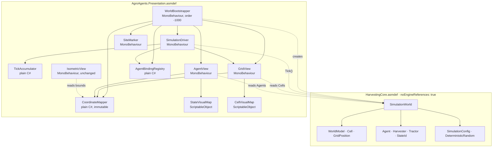

# Design Document

## Overview

This design turns `AgroAgents-RetoJohnDeere` into a pure view over `HarvestingCore`. The Unity project keeps prefab instantiation, materials, camera, interpolation, rotation smoothing, and debug controls. Everything that decides an outcome moves to the core, and the Unity implementations of those decisions are deleted.

Three constraints drive every decision below.

**The compiler enforces engine-agnosticism.** The core source is compiled inside the Unity project by an assembly definition with `noEngineReferences: true`. A stray `using UnityEngine;` in core source is a build error, not a review comment (Req 1.3).

**Presentation is a projection, never a fork.** The presentation assembly performs exactly one mutating core call in steady state, `SimulationWorld.Tick()`. Everything else is a read of `SimulationWorld.Cells` and `SimulationWorld.Agents` (Req 2.1 - 2.5).

**Simulated time is integer ticks; rendered time is continuous.** The driver converts real seconds into a whole number of `Tick()` calls plus a fractional remainder, and the fractional remainder only ever reaches the renderer (Req 3, Req 5).

### Deliberate deferrals

Two requirement fragments are **not** satisfied by this design and are recorded here rather than hidden:

| Deferred | Why |
| --- | --- |
| Req 13.5 (preserve existing scene prefab, material, and camera assignments) | This is editor authoring work on `SimulationScene.unity` and prefab assets. The design defines the serialized field surface that authoring targets; re-wiring the scene is a manual step outside the code contract. |
| Req 7.3 / 7.8 prefab-instantiation *authoring* (which crop and obstacle prefabs, variant lists, material assets) | The design fixes the `CellState` → visual contract and the serialized fields that hold it. Selecting and assigning the actual assets is authoring work. |

Everything else in the requirements document is addressed; see the traceability table at the end.

### Rejected alternative for the whole approach

Shipping `HarvestingCore.dll` as a precompiled binary into `Assets/Plugins/` was rejected: it satisfies Req 1.2 trivially but breaks the debugger stepping into core code, makes the core version implicit in a binary blob, and requires a build step before every Unity run. Source-in-project keeps one editable truth.

---

## Architecture

### Decision A: how core source enters the Unity project

**Chosen:** git submodule **outside** `Assets/`, exposed to Unity as a **local UPM package** via a `file:` path in `Packages/manifest.json`.

```
AgroAgents-RetoJohnDeere/                     (Unity project root, git repo)
├── Packages/
│   └── manifest.json                         ← adds the file: dependency
├── External/
│   └── AgenticModel/                         ← git submodule of the core repo
│       ├── HarvestingCore.sln
│       ├── artifacts/                        ← NEW: dotnet bin/obj redirected here
│       └── src/
│           └── HarvestingCore/               ← THIS folder is the UPM package root
│               ├── package.json              ← NEW
│               ├── HarvestingCore.asmdef     ← NEW
│               ├── HarvestingCore.csproj     (ignored by Unity, used by dotnet build)
│               ├── World.cs
│               ├── Agents/ Configuration/ Coordination/ Pathfinding/ World/
│               └── (no bin/ no obj/ no __tests__/)
└── Assets/
    ├── Scripts/
    │   ├── AgroAgents.Presentation.asmdef    ← NEW
    │   ├── Simulation/  Views/  Mapping/  Authoring/
    │   └── CameraScripts/IsometricView.cs
    ├── Plugins/CsCheck/                      ← test-only PBT dependency
    └── Tests/EditMode/ , Tests/PlayMode/
```

`Packages/manifest.json` gains:

```json
"com.agroagents.harvestingcore": "file:../External/AgenticModel/src/HarvestingCore"
```

The path is resolved relative to the `Packages` folder, so it may point outside the project. This is the documented behaviour of local `file:` packages; I have not run it in this project, so it is worth confirming on the first import.

`External/AgenticModel/src/HarvestingCore/package.json`:

```json
{
  "name": "com.agroagents.harvestingcore",
  "version": "0.1.0",
  "displayName": "Harvesting Core",
  "description": "Engine-agnostic multi-agent harvesting simulation core.",
  "unity": "6000.0"
}
```

Three small changes inside the core repo make this safe, and none of them touch core logic:

1. **Redirect MSBuild output** so `bin/` and `obj/` never sit in the package root. Unity compiles every `.cs` under a package, and `obj/` contains generated `HarvestingCore.AssemblyInfo.cs` and `.NETStandard,Version=v2.1.AssemblyAttributes.cs`, which would produce duplicate-attribute compile errors. Add to `HarvestingCore.csproj`:

   ```xml
   <PropertyGroup>
     <BaseOutputPath>$(MSBuildThisFileDirectory)../../artifacts/bin/</BaseOutputPath>
     <BaseIntermediateOutputPath>$(MSBuildThisFileDirectory)../../artifacts/obj/</BaseIntermediateOutputPath>
   </PropertyGroup>
   ```

   and `artifacts/` to the core `.gitignore`. `dotnet build HarvestingCore.sln` keeps working unchanged.
2. **Remove the empty `src/HarvestingCore/__tests__/` folder.** Core tests live in a sibling project (Decision I), so nothing under the package root is ever test source. If that folder is wanted back, it must be named `__tests__~`; Unity ignores folders with a trailing `~`.
3. Nothing else. `HarvestingCore.csproj` is imported by Unity as an inert `DefaultAsset` and is not compiled.

**Why not the alternatives:**

| Alternative | Rejected because |
| --- | --- |
| Submodule under `Assets/` | Unity writes a `.meta` file next to every file it imports, so the core repo's working tree is permanently dirty and every collaborator produces conflicting GUIDs inside a repo that is not theirs. Packages outside the project get no `.meta` files. Also compiles `obj/`-generated `.cs`. |
| Symlink into `Assets/` | Not portable: needs Developer Mode or admin on Windows, and git does not round-trip symlinks there. Unity's asset database has historically mis-tracked symlinked trees. |
| Copy step (script or CI) | Two copies of the same source, so it goes stale exactly when someone is in a hurry. Requires a guard job to detect drift, which is more machinery than the submodule it replaces. |

`AgenticModel` remains independently buildable: `dotnet build` from its own root sees only the `.sln` and `.csproj`; `package.json` and `.asmdef` are not `.cs` and not globbed.

### Decision B: assembly graph

`External/AgenticModel/src/HarvestingCore/HarvestingCore.asmdef`:

```json
{
  "name": "HarvestingCore",
  "rootNamespace": "HarvestingCore",
  "references": [],
  "includePlatforms": [],
  "excludePlatforms": [],
  "allowUnsafeCode": false,
  "overrideReferences": true,
  "precompiledReferences": [],
  "autoReferenced": false,
  "defineConstraints": [],
  "versionDefines": [],
  "noEngineReferences": true
}
```

`Assets/Scripts/AgroAgents.Presentation.asmdef`:

```json
{
  "name": "AgroAgents.Presentation",
  "rootNamespace": "AgroAgents.Presentation",
  "references": [
    "HarvestingCore"
  ],
  "includePlatforms": [],
  "excludePlatforms": [],
  "allowUnsafeCode": false,
  "overrideReferences": false,
  "precompiledReferences": [],
  "autoReferenced": true,
  "defineConstraints": [],
  "versionDefines": [],
  "noEngineReferences": false
}
```

`noEngineReferences: true` removes `UnityEngine.dll` and `UnityEngine.CoreModule.dll` from the compiler invocation for that assembly. A core file writing `Vector3` or `MonoBehaviour` therefore fails with `CS0246: The type or namespace name 'Vector3' could not be found`, which is exactly the unresolved-type error Req 1.3 asks for. `autoReferenced: false` means only assemblies that name `HarvestingCore` explicitly can see it, so Req 1.5's "no reference back" is structural: `references` is empty and asmdef references are not transitive upward.

**Test assemblies.** `Assets/Tests/EditMode/AgroAgents.Tests.EditMode.asmdef` and `Assets/Tests/PlayMode/AgroAgents.Tests.PlayMode.asmdef` both reference `AgroAgents.Presentation` and `HarvestingCore`, set `"defineConstraints": ["UNITY_INCLUDE_TESTS"]`, and take `precompiledReferences` on `nunit.framework.dll` and `CsCheck.dll` with `overrideReferences: true`. They are excluded from player builds by the define constraint, so the PBT dependency never ships.

### Component graph



The dashed edges are the only crossings, and all of them point presentation → core.

### One frame

```mermaid
sequenceDiagram
    participant U as Unity
    participant SD as SimulationDriver.Update
    participant TA as TickAccumulator
    participant ABR as AgentBindingRegistry
    participant SW as SimulationWorld
    participant GV as GridView
    participant AV as AgentView

    U->>SD: Update() with Time.unscaledDeltaTime
    SD->>TA: Advance(dt, speed, halted, paused)
    TA-->>SD: TickPlan { Count, Alpha }
    loop Count times (0..TickBudget)
        SD->>ABR: SnapshotPositions()   %% prev = current, before mutation
        SD->>SW: Tick()
        SD->>GV: OnTickCompleted()      %% diff CellState vs render cache
    end
    SD->>AV: Render(Alpha) for each bound view
    AV->>SW: read Agent.Position / CurrentState / Fuel / Load
    AV->>AV: lerp(prevWorld, currWorld, Alpha); RotateTowards
    Note over U: Unity renders
```

The ordering matters. Snapshot **before** `Tick()`, because `Tick()` mutates `Agent.Position` in place. Diff cells **after** each `Tick()`, so a cell that changes twice in one frame still ends on the right visual. Compute alpha **before** the tick loop is wrong and **after** it is right: alpha must reflect the accumulator remainder that survives the loop, otherwise a frame in which a tick fired renders a full interval ahead of itself. And render views last, in the same `Update`, so no frame is ever rendered with a stale alpha.

---

## Components and Interfaces

Namespace root: `AgroAgents.Presentation`.

### TickAccumulator (plain C#, `AgroAgents.Presentation.Simulation`)

Extracted from the MonoBehaviour so the whole of Requirement 3 and 4 is testable without a frame loop.

```csharp
public readonly struct TickPlan
{
    public int TickCount { get; }        // ticks to execute this frame, 0..TickBudget
    public float InterpolationAlpha { get; }  // [0,1], accumulator / interval after the loop
    public bool Clamped { get; }         // true when Req 3.6 clamping fired
}

public sealed class TickAccumulator
{
    public TickAccumulator(float tickRate, int tickBudget, float speedMultiplier, bool startPaused);

    public float TickRate { get; set; }            // setter: rejects <= 0, retains previous (Req 3.2)
    public int TickBudget { get; set; }            // setter: rejects < 1, retains previous
    public float SpeedMultiplier { get; set; }     // setter: rejects <= 0, retains previous (Req 4.5)
    public bool IsPaused { get; set; }
    public float TickInterval { get; }             // 1f / TickRate
    public float Accumulated { get; }              // exposed read-only for tests and HUD

    /// Pure function of (state, deltaSeconds, halted). Mutates only the accumulator.
    public TickPlan Advance(float deltaSeconds, bool halted);

    /// Req 4.2: returns 1 when paused, 0 otherwise. Does not touch the accumulator.
    public int RequestSingleStep();

    public void Reset();
}
```

`Advance` never calls `Tick()` itself; it returns a count. That is what makes it host-free.

### SimulationDriver (MonoBehaviour, `AgroAgents.Presentation.Simulation`)

Owns the single `SimulationWorld` (Req glossary, Assumption 3). Nothing else in the project holds a mutable reference to it.

```csharp
[DisallowMultipleComponent]
public sealed class SimulationDriver : MonoBehaviour
{
    public SimulationWorld World { get; private set; }
    public CoordinateMapper Mapper { get; private set; }
    public AgentBindingRegistry Bindings { get; private set; }
    public TickAccumulator Accumulator { get; }
    public float InterpolationAlpha { get; private set; }
    public bool IsPaused { get; set; }
    public int DischargedTotal => World?.DischargedTotal ?? 0;   // Req 2.6

    /// Called once by WorldBootstrapper. Enables the component; before this the
    /// component is disabled so Update never sees a null world.
    public void Initialize(SimulationWorld world, CoordinateMapper mapper,
                          AgentBindingRegistry bindings, GridView gridView);

    public void StepOneTick();          // Req 4.2
    public void SetTickRate(float value);       // Req 3.1, 3.2
    public void SetSpeedMultiplier(float value);// Req 4.4, 4.5, 4.6

    private void Update();              // the loop below
}
```

### CoordinateMapper (plain C#, immutable, `AgroAgents.Presentation.Mapping`)

Not a MonoBehaviour: it has no per-frame work and no lifecycle, and making it a plain immutable value removes any chance of two mappers disagreeing. Its authored inputs live on `WorldBootstrapper`.

```csharp
public sealed class CoordinateMapper
{
    public Vector3 GridOrigin { get; }
    public float TileSize { get; }
    public int Width { get; }
    public int Height { get; }

    public CoordinateMapper(Vector3 gridOrigin, float tileSize, int width, int height);

    public Vector3 ToWorld(GridPosition p);                  // Req 6.1
    public Vector3 ToWorld(GridPosition p, float height);    // convenience for agent/content Y
    public bool TryToGrid(Vector3 world, out GridPosition p); // Req 6.2, 6.5
    public bool InBounds(GridPosition p);
    public Vector3 GridCentreWorld { get; }                  // used by IsometricView
}
```

`ToWorld` is `GridOrigin + new Vector3(p.X * TileSize, 0f, p.Y * TileSize)`, verbatim from Req 6.1. `TryToGrid` uses `Mathf.RoundToInt` on the local x/z divided by `TileSize`, returning `false` without producing a `GridPosition` when the rounded cell is outside `[0,Width) x [0,Height)`.

### WorldBootstrapper (MonoBehaviour, `AgroAgents.Presentation.Authoring`)

```csharp
[DefaultExecutionOrder(-1000)]
[DisallowMultipleComponent]
public sealed class WorldBootstrapper : MonoBehaviour
{
    public bool InitializationFailed { get; private set; }
    public SimulationWorld World { get; private set; }
    public CoordinateMapper Mapper { get; private set; }

    private void Awake();   // the full sequence, see Decision G

    /// Testable core of Awake: no Unity lifecycle, takes an authored snapshot,
    /// returns null and fills `error` instead of throwing at the Unity boundary.
    public static SimulationWorld TryBuild(in BootstrapRequest request, out string error);
}

/// Plain serializable-free DTO that carries every authored value out of the
/// MonoBehaviour so TryBuild is unit-testable and Unity-free apart from Vector3.
public readonly struct BootstrapRequest
{
    public SimulationConfig Config { get; }
    public int Width { get; }
    public int Height { get; }
    public string AuthoredGridText { get; }            // null when generating
    public IReadOnlyList<GridPosition> RefuelStations { get; }
    public IReadOnlyList<GridPosition> DumpSites { get; }
    public IReadOnlyList<AgentSpec> Agents { get; }    // already sorted by ordinal id
}

public readonly struct AgentSpec
{
    public string Id { get; }
    public AgentRole Role { get; }
    public GridPosition Start { get; }
    public int? MaxLoad { get; }
    public int? MaxFuel { get; }
    public int? FuelConsumption { get; }
}
```

### AgentBindingRegistry (plain C#, `AgroAgents.Presentation.Simulation`)

Holds the Agent_Binding of Req 9.3 and the previous-tick snapshot of Req 5.1.

```csharp
public sealed class AgentBindingRegistry
{
    public IReadOnlyList<AgentBinding> Bindings { get; }   // ordinal-id order
    public bool TryGet(string agentId, out AgentBinding binding);

    public void Add(AgentBinding binding);
    /// Req 5.1, 5.6: copies each bound agent's current Position into
    /// PreviousPosition. Called immediately before every SimulationWorld.Tick().
    public void SnapshotPositions();
}

public sealed class AgentBinding
{
    public string AgentId { get; }
    public Agent Agent { get; }          // core reference, read-only use
    public AgentView View { get; }
    public GridPosition PreviousPosition { get; internal set; }
    public GridPosition CurrentPosition => Agent.Position;
}
```

### GridView (MonoBehaviour, `AgroAgents.Presentation.Views`)

```csharp
[DisallowMultipleComponent]
public sealed class GridView : MonoBehaviour
{
    public void Initialize(SimulationWorld world, CoordinateMapper mapper);  // Req 7.1 - 7.3
    /// Polls Cells, applies the diff against the render cache. Req 7.4, 7.5.
    public void OnTickCompleted();
    public CellState RenderedStateAt(int flatIndex);   // test seam only
}
```

### AgentView (MonoBehaviour, `AgroAgents.Presentation.Views`)

```csharp
[DisallowMultipleComponent]
public sealed class AgentView : MonoBehaviour
{
    public string AgentId { get; }
    public AgentRole Role { get; }
    public GridPosition AuthoredStart { get; }   // from the serialized Vector2Int
    public bool IsBound { get; }

    public void Bind(AgentBinding binding, CoordinateMapper mapper);
    /// Req 9.6: logs one warning naming the id, renders nothing thereafter.
    public void MarkUnbound();
    /// Req 5.2 - 5.9, 8.2 - 8.4. Reads the core agent, writes only transform,
    /// renderer material, and label text.
    public void Render(float interpolationAlpha, float deltaTime);
}
```

### StateVisualMap / CellVisualMap (ScriptableObject, `AgroAgents.Presentation.Views`)

ScriptableObjects because both maps are shared across many views and belong in version control as assets rather than duplicated per prefab.

```csharp
[CreateAssetMenu(menuName = "AgroAgents/State Visual Map")]
public sealed class StateVisualMap : ScriptableObject
{
    public bool TryGet(StateId state, out StateVisual visual);   // Req 8.1
    public StateVisual Fallback { get; }                         // Req 8.5
    public IReadOnlyList<StateId> MissingStates();               // editor validation
}

[Serializable] public struct StateVisual { public StateId State; public Material Material; public Color Tint; public GameObject Badge; }

[CreateAssetMenu(menuName = "AgroAgents/Cell Visual Map")]
public sealed class CellVisualMap : ScriptableObject
{
    public bool TryGet(CellState state, out CellVisual visual);  // Req 7.6
    public CellVisual Fallback { get; }
}

[Serializable] public struct CellVisual { public CellState State; public Material FloorMaterial; public GameObject ContentPrefab; public GameObject[] ContentVariants; }
```

### SiteMarker (MonoBehaviour, `AgroAgents.Presentation.Authoring`)

```csharp
public enum SiteKind { Refuel, Dump }   // presentation-only, no core counterpart to duplicate

public sealed class SiteMarker : MonoBehaviour
{
    public SiteKind Kind { get; }
    /// Req 10.1 - 10.3: resolves through the mapper, or returns the explicit cell.
    public bool TryResolveCell(CoordinateMapper mapper, out GridPosition cell);
}
```

### IsometricView

Survives intact, with `gridManager` swapped for `WorldBootstrapper` (or the `CoordinateMapper` it exposes) so it reads `Width`, `Height`, `TileSize` from the mapper instead of the deleted `GridManager`.

---

## Serialized Field Surface

This is the authoring contract. Every field is `private` with `[SerializeField]`; public access is through the properties listed above.

### `WorldBootstrapper`

| Field | Type | Attributes | Default |
| --- | --- | --- | --- |
| `simulationDriver` | `SimulationDriver` | `[Header("Wiring")]` `[Tooltip("Explicit reference. No FindObjectOfType anywhere in this project.")]` | none (required) |
| `gridView` | `GridView` | | none (required) |
| `agentViews` | `AgentView[]` | `[Tooltip("Authored list. Registration order is derived by sorting these by ordinal id, so drag order does not affect the simulation.")]` | empty |
| `siteMarkers` | `SiteMarker[]` | | empty |
| `gridOrigin` | `Transform` | `[Header("Grid")]` `[Tooltip("World position of GridPosition(0,0). Null falls back to this transform.")]` | `null` |
| `gridWidth` | `int` | `[Range(1, 512)]` | `32` |
| `gridHeight` | `int` | `[Range(1, 512)]` | `32` |
| `tileSize` | `float` | `[Min(0.0001f)]` | `1f` |
| `worldSource` | `WorldSource` | `[Header("World source")]` `[Tooltip("Generated uses SimulationWorld.GenerateGrid(); AuthoredText uses WorldModel.Parse.")]` | `WorldSource.Generated` |
| `authoredGrid` | `TextAsset` | `[Tooltip("Char grid: '.' empty, 'W' crop, '#' blocked, '_' harvested. Used only when worldSource is AuthoredText.")]` | `null` |
| `seed` | `int` | `[Header("Determinism")]` `[Tooltip("Feeds DeterministicRandom and SimulationConfig.Seed.")]` | `20240101` |
| `cropDensity` | `float` | `[Header("Grid generation")]` `[Range(0f, 1f)]` | `0.55f` |
| `blockedDensity` | `float` | `[Range(0f, 1f)]` | `0.10f` |
| `cropCost` | `int` | `[Header("Terrain costs")]` `[Min(1)]` | `1` |
| `emptyCost` | `int` | `[Min(1)]` | `2` |
| `harvestedCost` | `int` | `[Min(1)]` | `10` |
| `heuristic` | `HeuristicKind` | `[Tooltip("Core enum, int-backed, so Unity serializes it directly.")]` | `HeuristicKind.Octile` |
| `defaultMaxLoad` | `int` | `[Header("Agent defaults")]` `[Min(1)]` | `100` |
| `defaultMaxFuel` | `int` | `[Min(1)]` | `1000` |
| `defaultFuelConsumption` | `int` | `[Min(1)]` | `1` |
| `dumpPreferenceFactor` | `float` | `[Header("Coordination tunables")]` `[Min(0f)]` | `1f` |
| `capacityFactor` | `float` | `[Range(0f, 1f)]` | `0.5f` |
| `harvesterFuelReserveMultiplier` | `float` | `[Min(0f)]` | `1.2f` |
| `tractorFuelReserveMultiplier` | `float` | `[Min(0f)]` | `2.5f` |

`enum WorldSource { Generated, AuthoredText }` is presentation-only.

The `[Range]` and `[Min]` attributes mirror `SimulationConfig`'s own validation ranges exactly, which is the point: the inspector cannot author an individually invalid value. Req 11.3's error path is still real, because two constraints escape attribute-level enforcement:

- `cropDensity + blockedDensity > 1.0` is a cross-field constraint `SimulationConfig` throws on and no attribute can express.
- Attributes constrain the inspector, not code. A prefab authored before a range was tightened, a preset, or a script assigning through `EditorUtility` all reach the constructor unchecked.

So `TryBuild` wraps the `SimulationConfig` construction in `try/catch (ArgumentOutOfRangeException)` and surfaces `ex.Message` verbatim.

Unity serializes `float`, the config takes `double`. Conversion is a single explicit widening at `BootstrapRequest` construction, and the widened value is what determinism is defined against: `(double)0.55f` is stable, so two runs with the same authored float produce the same config.

### `SimulationDriver`

| Field | Type | Attributes | Default |
| --- | --- | --- | --- |
| `tickRate` | `float` | `[Header("Tick")]` `[Min(0.0001f)]` `[Tooltip("Ticks per second of unscaled real time.")]` | `4f` |
| `tickBudget` | `int` | `[Range(1, 64)]` `[Tooltip("Maximum Tick() calls in one Unity frame.")]` | `4` |
| `speedMultiplier` | `float` | `[Min(0.0001f)]` `[Tooltip("Scales simulation time only. Never affects per-tick outcomes.")]` | `1f` |
| `startPaused` | `bool` | | `false` |
| `pauseKey` | `KeyCode` | `[Header("Debug controls")]` | `KeyCode.P` |
| `stepKey` | `KeyCode` | `[Tooltip("Advances exactly one tick while paused.")]` | `KeyCode.Period` |

`OnValidate` pushes `tickRate`, `tickBudget`, and `speedMultiplier` through the `TickAccumulator` setters, which reject non-positive values and retain the previous one (Req 3.2, 4.5) rather than silently clamping.

### `AgentView`

| Field | Type | Attributes | Default |
| --- | --- | --- | --- |
| `agentId` | `string` | `[Header("Binding")]` `[Tooltip("Unique within the scene. Becomes the core Agent.Id.")]` | `""` |
| `role` | `AgentRole` | `[Tooltip("Core enum. Harvester registers a Harvester, Tractor a Tractor.")]` | `AgentRole.Harvester` |
| `startCell` | `Vector2Int` | `[Tooltip("X = column, Y = row, core top-left origin. GridPosition is a core struct with get-only properties and no [SerializeField], so Unity cannot serialize it; this Vector2Int is the surrogate and is converted at bootstrap.")]` | `(0, 0)` |
| `overrideCapacities` | `bool` | `[Header("Capacity overrides")]` `[Tooltip("Off means the SimulationConfig defaults apply.")]` | `false` |
| `maxLoad` | `int` | `[Min(1)]` | `100` |
| `maxFuel` | `int` | `[Min(1)]` | `1000` |
| `fuelConsumption` | `int` | `[Min(1)]` | `1` |
| `stateVisualMap` | `StateVisualMap` | `[Header("Visuals")]` | none (required) |
| `bodyRenderer` | `Renderer` | `[Tooltip("Renderer whose material the State_Visual_Map drives.")]` | none |
| `badgeAnchor` | `Transform` | | `null` |
| `heightOffset` | `float` | `[Tooltip("Added to world Y so the model rests on the tile surface.")]` | `0f` |
| `rotationSpeed` | `float` | `[Header("Rotation smoothing")]` `[Min(0f)]` `[Tooltip("Degrees per second, yaw only.")]` | `720f` |
| `forwardOffsetY` | `float` | `[Range(-180f, 180f)]` `[Tooltip("Yaw correction for models whose forward axis is not +Z. Preserved from the deleted AgentController.")]` | `0f` |
| `statusLabel` | `UnityEngine.UI.Text` | `[Header("Readouts")]` `[Tooltip("Optional. Shows Fuel and Load / MaxLoad read from the core Agent.")]` | `null` |

`GridPosition` is `readonly struct` with get-only auto-properties and no serialization attributes, so Unity's serializer sees no fields it can write. `Vector2Int` is the surrogate; conversion is `new GridPosition(startCell.x, startCell.y)` inside `WorldBootstrapper.Awake` when building each `AgentSpec`. Nothing else in the project stores a `GridPosition` in a serialized field.

`moveSpeed` and `arrivalTolerance` from the old `AgentController` are **gone**: motion is now fully determined by the tick boundary and the alpha, so a separate speed would let the view arrive early or late.

### `SiteMarker`

| Field | Type | Attributes | Default |
| --- | --- | --- | --- |
| `kind` | `SiteKind` | `[Tooltip("Refuel station or dump site. Passed to the WorldModel constructor.")]` | `SiteKind.Refuel` |
| `useExplicitCell` | `bool` | `[Tooltip("Off resolves the cell from this transform's world position via the Coordinate_Mapper.")]` | `false` |
| `explicitCell` | `Vector2Int` | | `(0, 0)` |

### `GridView`

| Field | Type | Attributes | Default |
| --- | --- | --- | --- |
| `floorPrefab` | `GameObject` | `[Header("Prefabs")]` `[Tooltip("One instance per core Cell.")]` | none (required) |
| `cellVisualMap` | `CellVisualMap` | | none (required) |
| `refuelMarkerPrefab` | `GameObject` | `[Tooltip("Rendered at each WorldModel.RefuelStations position.")]` | `null` |
| `dumpMarkerPrefab` | `GameObject` | | `null` |
| `floorParent` | `Transform` | `[Header("Hierarchy")]` `[Tooltip("Null parents floors to this transform.")]` | `null` |
| `contentParent` | `Transform` | | `null` |
| `contentYOffset` | `float` | `[Header("Rendering")]` | `0f` |
| `useSharedMaterial` | `bool` | `[Tooltip("On assigns sharedMaterial to avoid one material instance per tile.")]` | `true` |

Absent by requirement: `width`, `height`, `useRandomSeed`, `customSeed`, `obstacleChance`, `cropChance` (Req 12.3). Dimensions come from `SimulationWorld.Model`.

### `StateVisualMap`

| Field | Type | Attributes | Default |
| --- | --- | --- | --- |
| `entries` | `StateVisual[]` | `[Header("Per-state visuals")]` `[Tooltip("One entry per StateId. Missing entries fall back and log once.")]` | 8 entries, one per `StateId` |
| `fallbackMaterial` | `Material` | `[Header("Fallback (Req 8.5)")]` | none (required) |
| `fallbackTint` | `Color` | | `Color.magenta` |

`StateVisual` fields: `state` (`StateId`), `material` (`Material`), `tint` (`Color`, default `Color.white`), `badge` (`GameObject`, default `null`).

### `CellVisualMap`

| Field | Type | Attributes | Default |
| --- | --- | --- | --- |
| `entries` | `CellVisual[]` | `[Tooltip("One entry per CellState. Exactly four.")]` | 4 entries |
| `fallbackFloorMaterial` | `Material` | `[Header("Fallback")]` | none (required) |

`CellVisual` fields: `state` (`CellState`), `floorMaterial` (`Material`), `contentPrefab` (`GameObject`, `null` allowed per Req 7.8), `contentVariants` (`GameObject[]`, empty).

---

## Decision D: the tick loop

**Chosen:** `Update()` with `Time.unscaledDeltaTime`.

Req 3.3 says "unscaled elapsed real time multiplied by the Speed_Multiplier", which rules out `Time.timeScale`: `timeScale` scales `Time.deltaTime` and the `FixedUpdate` cadence together, so the driver would be reading a value the engine had already scaled and then scaling it again. `FixedUpdate` also fires zero or several times per frame independently of rendering, so computing an alpha inside it means the alpha the renderer sees is up to one physics step stale. `Update` gives exactly one accumulator advance, one tick loop, and one alpha per rendered frame, which is what Req 5.3 describes. `Time.timeScale` stays at `1` and the project does not touch it, so any physics or animation in the scene is unaffected by the simulation speed control.

```
SimulationDriver.Update():

    if World == null:                     # bootstrapper failed or has not run
        return

    dt = Time.unscaledDeltaTime
    plan = Accumulator.Advance(dt, World.IsHalted)

    ticks = plan.TickCount
    if pendingSingleStep > 0:             # StepOneTick while paused
        ticks = pendingSingleStep
        pendingSingleStep = 0

    for i in 0 .. ticks-1:
        Bindings.SnapshotPositions()      # prev <- current, BEFORE mutation (Req 5.1, 5.6)
        World.Tick()
        GridView.OnTickCompleted()        # diff after each tick (Req 7.4)
        if World.IsHalted:                # Req 3.7: stop mid-loop
            break

    InterpolationAlpha = plan.InterpolationAlpha
    for binding in Bindings.Bindings:
        binding.View.Render(InterpolationAlpha, dt)


TickAccumulator.Advance(dt, halted):

    if halted:
        accumulated = 0                   # Req 3.7: no ticks, alpha settles to 0
        return TickPlan(0, 0f, false)

    if IsPaused:
        return TickPlan(0, accumulated / TickInterval, false)   # Req 4.1: accumulator untouched

    accumulated += dt * SpeedMultiplier                         # Req 3.3

    count = 0
    while accumulated >= TickInterval and count < TickBudget:    # Req 3.4
        accumulated -= TickInterval
        count += 1

    clamped = false
    if accumulated > TickInterval * TickBudget:                  # Req 3.6
        accumulated = TickInterval * TickBudget
        clamped = true

    alpha = Clamp01(accumulated / TickInterval)                  # Req 5.3
    return TickPlan(count, alpha, clamped)
```

Notes on the edge cases the requirements single out.

**Alpha is computed after the loop.** `plan.InterpolationAlpha` is derived from the accumulator remainder that survives the loop. Computing it before would render the frame one interval ahead of the state it just ticked into, giving a visible snap backwards on the next frame.

**Previous-position snapshot.** `Agent.Position` has a private setter mutated in place by `Agent.Move`, so there is no core-side history to read. `Bindings.SnapshotPositions()` copies `Agent.Position` into `AgentBinding.PreviousPosition` immediately before `World.Tick()`. Because it runs inside the loop, a frame that executes three ticks leaves `PreviousPosition` at the position before the *third* tick, so the rendered interpolation covers only the final tick's transition. That is intentional: interpolating across three ticks would need a queue of intermediate positions and would still render motion the model already finished.

**Paused.** `Advance` returns early with `TickCount == 0` and leaves `accumulated` alone (Req 4.1), so the alpha it reports is constant across frames and `AgentView.Render` produces a constant position (Req 5.9). Rendering continues because `Render` is outside the tick loop (Req 4.3). Step-one-tick sets `pendingSingleStep = 1` without touching the accumulator, executes one tick, and stays paused (Req 4.2).

**IsHalted flips.** `IsHalted` is `Manager.AllInactive()`. On the frame it becomes true, the loop breaks after the tick that caused it, and the next `Advance` zeroes the accumulator and reports `alpha == 0`. Agents therefore render at their previous-tick position for exactly one frame and then settle. That is acceptable because Req 8.3 requires an `Inactive` agent to hold at its *current* `GridPosition`, and `AgentView.Render` special-cases `Inactive` by ignoring the alpha and rendering the current position directly. When `IsHalted` returns to false (it can, since `AllInactive` also requires a non-empty agent list, and agents never leave `Inactive`, so in practice it does not), the accumulator restarts from zero rather than from a stale value.

**Speed multiplier changes.** The setter writes only `SpeedMultiplier`; `accumulated` is untouched (Req 4.6). Since the multiplier scales the *input* to the accumulator and never the interval, the per-tick core state sequence is identical to an unscaled run with the same seed (Req 4.7) — the multiplier changes only when ticks happen in wall-clock time, never what a tick does.

---

## Decision E: cell state projection and change detection

`WorldModel.Cells` is an `IReadOnlyList<Cell>` of mutable `Cell` objects with no change event. Polling is the only mechanism available.

**Chosen:** a shadow array of last-rendered `CellState`, sized `Width * Height`, compared index by index in `OnTickCompleted`.

```csharp
private CellState[] _renderedState;      // render cache, not authoritative
private GameObject[] _floors;
private GameObject[] _contents;
```

The alternative, re-applying every cell's material and re-instantiating content every tick, was rejected on cost: at 32×32 that is 1024 material assignments and up to 1024 `Instantiate`/`Destroy` pairs per tick, which is the dominant frame cost for a field where typically a handful of cells change per tick.

**Why the cache does not violate Req 2.3.** Req 2.3 forbids storing a field that duplicates core state *as authoritative data*. `_renderedState[i]` answers exactly one question: "what did I last draw here?" It is never read to decide anything about the simulation, never passed to a core call, and never consulted when a core value is needed. The one and only read is the inequality `_renderedState[i] != cells[i].State`, in which `cells[i].State` is the authority and `_renderedState[i]` is the stale copy being corrected. Deleting the array would change frame cost and nothing else — which is the operational test for "cache, not source of truth". `AgentBinding.PreviousPosition` is the same category, and is justified the same way: Req 5.1 mandates it.

The `CellState` → visual mapping table is in Data Models below.

**`TileState.Deteriorado` is dropped.** It encoded a second harvester pass over an already-harvested tile — `TileData.PassHarvester` walked `Normal → Cosechado → Deteriorado`. The core's `Cell` has a flat `CellState` with no such progression: `Cell.Harvest()` returns `false` on a non-`Crop` cell, so a second pass is a no-op and produces no new state. Nothing in the core distinguishes a cell visited once from one visited five times except `Cell.Popularity`, which is an internal cost signal, not a visual one. Mapping `Deteriorado` onto a `Popularity` threshold would invent a rule the requirements do not ask for and would make the view depend on a counter the core is free to change. So the concept is removed along with `TileState`, and `deterioradoMaterial` is unassigned from the scene.

**Prefab variety.** `contentVariants` may hold several crop or obstacle meshes. The chosen index must be a pure function of the cell index (`flatIndex % contentVariants.Length`), never `UnityEngine.Random`: the presentation assembly must not consume randomness that could be mistaken for, or drift with, the core's `IRandomSource`, and Req 12.8 requires that deleting the presentation scripts leaves the core sequence unchanged.

---

## Decision F: interpolation mechanics

`MoveOrder.Offsets` is confirmed eight-directional: `(0,1) (1,0) (-1,0) (0,-1) (-1,1) (-1,-1) (1,1) (1,-1)`, with `MoveOrder.Count == 8`.

**Diagonal speed.** A diagonal step covers `sqrt(2) ≈ 1.414` times the world distance of an orthogonal step in the same tick interval, so a diagonal tick renders as a 41% speed-up. **Accepted, not normalised.** Normalising would mean stretching the diagonal transition across more than one tick interval, which desynchronises the rendered position from the tick boundary and breaks Req 5.5 (alpha `1` must render at the current-tick cell). The core already prices this correctly for decisions — `HeuristicKind.Octile` is the default heuristic — so the visual speed-up is an honest depiction of a model in which a diagonal move costs the same tick as an orthogonal one. If it later reads badly, the fix belongs in the core's cost model, not in the view.

**No feedback into the model.** `AgentView.Render` writes only `transform.position`, `transform.rotation`, a `Renderer` material or colour, and label text. It calls no core method. The smoothed rotation is derived from the interpolated position delta, which is itself derived from two core positions, so the data flow is strictly core → view.

**Rotation smoothing.** Preserved from `AgentController.RotateTowardsMovement`, including the `forwardOffsetY` correction:

```csharp
Vector3 dir = currentWorld - previousWorld;   // tick-to-tick direction, not frame-to-frame
dir.y = 0f;
if (dir.sqrMagnitude > 1e-6f)
{
    Quaternion desired = Quaternion.LookRotation(dir) * Quaternion.Euler(0f, forwardOffsetY, 0f);
    transform.rotation = Quaternion.RotateTowards(transform.rotation, desired, rotationSpeed * deltaTime);
}
```

Using the tick-to-tick direction rather than the frame-to-frame position delta keeps the target yaw constant for the whole interval, so the turn is a smooth approach to a fixed heading instead of chasing a moving target. When the agent does not move, `dir` is zero and rotation is left alone, preserving the last heading.

**`PathInvalidatedThisTick` mid-interval.** The flag is set by `Agent.Move` when the next path cell turned out `Blocked`, and in that case `Move` returns without changing `Position`. So from the view's side the agent simply did not move that tick: `PreviousPosition == CurrentPosition`, and Req 5.7 already covers it — the rendered position is constant for every alpha. No special case is needed. `AgentView` may optionally surface the flag as a one-tick visual cue (a brief tint flash); that is decoration and reads a core `bool` without writing anything.

**Several ticks in one frame.** Intermediate cells are skipped, as described in Decision D: the snapshot inside the loop means only the final tick's transition is interpolated. The agent visibly jumps the earlier cells. This is the correct trade for a catch-up frame — the model has already moved on, and rendering the skipped cells would put the view behind the model. The `TickBudget` of `4` bounds how far a jump can go.

**First tick, no previous position.** `AgentBinding.PreviousPosition` is initialised to the agent's authored start position at bind time, before any tick. So on the first frame `PreviousPosition == CurrentPosition` and the agent renders exactly at its start cell for any alpha. No null or sentinel case exists.

---

## Decision G: bootstrap and agent binding

`WorldBootstrapper` carries `[DefaultExecutionOrder(-1000)]`, so its `Awake` runs before any other project component's `Awake`. `SimulationDriver`, `GridView`, and every `AgentView` are authored **disabled**, or guard on a `_initialized` flag, and are enabled by the bootstrapper at the end of the sequence. Nothing in the project calls `FindObjectOfType` or `FindObjectsOfType` — the fragility in the current `AgentController.Awake`. All references are authored `[SerializeField]` links, which also makes a missing reference a null in the inspector rather than a silent runtime surprise.

Ordered sequence inside `Awake`:

1. Read the authored fields into a `BootstrapRequest`. Build `SimulationConfig` inside `try/catch`; on `ArgumentOutOfRangeException`, hard-fail with `ex.Message` (Req 11.3).
2. Build `CoordinateMapper` from `gridOrigin` (falling back to `transform.position`), `tileSize`, `gridWidth`, `gridHeight`.
3. Build `IRandomSource` as `new DeterministicRandom(seed)` (Req 11.2).
4. Resolve `SiteMarker`s to `GridPosition`s through the mapper, sorted by `GridPosition.CompareRowMajor` (Decision H). Validate bounds and per-kind duplicates (Req 10.3, 10.4).
5. Build the `WorldModel`:
   - `worldSource == Generated`: `new WorldModel(width, height, refuel, dumps)` then `world.GenerateGrid()` exactly once (Req 11.4).
   - `worldSource == AuthoredText`: `WorldModel.Parse(authoredGrid.text, refuel, dumps)`, and **no** `GenerateGrid()` call — `Parse` sets `IsGenerated = true`, so a later `GenerateGrid()` would return `false` anyway, but the branch makes the intent explicit (Req 11.7). `gridWidth`/`gridHeight` are ignored in this branch; the parsed text defines the dimensions, and a mismatch is logged as a soft warning.
6. Construct `new SimulationWorld(model, config, random)`.
7. Discover Agent_Views from the authored `agentViews` array; then **sort by `string.CompareOrdinal(a.AgentId, b.AgentId)`**.
8. Validate the agent set: reject duplicate ids (Req 9.4); reject an out-of-bounds or `Blocked` start cell naming the id and the position (Req 9.7); reject an empty or whitespace id.
9. Register in sorted order: `new Harvester(id, start, model, config, ...)` or `new Tractor(...)`, then `world.Register(agent)` (Req 9.1, 9.2).
10. `world.RedistributeAreas()` exactly once (Req 9.8).
11. `simulationDriver.Initialize(world, mapper, bindings, gridView)`, which enables the driver.
12. `gridView.Initialize(world, mapper)` — floors, initial materials, content prefabs, site markers (Req 7.1 - 7.3, 10.6).
13. `binding.View.Bind(binding, mapper)` for each binding; `MarkUnbound()` for any `AgentView` whose id matched nothing (Req 9.6); a warning for any registered `Agent` with no view (Req 9.5, which cannot happen when the bootstrapper is the only registrar, but the check is cheap and guards a future second registrar).

**Deterministic discovery.** `FindObjectsOfType` ordering is explicitly undefined by Unity and in practice varies with scene load order and hierarchy edits. Since registration order determines `RegistrationIndex`, which determines tick execution order, area-distribution seeding order, and tractor tie-breaks, an unstable discovery order silently breaks Req 11.6. Two mechanisms are combined: the authored `agentViews` array is the source (a designer can see exactly which views participate), and the array is then **sorted by ordinal id** before registration. Sorting means drag order in the inspector cannot change outcomes, and it matches the core's own tie-break convention (`AgentManager.TrySelectTractor` uses `string.CompareOrdinal`). Sorting is the load-bearing guarantee; the authored array is the visibility win.

**"Reject initialisation" concretely.** Hard-fail means, in order: `Debug.LogError` with the specific message; set `InitializationFailed = true`; leave `World` null; leave `simulationDriver` disabled; leave `gridView` uninitialised; `return` from `Awake` without throwing.

Not throwing is deliberate. A throw from `Awake` leaves the scene half-initialised and violates Req 13.2 ("enter play mode without an unhandled exception"). Instead the scene enters play mode, renders an empty field, and the console carries one precise error. `SimulationDriver.Update` returns immediately on a null world, so no `NullReferenceException` cascade follows.

**Pre-validation vs letting core exceptions propagate.** `Agent`'s constructor already throws `ArgumentException` on an out-of-bounds start and on a `Blocked` start. The bootstrapper **pre-validates anyway**, at step 8, before constructing anything. Two reasons: the core message says `start position (3, 7) is Blocked` but cannot name the offending `AgentView`, and Req 9.7 requires the error to name both the identifier and the position; and pre-validation lets all agents be checked and reported in one pass rather than failing on the first one. Step 9 still wraps construction in `try/catch (ArgumentException)` as a backstop, converting any remaining core rejection into the same hard-fail path — belt and braces, since a core validation rule could tighten without this file noticing.

---

## Decision H: site markers

Refuel stations and dump sites become `WorldModel` constructor arguments. `FieldManager`'s `List<Transform> refuelStations` / `dumpSites` and its `FindNearestTransform` search are deleted (Req 10.5, 12.7); target selection is entirely core-side via `Agent.Refuel`, `Agent.DumpLoad`, and `PathFinder.TryCostToNearest`.

**Authoring representation.** One `SiteMarker` MonoBehaviour per site, on the marker GameObject, serialized fields as tabled above. By default the cell is resolved from the transform's world position through `CoordinateMapper.TryToGrid`, so a designer positions a visible object and the cell follows. `useExplicitCell` overrides that with an authored `Vector2Int` for cases where the visual model sits off-centre from the cell it represents.

Assumption 6 stands: sites occupy cells inside the grid. `WorldModel`'s `ValidatePositions` throws `ArgumentException` on an out-of-bounds or duplicated position, so an out-of-grid marker is rejected either way; the bootstrapper checks first so the error can name the marker's `GameObject` (Req 10.3, 10.4).

**Does array order affect determinism?** Yes, in one narrow way. `WorldModel.RefuelStations` and `DumpSites` preserve insertion order, and `PathFinder.TryCostToNearest` scans that list — so with two stations at equal cost, the earlier entry wins. Marker order in the scene hierarchy is not stable across edits, so the bootstrapper sorts both collections with `GridPosition.CompareRowMajor` (lowest `y`, then lowest `x`) before passing them in. That matches the core's own row-major convention and makes the outcome independent of authoring order.

**Interaction with grid generation.** `WorldModel.Generate` already handles this: after the per-cell random pass it forces every refuel and dump position to `CellState.Empty`, with the in-source comment "so stations are never unreachable by construction". So a generated `Blocked` or `Crop` cell landing on a station is overwritten by the core. No presentation-side rule is needed and none is invented. Two consequences worth naming: the number of `Crop` cells in a generated world is slightly below `cropDensity * width * height` when stations overlap crop draws, and the same overwrite does **not** happen in the `WorldModel.Parse` branch — `Parse` writes the authored characters verbatim after the constructor has validated positions, so an authored `#` on a station cell stays `Blocked`. The bootstrapper therefore emits a soft warning when `worldSource == AuthoredText` and any site cell parses as `Blocked`.

---

## Data Models

Every simulation data model is a core type, consumed directly. The presentation assembly declares no model of its own beyond the serializable surrogates and view maps listed here.

### Core types read by the presentation assembly

| Core type | Members the view reads | Never written by the view |
| --- | --- | --- |
| `SimulationWorld` | `Cells`, `Agents`, `TickIndex`, `DischargedTotal`, `IsHalted`, `Model` | all of them; `Tick()` is the only call |
| `WorldModel` | `Width`, `Height`, `Cells`, `RefuelStations`, `DumpSites`, `Serialize()` | — |
| `Cell` | `State` | `Popularity`, `OwnerId` are read for debug overlays only |
| `Agent` | `Id`, `Position`, `CurrentState`, `Fuel`, `Load`, `MaxLoad`, `Role`, `Path`, `MeetingPoint`, `PathInvalidatedThisTick` | — |
| `GridPosition` | `X`, `Y` | struct, immutable |
| `CellState`, `StateId`, `AgentRole`, `HeuristicKind` | all values | int-backed enums, Unity-serializable as-is |

### Serializable surrogates

Unity's serializer writes fields, and it cannot write a `readonly struct` whose properties are get-only. Two core types therefore need a surrogate, and the conversion happens in exactly one place each.

| Core type | Why it cannot be serialized | Surrogate | Conversion point |
| --- | --- | --- | --- |
| `GridPosition` | `readonly struct`, get-only auto-properties, no `[SerializeField]` backing fields Unity can see | `Vector2Int` (`x` = column, `y` = row, core top-left origin) | `WorldBootstrapper.Awake`, building each `AgentSpec` and each resolved `SiteMarker` cell |
| `SimulationConfig` | immutable class with a constructor-only surface and no default constructor | the flat `[SerializeField]` tunables on `WorldBootstrapper` (see the field tables) | `WorldBootstrapper.Awake`, one constructor call inside `try/catch` |

`float` → `double` widening for the config's density and factor tunables also happens at that single point. `SimulationConfig`'s own `Seed`, `CropDensity`, and `BlockedDensity` are the only tunables the core reads back for generation, and all three are set from the authored values, so the authored inspector state fully determines a run.

### CellState → visual mapping

| `CellState` | Floor material | Content prefab | On entry from another state |
| --- | --- | --- | --- |
| `Empty` | `emptyMaterial` (bare soil) | none | destroy any existing content |
| `Crop` | `cropMaterial` | crop prefab (`contentPrefab` or a variant) | instantiate content |
| `Blocked` | `blockedMaterial` | obstacle prefab | instantiate content |
| `Harvested` | `harvestedMaterial` (stubble) | none | destroy content — the `Crop` → `Harvested` case of Req 7.5 |

All four floor materials are distinct, satisfying Req 7.6. Where `contentPrefab` is unassigned the floor material is still applied and no content is instantiated (Req 7.8). The old `TileContent` triple (`Vacio`/`Cultivo`/`Obstaculo`) collapses into this table: it carried no information `CellState` does not, and its fourth state, `Harvested`, had no `TileContent` equivalent at all.

### StateId → visual mapping

All eight values, satisfying Req 8.1. Tints are authored defaults.

| `StateId` | Tint | Badge | Notes |
| --- | --- | --- | --- |
| `Idle` | grey | none | resting; still interpolates if the core moves it |
| `Harvest` | green | harvest icon | |
| `GoToRefuel` | amber | fuel icon | |
| `GoToDump` | brown | dump icon | |
| `GoToMeetingPoint` | cyan | rendezvous icon | |
| `WaitTractor` | blue, pulsing | wait icon | harvester side of a pending transfer |
| `WaitHarvester` | blue, pulsing | wait icon | shares the wait visual; distinguished by the role's mesh |
| `Inactive` | dark red, desaturated | halt icon | Req 8.3: rendered at the current `GridPosition`, alpha ignored |

Missing entry → `Fallback` (magenta) plus one `Debug.LogWarning` naming the `StateId`, logged once per state per session (Req 8.5).

`SiteKind` and `WorldSource` are the only new presentation enums. Neither duplicates a core enum: there is no presentation copy of `StateId` (Req 8.6), `CellState`, or `AgentRole`, because the `.asmdef` reference lets the views consume them directly.

---

## Correctness Properties

*A property is a characteristic or behavior that should hold true across all valid executions of a system — essentially, a formal statement about what the system should do. Properties serve as the bridge between human-readable specifications and machine-verifiable correctness guarantees.*

### Property 1: Coordinate round trip

*For any* `GridPosition` inside the grid bounds, and any `CoordinateMapper` with a positive `TileSize` and any `GridOrigin`, converting the position to a Unity world position with `ToWorld` and back with `TryToGrid` succeeds and yields the original `GridPosition`.

**Validates: Requirements 6.1, 6.2, 6.3**

### Property 2: World-position quantisation is bounded

*For any* Unity world position whose nearest cell centre lies inside the grid bounds, `TryToGrid` succeeds and `ToWorld` of the result differs from the input by at most half of `TileSize` on each of the world `x` and `z` axes.

**Validates: Requirements 6.2, 6.4**

### Property 3: Out-of-bounds world positions are rejected without a GridPosition

*For any* Unity world position whose nearest cell lies outside `[0, Width) × [0, Height)`, `TryToGrid` returns `false` and writes no usable `GridPosition` to its out parameter.

**Validates: Requirements 6.5**

### Property 4: Equal total elapsed time yields an equal tick count

*For any* two sequences of positive frame durations whose sums are equal, and any positive `TickRate`, `TickBudget`, and `SpeedMultiplier`, feeding each sequence to a fresh `TickAccumulator` produces the same total `TickCount` — provided no clamp from Req 3.6 occurs during either sequence.

**Validates: Requirements 3.3, 3.4, 3.8**

### Property 5: Tick count per frame never exceeds the budget

*For any* frame duration, `TickRate`, `TickBudget`, and `SpeedMultiplier`, a single `Advance` call returns a `TickCount` in `[0, TickBudget]`, and afterwards the accumulator holds a value in `[0, TickInterval * TickBudget]`.

**Validates: Requirements 3.4, 3.5, 3.6**

### Property 6: Interpolation alpha stays in the unit interval

*For any* sequence of `Advance` calls with arbitrary positive frame durations and arbitrary positive settings, every returned `InterpolationAlpha` lies in the closed interval `[0, 1]`.

**Validates: Requirements 5.3**

### Property 7: Rejected settings leave the accumulator's configuration unchanged

*For any* `TickAccumulator` and any value less than or equal to zero, assigning that value to `TickRate` or to `SpeedMultiplier` leaves the previous value in place and leaves the accumulated time unchanged.

**Validates: Requirements 3.1, 3.2, 4.4, 4.5**

### Property 8: Pausing freezes ticks but not the accumulator's value

*For any* paused `TickAccumulator` and any sequence of frame durations, every `Advance` returns `TickCount == 0`, the accumulated time after the sequence equals the accumulated time before it, and every returned `InterpolationAlpha` is identical.

**Validates: Requirements 4.1, 4.3, 5.9**

### Property 9: A single step advances exactly one tick and stays paused

*For any* paused `TickAccumulator` at any accumulated value, `RequestSingleStep` returns `1`, leaves `IsPaused` true, and leaves the accumulated value unchanged.

**Validates: Requirements 4.2**

### Property 10: Speed multiplier does not alter per-tick core state

*For any* seed, authored configuration, agent set, tick count `N`, and pair of positive `SpeedMultiplier` values, driving two worlds through `N` ticks under each multiplier — with arbitrary, differing frame durations — produces identical serialised `WorldModel` text, identical `TickIndex`, identical `DischargedTotal`, and identical per-agent `Position`, `Fuel`, `Load`, and `CurrentState` at every tick index.

**Validates: Requirements 4.7, 11.6, 12.8**

### Property 11: Seeded runs are frame-rate independent

*For any* seed, authored configuration, and agent registration order, two `SimulationWorld` instances advanced `N` ticks by any two different frame-duration sequences hold identical core state.

**Validates: Requirements 3.8, 11.6**

### Property 12: WorldModel serialisation round trip

*For any* `WorldModel` the bootstrapper can construct — from either the generation branch or the `Parse` branch — parsing `Serialize()`'s output with the same station and dump collections yields a model with identical `CellState` at every position.

**Validates: Requirements 11.8**

### Property 13: Rendering leaves core state untouched

*For any* `SimulationWorld` and any sequence of `AgentView.Render` and `GridView.OnTickCompleted` calls with arbitrary alpha values, every `Cell.State`, `Cell.OwnerId`, `Cell.Popularity`, agent `Position`, `Fuel`, `Load`, `CurrentState`, and `SimulationWorld.TickIndex` is unchanged.

**Validates: Requirements 2.5, 7.7, 5.8**

### Property 14: Interpolation endpoints match the tick positions

*For any* previous and current `GridPosition` pair and any `CoordinateMapper`, `AgentView.Render` with alpha `0` places the transform at `ToWorld(previous)` and with alpha `1` at `ToWorld(current)`, within floating-point tolerance; and when previous equals current, every alpha in `[0, 1]` produces `ToWorld(current)`.

**Validates: Requirements 5.2, 5.4, 5.5, 5.7**

### Property 15: Cell projection matches the core after any mutation sequence

*For any* `WorldModel` and any sequence of `Harvest`, `Plant`, and generation operations, after `GridView.OnTickCompleted` the rendered floor material of every cell equals the material the `CellVisualMap` assigns to that cell's current `CellState`, and a content prefab instance exists at a cell if and only if that cell's `CellState` has a configured content prefab.

**Validates: Requirements 7.2, 7.4, 7.5, 7.6, 7.8**

### Property 16: Every StateId resolves to a visual

*For any* `StateId` value and any `StateVisualMap`, `TryGet` either returns a configured `StateVisual` or the map's `Fallback`, and the applied visual is never null.

**Validates: Requirements 8.1, 8.5**

### Property 17: Duplicate agent identifiers reject initialisation

*For any* set of authored `AgentSpec`s containing at least one repeated identifier, `WorldBootstrapper.TryBuild` returns null, produces an error message containing the duplicated identifier, and registers no agent.

**Validates: Requirements 9.4**

### Property 18: Invalid agent start cells reject initialisation

*For any* authored `AgentSpec` whose start cell is out of bounds or whose `CellState` is `Blocked`, `TryBuild` returns null with an error message containing both the identifier and the rejected position.

**Validates: Requirements 9.7**

### Property 19: Registration order is independent of authoring order

*For any* set of authored `AgentSpec`s with distinct identifiers, and any permutation of that set, `TryBuild` produces the same `RegistrationIndex` for each identifier and the same core state after `N` ticks.

**Validates: Requirements 9.1, 11.6**

### Property 20: Site marker validation and ordering

*For any* set of authored site markers, `TryBuild` succeeds if and only if every marker resolves in-bounds and no two markers of the same kind resolve to the same cell; on success `WorldModel.RefuelStations` and `DumpSites` are in row-major order regardless of authoring order, and every generated station and dump cell holds `CellState.Empty`.

**Validates: Requirements 10.1, 10.2, 10.3, 10.4**

### Property 21: Invalid configuration reports the core's rejection message

*For any* authored configuration tuple that `SimulationConfig`'s constructor rejects — notably any pair where `cropDensity + blockedDensity > 1.0` — `TryBuild` returns null and its error message contains the `ArgumentOutOfRangeException` message text.

**Validates: Requirements 11.3**

### Property reflection

Consolidations applied while deriving the list above:

- Req 3.4, 3.5 and 3.6 were three separate criteria about the tick loop; Property 5 covers all three as one post-condition on the returned count and the resulting accumulator range, because "count ≤ budget" and "accumulator ≤ interval × budget" are the complete observable contract.
- Req 3.8, 4.7 and 11.6 all state determinism, at different scopes. They collapse into Properties 10 and 11: one varying the multiplier, one varying frame durations. A third property varying only the tick rate would be subsumed by Property 10, since the multiplier and the rate enter the accumulator through the same ratio.
- Req 5.4, 5.5 and 5.7 are three endpoint cases of one interpolation contract, merged into Property 14.
- Req 2.5 and 7.7 both say "rendering mutates nothing", one for agents and one for cells; merged into Property 13.
- Req 7.2, 7.4, 7.5 and 7.6 are four statements about the same projection function; merged into Property 15, which asserts the invariant "rendered representation equals the mapped representation of the current state" after arbitrary mutation. The specific `Crop → Harvested` content removal of Req 7.5 is an instance of that invariant, plus one unit test as a named example.
- Req 10.3 and 10.4 are both site-marker rejections, and Req 10.1/10.2 are the success path; merged into Property 20 as an if-and-only-if.
- Req 3.2 and 4.5 are the same "reject and retain" shape on two fields; merged into Property 7.

Criteria judged not property-testable, from the prework: the assembly-boundary criteria (Req 1.1 - 1.7) are build-system facts verified by a compilation, not by a runtime assertion; Req 2.7 (main thread only) is an architectural constraint with no generator; Req 12.1 - 12.7 and 12.9 assert file and type absence, which is a static check; Req 13.1 - 13.6 are process criteria. Each is covered by a checklist or an editor test instead — see Testing Strategy.

---

## Error Handling

### Hard failures (reject initialisation)

All follow the same path: `Debug.LogError` with a specific message, `InitializationFailed = true`, driver and grid view left disabled, no throw.

| Condition | Message shape | Requirement |
| --- | --- | --- |
| `SimulationConfig` rejects a value | `"[Bootstrap] Invalid configuration: {ex.Message}"` | 11.3 |
| Two `AgentView`s share an id | `"[Bootstrap] Duplicate agent identifier '{id}' on '{goA}' and '{goB}'."` | 9.4 |
| Agent start out of bounds or `Blocked` | `"[Bootstrap] Agent '{id}' start position {pos} is {out of bounds\|Blocked}."` | 9.7 |
| Agent id null, empty, or whitespace | `"[Bootstrap] AgentView on '{go}' has no identifier."` | 9.1 |
| Site marker maps out of bounds | `"[Bootstrap] Site marker '{go}' maps to {pos}, outside the {w}x{h} grid."` | 10.3 |
| Two same-kind markers on one cell | `"[Bootstrap] Site markers '{goA}' and '{goB}' both map to {pos}."` | 10.4 |
| Required serialized reference null | `"[Bootstrap] {fieldName} is not assigned."` | — |
| `WorldModel.Parse` throws on a bad character | `"[Bootstrap] Authored grid: {ex.Message}"` | 11.7 |
| Core `ArgumentException` slips through pre-validation | `"[Bootstrap] Core rejected agent '{id}': {ex.Message}"` | 9.7 |

### Soft warnings (continue, degraded)

| Condition | Behaviour | Requirement |
| --- | --- | --- |
| Registered `Agent` with no bound view | warn naming the id, continue | 9.5 |
| `AgentView` id matches no agent | warn once naming the id, `MarkUnbound()`, render nothing | 9.6 |
| `StateId` has no map entry | warn once per state naming it, apply `Fallback` | 8.5 |
| `CellState` has no map entry | warn once, apply fallback floor material | 7.6 |
| `CellState` has no content prefab | silent, floor material only, no content | 7.8 |
| Tick clamp fired (Req 3.6) | throttled warning: the machine cannot keep up | 3.6 |
| Authored grid dimensions differ from `gridWidth`/`gridHeight` | warn, parsed dimensions win | 11.7 |
| Authored grid places `Blocked` on a site cell | warn naming the cell; `Parse` does not force `Empty` the way `Generate` does | 10.1, 10.2 |
| Non-positive value assigned in the inspector | warn, retain previous | 3.2, 4.5 |

Every warning that could fire per frame or per cell is gated by a `HashSet<string>` of already-logged keys, so a misconfiguration produces one line, not a wall.

---

## Testing Strategy

### Where tests live

**Both hosts**, split by what they need:

1. `AgenticModel/tests/HarvestingCore.Tests/` — a `net8.0` `dotnet test` project beside the core. Hosts everything that needs no Unity types: `TickAccumulator` (Properties 4 - 9), `BootstrapRequest`/`TryBuild` validation (Properties 17, 18, 19, 21), determinism (Properties 10, 11), and the `WorldModel` round trip (Property 12). Runs in CI without a Unity licence and is the fast loop.
2. `Assets/Tests/EditMode/` — Unity Test Runner EditMode. Hosts everything needing `Vector3`, `Material`, or `ScriptableObject` but no frame loop: `CoordinateMapper` (Properties 1 - 3), `StateVisualMap`/`CellVisualMap` (Property 16), `GridView` projection against an in-memory `WorldModel` (Property 15), and the static checks standing in for Req 12 (assert by reflection over the loaded assemblies that no type named `TileData`, `TileState`, `TileContent`, `AgentState`, `GridPathfinder`, or `GridManager` exists in `AgroAgents.Presentation`, and that `typeof(SimulationWorld).Assembly.GetName().Name == "HarvestingCore"`).
3. `Assets/Tests/PlayMode/` — Unity Test Runner PlayMode. Hosts the handful of tests that genuinely need a frame: bootstrap of a scene fixture, one-frame ordering, `AgentView.Render` endpoints (Property 14), and no-mutation-during-render (Property 13).

Splitting this way keeps the Unity-dependent surface small. `TickAccumulator` being a plain class is what makes the split possible; had the accumulator stayed inside `Update`, all of Requirements 3 and 4 would need PlayMode tests.

Requires one change to the core repo: `HarvestingCore.sln` gains the test project. `src/HarvestingCore/` gains nothing — the shipped library keeps its zero references.

### Property-based testing library

**Chosen: CsCheck** for the `dotnet` project, and CsCheck again in the Unity test assemblies via a DLL in `Assets/Plugins/CsCheck/`.

| | CsCheck | FsCheck |
| --- | --- | --- |
| Dependencies | single assembly, no FSharp.Core | requires `FSharp.Core.dll` |
| Unity consumability | drop the DLL in `Plugins/`, reference from the test asmdef | `FSharp.Core` in a Unity project is a known source of version-conflict and IL2CPP stripping pain |
| API from C# | designed for C#: `Gen.Int[0, 100]`, `.Sample(...)` | C#-first `Prop.ForAll` wrappers exist but read awkwardly |
| Shrinking | built in, deterministic, reproducible via a printed seed | built in |

FSharp.Core is the deciding factor: needing the same PBT library in both hosts makes the single-assembly option clearly better.

**This does not violate the core's zero-dependency rule.** Requirement 18.1 of the core spec constrains `src/HarvestingCore/HarvestingCore.csproj` — the shipped library. A separate test project taking a `PackageReference` on CsCheck adds nothing to the shipped assembly and nothing that reaches Unity's player build (the Unity test asmdefs carry `"defineConstraints": ["UNITY_INCLUDE_TESTS"]`). Worth noting the core's own design doc chose a hand-rolled property harness under the same rule; that choice applied to the core's own test project and is not binding here, and using a real library for the integration tests is the better trade now that the tests must run in two hosts.

### Configuration

- Every property test runs a minimum of **100 iterations** (`Gen.Sample(iter: 100)`; determinism properties use 100, the cheap mapper properties 1000).
- Every property test carries a comment tagging its design property:
  `// Feature: unity-core-integration, Property 4: For any two sequences of positive frame durations whose sums are equal ...`
- Each correctness property is implemented by exactly **one** property-based test.
- Reproduction: CsCheck prints the failing seed; failures are pinned by adding the seed to the test's `Sample` call.

### Generator strategies

| Property | Generator | Assertion |
| --- | --- | --- |
| 1, 2, 3 | `tileSize` in `[0.01, 100]`, origin components in `[-1000, 1000]`, `width`/`height` in `[1, 64]`, positions in and out of bounds | round trip equality; ≤ half-tile deviation; `TryToGrid` false out of bounds |
| 4 | two `float[]` of durations in `(0, 0.5]`, second built by splitting/merging the first so sums match exactly (build the second as a repartition of the same total to avoid float-sum drift) | equal total `TickCount`, skipping samples where `Clamped` fired |
| 5, 6 | duration in `(0, 10]`, `tickRate` in `[0.1, 240]`, `tickBudget` in `[1, 64]`, `speed` in `[0.01, 100]` | count in range; accumulator in range; alpha in `[0, 1]` |
| 7 | arbitrary non-positive floats | previous value retained |
| 8, 9 | arbitrary duration sequences with `IsPaused = true` | zero ticks, unchanged accumulator, constant alpha |
| 10, 11 | seed in full `int` range, densities summing ≤ 1, 1 - 6 agents with generated ids and valid starts, `N` in `[1, 200]`, two independent duration sequences | `Serialize()` equality plus per-agent tuple equality at every tick index |
| 12 | generated and parsed `WorldModel`s over random dimensions and densities | `Parse(Serialize(m))` cell-state equality at every position |
| 13 | random world, random alpha sequence | snapshot of all core state before and after render calls is equal |
| 14 | adjacent `GridPosition` pairs drawn from `MoveOrder.Offsets`, plus the equal pair, alpha in `[0, 1]` | endpoint and constant-position assertions with `1e-4` tolerance |
| 15 | random `WorldModel` plus random `Harvest`/`Plant` sequences | rendered material and content presence match the map for every cell |
| 16 | all eight `StateId`s crossed with maps missing random subsets | non-null visual, warning emitted exactly when the entry is absent |
| 17, 18, 19 | random `AgentSpec` sets, then injected duplicates / invalid starts / permutations | null result with the expected message substring; equal registration indices across permutations |
| 20 | random marker sets over random grids, with injected out-of-bounds and same-kind collisions | success iff valid; row-major ordering; station cells `Empty` after generation |
| 21 | density pairs constrained to sum > 1, plus out-of-range individual tunables | null result, message contains the core's text |

### Unit tests (examples and edge cases, kept few)

- Alpha exactly `0` and exactly `1` render at the previous and current cell — the named instances of Property 14.
- A single `Crop → Harvested` transition destroys exactly the crop content instance — the named instance of Property 15 and Req 7.5.
- `IsHalted` true stops ticking; agents render at their current cell (Req 3.7, 8.3).
- Diagonal step renders as `sqrt(2)` of an orthogonal step, asserting the accepted behaviour of Decision F so it cannot regress silently.
- `PathInvalidatedThisTick` with an unchanged position renders constant (Req 5.7 instance).
- Empty agent list: bootstrap succeeds, `IsHalted` stays false (`AllInactive` requires a non-empty list), nothing renders.
- 1×1 grid with a station on the only cell.
- `worldSource == AuthoredText` with a `Blocked` character on a station cell emits the soft warning.
- Missing serialized reference produces one error and a disabled driver.

### Assembly-boundary verification (Req 1, not property-testable)

- The project compiling at all is the proof of Req 1.1, 1.4, 1.7.
- An EditMode test asserts `typeof(SimulationWorld).Assembly.GetName().Name == "HarvestingCore"` and that this assembly's referenced-assembly list contains no name starting with `Unity` (Req 1.2, 1.5).
- An EditMode test scans `typeof(SimulationWorld).Assembly.GetTypes()` for anything assignable to `UnityEngine.Object` and asserts the set is empty (Req 1.6).
- Req 1.3 is verified once, manually: add `using UnityEngine;` to a core file, confirm `CS0246`, revert. Recorded in the migration plan as a step, not automated — an automated version would need a scripted compile of a deliberately broken tree.

---

## Migration Plan

File-level only. Editor authoring (scene re-wiring, prefab and material assignment) is called out where needed but not enumerated; that is the deferral recorded in the Overview.

**Step 1 — Assembly boundary, no behaviour change.**
Added: `External/AgenticModel` submodule; `package.json` and `HarvestingCore.asmdef` in the core package root; `Assets/Scripts/AgroAgents.Presentation.asmdef`; the `Packages/manifest.json` entry.
Modified: `HarvestingCore.csproj` (output redirect).
Deleted: `src/HarvestingCore/__tests__/`.
Compiles because the presentation assembly contains exactly the scripts it did before, now under an asmdef that references `HarvestingCore`. No legacy script is touched (Req 13.3). Verify Req 1.3 manually here.

**Step 2 — Coordinate mapper and tick accumulator, unused.**
Added: `Mapping/CoordinateMapper.cs`, `Simulation/TickAccumulator.cs`, `Simulation/TickPlan.cs`; the `dotnet` test project with Properties 1 - 9.
Compiles: new files with no callers. `GridManager.GridToWorld` still exists and is still used.

**Step 3 — Bootstrapper and driver, running alongside the legacy scripts.**
Added: `Authoring/WorldBootstrapper.cs`, `Authoring/BootstrapRequest.cs`, `Authoring/AgentSpec.cs`, `Authoring/SiteMarker.cs`, `Authoring/SiteKind.cs`, `Simulation/SimulationDriver.cs`, `Simulation/AgentBindingRegistry.cs`, `Simulation/AgentBinding.cs`.
Compiles: a core `SimulationWorld` is now built and ticked, but nothing renders from it and the legacy `AgentController` subclasses still drive the visuals. Both run; the core one is invisible. This is the one step with two simulations alive, and it is deliberate — it proves the core ticks inside Unity before anything is deleted.

**Step 4 — Grid view replaces `GridManager`, and grid generation moves.**
Added: `Views/GridView.cs`, `Views/CellVisualMap.cs`, `Views/CellVisual.cs`.
Deleted: `Assets/Scripts/GridScripts/GridManager.cs`, `Assets/Scripts/GridScripts/TileData.cs` (takes `TileState` and `TileContent` with it, Req 12.2, 12.3).
Modified: `IsometricView.cs` (`gridManager` field → `WorldBootstrapper`/`CoordinateMapper`); `AgentController.cs`, `HarvesterController.cs`, `TractorController.cs`, `FieldManager.cs` — every `GridManager` and `TileData` call site is removed, which strips these to inert shells holding only their serialized fields.
Compiles because the replacing behaviour lands in the same step (Req 13.4). This is the largest step; splitting it is not possible, since `TileData` and `GridManager` are mutually dependent and every legacy controller reaches into both.

**Step 5 — Agent views replace the controllers.**
Added: `Views/AgentView.cs`, `Views/StateVisualMap.cs`, `Views/StateVisual.cs`.
Deleted: `Assets/Scripts/AgentsScripts/AgentController.cs` (takes the Unity `AgentState` enum, Req 12.4), `HarvesterController.cs`, `TractorController.cs`, `FieldManager.cs`.
Compiles: nothing references the deleted types — Step 4 already emptied them. All fuel, load, harvest, pairing, meeting-point, transfer, and discharge logic disappears with these four files (Req 12.5, 12.6). Authoring needed: swap the controller components on the agent prefabs for `AgentView`.

**Step 6 — Delete the Unity pathfinder.**
Deleted: `Assets/Scripts/GridScripts/GridPathFinder.cs`. Confirmed from the source: the file is `GridPathFinder.cs`, the type inside is `public static class GridPathfinder` with a lowercase `f`. It is a 4-directional BFS over `TileData`, so it was already broken by Step 4's deletion of `TileData` and is only removable now that its last caller, `AgentController.SetPathTo`, is gone (Req 12.1).
Compiles: zero references remain.

**Step 7 — Test assemblies and the static absence checks.**
Added: `Assets/Tests/EditMode/`, `Assets/Tests/PlayMode/` with their asmdefs; `Assets/Plugins/CsCheck/`; Properties 13 - 21 and the Req 1 / Req 12 reflection tests.
Compiles: test-only, gated by `UNITY_INCLUDE_TESTS`.

At the end of every step the project compiles (Req 13.1). Steps 4 and 5 need the accompanying scene and prefab authoring before play mode is clean (Req 13.2); that is the deferred authoring work.

Surviving unchanged: `Assets/Scripts/CameraScripts/IsometricView.cs`, apart from the one reference swap. It is pure presentation — orbit, distance, orthographic sizing — and reads only grid dimensions.

---

## Traceability

| Requirement | Component | Notes |
| --- | --- | --- |
| 1.1 - 1.7 | `HarvestingCore.asmdef`, `AgroAgents.Presentation.asmdef` | Decision A, B; 1.3 verified manually |
| 2.1 - 2.7 | `GridView`, `AgentView`, `SimulationDriver` | 2.3: render cache justified in Decision E |
| 3.1 - 3.8 | `TickAccumulator`, `SimulationDriver` | Properties 4 - 7, 11 |
| 4.1 - 4.7 | `TickAccumulator`, `SimulationDriver` | Properties 7 - 10 |
| 5.1 - 5.9 | `AgentView`, `AgentBindingRegistry`, `TickAccumulator` | Properties 6, 13, 14 |
| 6.1 - 6.6 | `CoordinateMapper` | Properties 1 - 3 |
| 7.1, 7.2, 7.4 - 7.8 | `GridView`, `CellVisualMap` | Property 15 |
| **7.3** | `CellVisualMap.contentPrefab` | **Contract defined; asset assignment deferred to authoring** |
| 8.1 - 8.6 | `AgentView`, `StateVisualMap` | Property 16 |
| 9.1 - 9.8 | `WorldBootstrapper`, `AgentBindingRegistry`, `AgentView` | Properties 17 - 19 |
| 10.1 - 10.6 | `SiteMarker`, `WorldBootstrapper`, `GridView` | Property 20 |
| 11.1 - 11.8 | `WorldBootstrapper` | Properties 10 - 12, 21 |
| 12.1 - 12.9 | Migration steps 4 - 6 | Verified by EditMode reflection tests |
| 13.1, 13.2, 13.3, 13.4, 13.6 | Migration plan | 13.2 needs authoring at steps 4 and 5 |
| **13.5** | — | **Not satisfied by this design: scene and prefab re-wiring is manual authoring work** |

Requirements this design does not fully satisfy: **13.5** (preserve existing prefab, material, and camera assignments — authoring, out of the agreed scope) and the asset-assignment half of **7.3** (the projection contract and the serialized surface are specified; choosing and assigning the prefabs is authoring). Both are recorded rather than silently dropped.

Unverified claims worth confirming on first import: that Unity resolves a `file:` package path pointing outside the project root (documented behaviour, not exercised here); and that `obj/`-generated `AssemblyInfo.cs` under a package root would indeed produce duplicate-attribute errors — the output redirect makes it moot either way.
