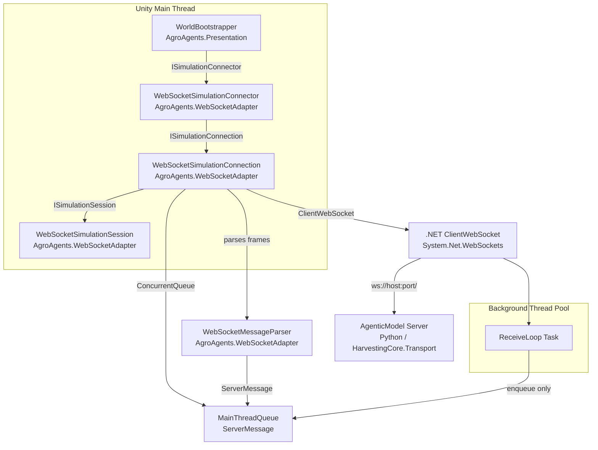

# Design Document — WebSocket Client Adapter

## Overview

The WebSocket client adapter adds a second implementation of the three port interfaces
(`ISimulationConnector`, `ISimulationConnection`, `ISimulationSession`) defined in
`AgroAgents.SimulationPort`. It connects the Unity 6 presentation layer to the remote Python
`AgenticModel` WebSocket server at `ws://localhost:8765/` by default.

The adapter lives in a new assembly, `AgroAgents.WebSocketAdapter`, and can be dropped into
`WorldBootstrapper`'s `[SerializeReference] ISimulationConnector connector` field without any
change to `WorldBootstrapper` or any other presentation code. It replaces
`InMemorySimulationConnector` as the selectable runtime connector.

A companion server-side change to `AgenticModel` extends `AgentSnapshot` so that `MaxLoad`,
`PathInvalidatedThisTick`, and `MeetingPoint` travel over the wire, closing the gap between what
the in-memory adapter already exposes and what the WebSocket path can deliver.

### Design Goals

- **Non-blocking main thread**: all I/O happens on a background `Task`; `Poll()` only drains a
  `ConcurrentQueue`.
- **Port boundary stays clean**: no `HarvestingCore` or `AgenticModel` type ever crosses into the
  presentation layer.
- **Unity-free parser**: `WebSocketMessageParser` has zero `UnityEngine` dependencies and can be
  tested with `dotnet test`.
- **Minimal surface area**: no reconnect loop, no multi-tick batching, no retry logic.

---

## Architecture



### Connection State Machine

`WebSocketSimulationConnection` drives a four-state machine, advanced entirely inside `Poll()`:

```
Idle ──(first Poll)──► Connecting ──(ConnectAsync done, sends state_request)──► Handshaking
                                                                                     │
                             ◄──(state_response dequeued)──────────────────────── Complete
                             ◄──(error/timeout/ws-close)────────────────────────── Failed
```

| State | `IsComplete` | `Failed` | Description |
|-------|-------------|---------|-------------|
| `Idle` | false | false | Before first `Poll()` |
| `Connecting` | false | false | `ConnectAsync` task running |
| `Handshaking` | false | false | `state_request` sent, waiting for `state_response` |
| `Complete` | true | false | `Session` is live |
| `Failed` | true | true | Terminal error, `Error` is set |

### Thread-Safety Model

```
Background Thread (ReceiveLoop)          Unity Main Thread (Poll / RequestTick)
─────────────────────────────────────   ──────────────────────────────────────
ReadAsync frame from ClientWebSocket
Parse frame → ServerMessage
ConcurrentQueue.Enqueue(msg)            while (queue.TryDequeue(out msg)) { … }
                                          mutate Connection/Session state
                                          raise UpdateReceived
```

The only cross-thread primitive is `ConcurrentQueue<ServerMessage>`. No `lock`, `Monitor`, or
`Mutex` is used on the hot path.

---

## Components and Interfaces

### WebSocketSimulationConnector

```csharp
[Serializable]
public sealed class WebSocketSimulationConnector : ISimulationConnector
```

Authored as a `[Serializable]` class (not a `MonoBehaviour`) so Unity's `[SerializeReference]`
system can inline it under `WorldBootstrapper.connector` in the Inspector. Its sole job is to
carry configuration and produce a `WebSocketSimulationConnection`.

| Serialized field | Type | Default | Notes |
|---|---|---|---|
| `host` | `string` | `"localhost"` | Server hostname or IP |
| `port` | `int` | `8765` | TCP port [1, 65535] |
| `connectionTimeoutSeconds` | `float` | `10f` | Max seconds to wait for `state_response` |
| `reconnectOnDrop` | `bool` | `false` | If false, mid-session disconnect is fatal |

`Connect(SessionRequest request)` constructs and returns `new WebSocketSimulationConnection(...)`.
No socket is opened, no task is started.

### WebSocketSimulationConnection

```csharp
internal sealed class WebSocketSimulationConnection : ISimulationConnection, IDisposable
```

Implements the `ISimulationConnection` polling contract. Owns:

- `ClientWebSocket _socket` — .NET managed WebSocket client.
- `ConcurrentQueue<ServerMessage> _queue` — the main-thread bridge.
- `Task _connectTask` — the in-flight `ConnectAsync` task (state Connecting).
- `Task _receiveLoop` — the background receive task (states Handshaking/Complete).
- `CancellationTokenSource _cts` — shared cancel token, cancelled on `Dispose()`.
- `float _timeoutAt` — wall-clock deadline (set at first `Poll()`).
- `int _state` — `ConnectionState` enum, written only from main thread after first `Poll()`.

`Poll()` drives the state machine:

1. **Idle → Connecting**: fire-and-forget `_connectTask = _socket.ConnectAsync(uri, _cts.Token)`.
2. **Connecting**: check `_connectTask.IsCompleted`. On success: serialize `state_request`, call
   `_socket.SendAsync`, start `_receiveLoop`, advance to Handshaking. On faulted task: set Failed.
3. **Handshaking**: drain `_queue`. On `state_response`: construct `WebSocketSimulationSession`,
   set `IsComplete = true`. On `error_response` or `Disconnected`: set Failed. On timeout: set
   Failed with timeout message.
4. **Complete**: immediate return.

### WebSocketSimulationSession

```csharp
internal sealed class WebSocketSimulationSession : ISimulationSession
```

The live session handle. Owns:

- `ClientWebSocket _socket` — shared reference (borrowed from Connection on handshake completion).
- `CancellationTokenSource _cts` — used to stop the ReceiveLoop.
- `ConcurrentQueue<ServerMessage> _queue` — same queue drained by the Connection during
  handshake; after `IsComplete`, the Session takes over draining it inside `RequestTick` responses
  (via `Poll()` remaining on the Connection object — see tick flow below).
- `PortCellState[] _cellCache` — the CellDiffCache, `Width × Height`, row-major.
- `int _pendingTickCount` — count of `RequestTick()` calls queued but not yet responded (main
  thread only).
- `bool _tickInFlight` — true while a `tick_request` is in flight (main thread only).
- `int _disposed` — Interlocked flag for idempotent `Dispose()`.

`UpdateReceived` is raised from inside `Poll()` on the main thread.

> **Note**: After `IsComplete`, `WorldBootstrapper` stops calling `Connection.Poll()`. The
> `SimulationDriver` drives the session via `RequestTick()`. The queue draining therefore moves
> inside the session: the Connection's `Poll()` becomes a no-op and the Session drains the queue
> on each call to `RequestTick()` (asynchronous delivery) or on the next `Update()` frame via a
> dedicated `DrainQueue()` method exposed to `SimulationDriver`.
>
> **Simpler alternative chosen**: `Connection.Poll()` remains a no-op after `IsComplete`. The
> Session exposes a `DrainQueue()` method called by `SimulationDriver` once per `Update()` frame.
> `RequestTick()` only sends the frame and increments `_pendingTickCount`; the actual
> `UpdateReceived` raise happens in `DrainQueue()`.

### WebSocketMessageParser

```csharp
internal static class WebSocketMessageParser
```

A Unity-free static class. Its single public entry point:

```csharp
internal static ServerMessage Parse(string json);
```

Peeks the `"type"` field with a minimal two-pass approach: first deserialize as
`JsonDocument` to read `type`, then deserialize into the concrete DTO. Returns a `ServerMessage`
discriminated union. Never throws — all exceptions are caught and returned as `ParseError` or
`UnknownType`.

No `using UnityEngine` anywhere in this file. Testable via `dotnet test` against a
`netstandard2.1` class library project.

---

## Data Models

### ServerMessage (discriminated union)

```csharp
internal sealed class ServerMessage
{
    public ServerMessageKind Kind { get; }

    // StateResponse / TickResponse:
    public WsSimulationSnapshot? SnapshotData { get; }

    // ErrorResponse:
    public string? ErrorCode { get; }
    public string? ErrorMessage { get; }

    // ParseError:
    public string? ParseErrorMessage { get; }

    // Disconnected:
    public string? CloseReason { get; }
}

internal enum ServerMessageKind
{
    StateResponse,
    TickResponse,
    ErrorResponse,
    ParseError,
    UnknownType,
    Disconnected
}
```

### Internal Parser DTOs (WebSocketMessageParser private types)

These exist solely inside `WebSocketMessageParser` to avoid any dependency on the
`HarvestingCore.Transport` assembly:

```csharp
// private
private sealed class WsSimulationSnapshot
{
    [JsonPropertyName("tick")]          public int Tick { get; set; }
    [JsonPropertyName("isHalted")]      public bool IsHalted { get; set; }
    [JsonPropertyName("dischargedTotal")] public int DischargedTotal { get; set; }
    [JsonPropertyName("agents")]        public List<WsAgentSnapshot> Agents { get; set; }
    [JsonPropertyName("cells")]         public List<WsCellSnapshot> Cells { get; set; }
}

private sealed class WsAgentSnapshot
{
    [JsonPropertyName("id")]            public string Id { get; set; }
    [JsonPropertyName("role")]          public string Role { get; set; }
    [JsonPropertyName("state")]         public string State { get; set; }
    [JsonPropertyName("x")]             public int X { get; set; }
    [JsonPropertyName("y")]             public int Y { get; set; }
    [JsonPropertyName("fuel")]          public int Fuel { get; set; }
    [JsonPropertyName("load")]          public int Load { get; set; }
    [JsonPropertyName("maxLoad")]       public int? MaxLoad { get; set; }
    [JsonPropertyName("pathInvalidatedThisTick")] public bool? PathInvalidatedThisTick { get; set; }
    [JsonPropertyName("meetingPointX")] public int? MeetingPointX { get; set; }
    [JsonPropertyName("meetingPointY")] public int? MeetingPointY { get; set; }
}

private sealed class WsCellSnapshot
{
    [JsonPropertyName("x")]             public int X { get; set; }
    [JsonPropertyName("y")]             public int Y { get; set; }
    [JsonPropertyName("state")]         public string State { get; set; }
    [JsonPropertyName("ownerId")]       public string? OwnerId { get; set; }
}
```

### DTO Mapping Rules (WsAgentSnapshot → PortAgentSnapshot)

| WsAgentSnapshot field | PortAgentSnapshot field | Mapping rule |
|---|---|---|
| `Role` | `Role` | `"Harvester"` → `Harvester`, `"Tractor"` → `Tractor`; unknown → log warning, default `Harvester` |
| `State` | `CurrentState` | `Enum.TryParse<PortStateId>(state, ignoreCase: true)`, fallback `PortStateId.Idle` + warning |
| `X`, `Y` | `Position` | `new PortGridPosition(X, Y)` |
| `MaxLoad` | `MaxLoad` | use value if non-null, else `0` |
| `PathInvalidatedThisTick` | `PathInvalidatedThisTick` | use value if non-null, else `false` |
| `MeetingPointX`, `MeetingPointY` | `MeetingPoint` | `new PortGridPosition?(X,Y)` if both non-null, else `null` |

### CellDiffCache

A flat `PortCellState[]` of length `Width × Height` using row-major indexing (`y * Width + x`).
Initialized from the `state_response` cells at session construction. On every `tick_response`:

1. Iterate each `WsCellSnapshot` in the snapshot.
2. Compute index = `cell.Y * Width + cell.X`.
3. Map `cell.State` → `PortCellState`.
4. If new state ≠ cache[index]: add to `changedCells` list, update cache[index].

### AgentSnapshot Extension (AgenticModel server-side)

`AgenticModel/src/HarvestingCore.Transport/Dto/AgentSnapshot.cs` gains four new properties:

```csharp
[JsonPropertyName("maxLoad")]
public int MaxLoad { get; set; }

[JsonPropertyName("pathInvalidatedThisTick")]
public bool PathInvalidatedThisTick { get; set; }

[JsonPropertyName("meetingPointX")]
public int? MeetingPointX { get; set; }

[JsonPropertyName("meetingPointY")]
public int? MeetingPointY { get; set; }
```

`SimulationHostAdapter.GetSnapshot()` populates them from `Agent.MaxLoad`,
`Agent.PathInvalidatedThisTick`, and `Agent.MeetingPoint` (null → both coords null).

### Assembly Definition

`AgroAgents.WebSocketAdapter.asmdef`:

```json
{
  "name": "AgroAgents.WebSocketAdapter",
  "references": ["AgroAgents.SimulationPort"],
  "includePlatforms": [],
  "excludePlatforms": [],
  "allowUnsafeCode": false,
  "overrideReferences": false,
  "noEngineReferences": false
}
```

---

## Correctness Properties

*A property is a characteristic or behavior that should hold true across all valid executions of a
system — essentially, a formal statement about what the system should do. Properties serve as the
bridge between human-readable specifications and machine-verifiable correctness guarantees.*

### Property 1: state_response transitions Connection to complete with live Session

*For any* valid `state_response` JSON frame, when it is enqueued into `MainThreadQueue` and
`Poll()` is called, `IsComplete` must be `true`, `Failed` must be `false`, and `Session` must be
non-null.

**Validates: Requirements 2.3, 2.5**

---

### Property 2: Poll() is idempotent after IsComplete

*For any* `WebSocketSimulationConnection` that has reached `IsComplete = true`, calling `Poll()`
any additional number of times must not change `IsComplete`, `Failed`, `Error`, or `Session`.

**Validates: Requirements 2.4, 2.6**

---

### Property 3: Failed ↔ IsComplete invariant

*For any* `WebSocketSimulationConnection`, after every `Poll()` call, `Failed = true` implies
`IsComplete = true`, and `Session ≠ null` implies `IsComplete = true` and `Failed = false`.

**Validates: Requirements 2.5, 3.5**

---

### Property 4: Timeout sets Failed

*For any* configured `connectionTimeoutSeconds` value, if no `state_response` arrives within that
duration, `Poll()` must eventually set `Failed = true` and `IsComplete = true` with a descriptive
timeout error message.

**Validates: Requirements 3.1**

---

### Property 5: ConnectAsync exception sets Failed

*For any* exception thrown by `ClientWebSocket.ConnectAsync`, the connection must transition to
`Failed = true`, `IsComplete = true`, and `Error` must contain the exception message.

**Validates: Requirements 3.2**

---

### Property 6: Server error_response during handshake sets Failed

*For any* `error_response` frame received before `IsComplete`, `Poll()` must set `Failed = true`,
`IsComplete = true`, and `Error` must contain the server's `code` and `message`.

**Validates: Requirements 3.3**

---

### Property 7: WebSocket disconnect before handshake sets Failed

*For any* `Disconnected` sentinel enqueued before `state_response` arrives, `Poll()` must set
`Failed = true` and `IsComplete = true`.

**Validates: Requirements 3.4**

---

### Property 8: UpdateReceived fires exactly once per tick_response

*For any* valid `tick_response` JSON snapshot, when it is enqueued and drained, `UpdateReceived`
must be raised exactly once with a non-null `WorldUpdate`.

**Validates: Requirements 5.2, 5.3**

---

### Property 9: Queued tick requests maintain ordering

*For any* sequence of two `RequestTick()` calls issued before the first `tick_response` arrives,
only one `tick_request` frame must be sent before the first `tick_response`, and the second must
be sent only after processing the first response.

**Validates: Requirements 5.4**

---

### Property 10: error_response to tick_request does NOT raise UpdateReceived

*For any* `error_response` received while a tick is in flight, `UpdateReceived` must not fire.

**Validates: Requirements 5.5**

---

### Property 11: InitialSnapshot is immutable after construction

*For any* `WebSocketSimulationSession`, the value of `InitialSnapshot` must be identical before
and after any number of `RequestTick()` calls.

**Validates: Requirements 5.6**

---

### Property 12: ChangedCells contains exactly the diffed positions

*For any* pair of consecutive snapshots, `WorldUpdate.ChangedCells` must contain exactly those
grid positions where the cell state in the new snapshot differs from the cached previous state,
and no others.

**Validates: Requirements 6.2**

---

### Property 13: ChangedCells bounds invariant

*For any* `WorldUpdate`, every position in `ChangedCells` must satisfy `0 ≤ x < Width` and
`0 ≤ y < Height`.

**Validates: Requirements 6.4**

---

### Property 14: Identical consecutive snapshots produce empty ChangedCells

*For any* snapshot applied twice in succession (idempotence), the second application must produce
a `WorldUpdate` with an empty `ChangedCells` list.

**Validates: Requirements 6.5, 6.6**

---

### Property 15: Parser returns correct kind for known type fields

*For any* well-formed JSON frame whose `"type"` field is one of `"state_response"`,
`"tick_response"`, or `"error_response"`, `WebSocketMessageParser.Parse()` must return a
`ServerMessage` with the corresponding `Kind` and non-null payload data.

**Validates: Requirements 7.1**

---

### Property 16: Parser returns ParseError for malformed JSON

*For any* string that is not valid JSON, `WebSocketMessageParser.Parse()` must return a
`ServerMessage` with `Kind = ParseError` and must not throw.

**Validates: Requirements 7.3**

---

### Property 17: String-to-enum mapping is correct and exhaustive

*For any* string value that equals (case-insensitively) a `PortStateId` member name, the adapter
must map it to that member. *For any* string with no case-insensitive match, the adapter must
return `PortStateId.Idle`. *For any* `"Harvester"` or `"Tractor"` role string, the mapping must
produce the matching `PortAgentRole`. *For any* valid `CellState` string, the mapping must produce
the matching `PortCellState`.

**Validates: Requirements 7.4, 7.5, 7.6**

---

### Property 18: Dispose() is idempotent

*For any* `WebSocketSimulationSession` or `WebSocketSimulationConnection`, calling `Dispose()` two
or more times must produce the same observable effect as calling it once — no exception, no
repeated CloseAsync calls, no state corruption.

**Validates: Requirements 8.3**

---

### Property 19: AgentSnapshot serialization round-trip

*For any* valid `AgentSnapshot` object (including the four new fields), serializing to JSON with
`System.Text.Json` and then deserializing must produce an object with equal field values.

**Validates: Requirements 10.6**

---

### Property 20: SimulationHostAdapter populates new fields from Agent

*For any* `Agent` with arbitrary `MaxLoad`, `PathInvalidatedThisTick`, and `MeetingPoint` values,
`SimulationHostAdapter.GetSnapshot()` must produce an `AgentSnapshot` whose `MaxLoad`,
`PathInvalidatedThisTick`, `MeetingPointX`, and `MeetingPointY` fields match.

**Validates: Requirements 10.2**

---

### Property 21: Missing optional fields fall back to defaults

*For any* JSON `AgentSnapshot` object that omits `maxLoad`, `pathInvalidatedThisTick`,
`meetingPointX`, and/or `meetingPointY`, the adapter must map them to `MaxLoad = 0`,
`PathInvalidatedThisTick = false`, and `MeetingPoint = null` without throwing.

**Validates: Requirements 7.7, 7.8, 10.5**

---

## Error Handling

| Failure condition | Detection point | Action |
|---|---|---|
| Server not running / DNS failure | `ConnectAsync` task faults | `Failed=true`, `Error="WebSocket connect error: {msg}"`, `IsComplete=true` |
| Timeout waiting for `state_response` | `Poll()`, Handshaking state | `Failed=true`, `Error="Connection timed out after {N}s waiting for state_response"`, `IsComplete=true` |
| Server sends `error_response` during handshake | `Poll()`, Handshaking, dequeue | `Failed=true`, `Error="Server error [{code}]: {msg}"`, `IsComplete=true` |
| WebSocket closed before handshake | ReceiveLoop enqueues `Disconnected` | `Poll()` sets `Failed=true`, `Error="WebSocket closed unexpectedly: {reason}"` |
| Malformed JSON frame | `WebSocketMessageParser.Parse()` catches `JsonException` | `ServerMessage{Kind=ParseError}` enqueued; `Poll()` logs warning, continues |
| Unknown `"type"` value | `WebSocketMessageParser.Parse()` | `ServerMessage{Kind=UnknownType}` enqueued; `Poll()` logs warning, continues |
| Unknown agent role string | Mapping inside Session | Log warning, default to `PortAgentRole.Harvester` |
| Unknown agent state string | Mapping inside Session | Log warning, default to `PortStateId.Idle` |
| `error_response` to `tick_request` | Session, tick drain | Log warning with code+message, do NOT raise `UpdateReceived` |
| `Dispose()` before handshake | `WebSocketSimulationConnection.Dispose()` | Cancel `_cts`, set `Failed=true`, `Error="Disposed before connection completed"`, `IsComplete=true` |
| Double `Dispose()` | `Interlocked.Exchange` on `_disposed` | Silent no-op |

---

## Testing Strategy

### Dual Testing Approach

Both unit tests and property-based tests are required and complementary:

- **Unit tests** cover specific examples, integration points, and error conditions that are hard to
  express as universal properties (e.g., exact error message format, Dispose ordering).
- **Property tests** verify universal correctness across all generated inputs — they are the
  primary mechanism for verifying the Correctness Properties above.

### Property-Based Testing Library

**FsCheck** (NuGet: `FsCheck`, `FsCheck.NUnit` or `FsCheck.Xunit`) is the chosen PBT library for
the .NET/C# side. Minimum **100 iterations** per property test. Each test must be tagged with a
comment in the following format:

```
// Feature: websocket-client-adapter, Property {N}: {property_text}
```

Each Correctness Property (1–21) must be implemented by exactly one property-based test.

### Test Projects

#### `AgroAgents.WebSocketAdapter.Tests` (new `dotnet test` project, `netstandard2.1` / `net8.0`)

Tests `WebSocketMessageParser` and the mapping/diff logic that has no Unity dependency. Does not
require a Unity process.

Key test areas:

- **Parser round-trips** (Properties 15, 16): generate random valid JSON frames, verify correct
  `Kind` returned; generate random non-JSON strings, verify `ParseError`.
- **String mapping** (Property 17): generate arbitrary strings, verify `PortStateId` mapping
  is case-insensitive with `Idle` fallback; generate valid role/cell strings, verify exact mapping.
- **CellDiffCache diff** (Properties 12, 13, 14): generate pairs of `PortCellState[]` arrays,
  verify `ChangedCells` is exactly the symmetric difference, verify bounds invariant.
- **AgentSnapshot round-trip** (Property 19): generate random `AgentSnapshot` instances with all
  fields, serialize and deserialize, verify equality.
- **SimulationHostAdapter population** (Property 20): generate random `Agent` instances, call
  `GetSnapshot()`, verify new fields match.
- **Optional field defaults** (Property 21): generate JSON without optional fields, verify default
  values after deserialization.

#### Unity Play Mode / Edit Mode Tests (Unity Test Framework)

Tests requiring `ClientWebSocket`, Unity lifecycle, or `MonoBehaviour`:

- **Connection state machine** (Properties 1, 2, 3, 4, 5, 6, 7): use a `FakeWebSocket` mock (an
  in-process implementation of `ClientWebSocket`-compatible interface) to simulate server
  responses, timeouts, and errors. Drive `Poll()` from the test and assert state transitions.
- **Tick ordering** (Properties 8, 9, 10, 11): mock WebSocket, call `RequestTick()` twice before
  responding, verify only one in-flight at a time and `UpdateReceived` fires once per response.
- **Dispose idempotence** (Property 18): call `Dispose()` multiple times, verify no exception and
  `CloseAsync` called once.
- **Unit examples**: connector defaults (Req 1.2–1.5), `Connect()` returns immediately with no
  socket (Req 1.6), `Poll()` drains queue on calling thread (Req 4.2), session disposal ordering
  (Req 8.1, 8.2, 8.4).

### Unit Test Balance

Unit tests should focus on concrete scenarios: exact error message strings, disposal ordering
guarantees, and integration between Connection and Session. Property tests handle the wide input
space (all valid/invalid JSON, all cell state combinations, all enum string variants).
